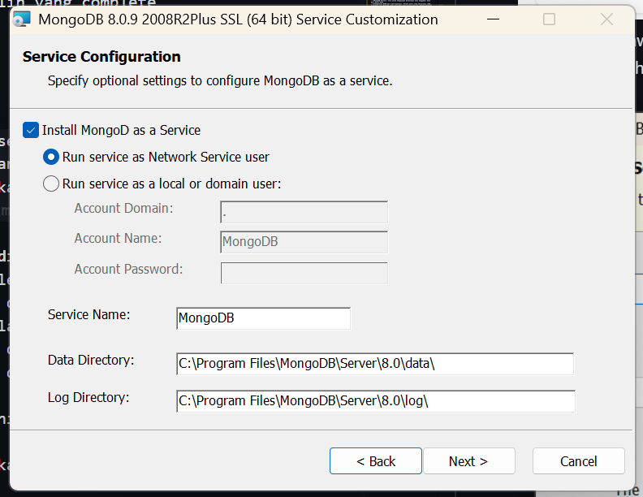
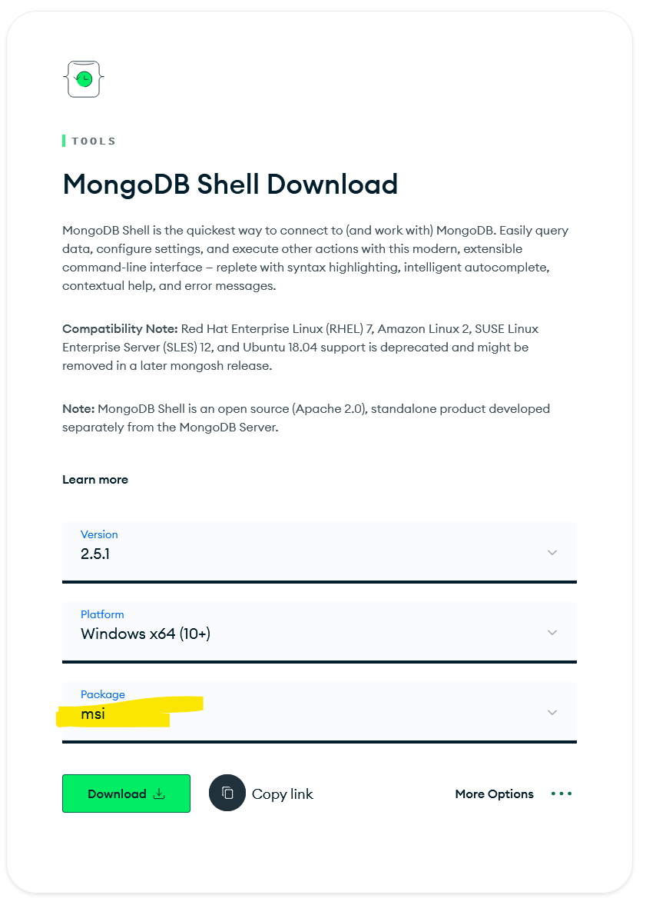
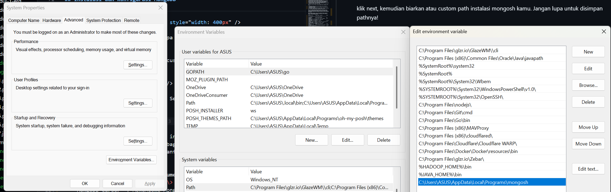

# Module 0

## Daftar Isi

- [Introduction](#introduction)
  - [Apa Itu Sistem Basis Data (SBD)?](#apa-itu-sistem-basis-data-sbd)
  - ["Terus, apa bedanya sih dengan Excel?"](#terus-apa-bedanya-sih-dengan-excel)
  - [Kapan Kita Menggunakan Konsep SBD?](#kapan-kita-menggunakan-konsep-sbd)
  - [Apa Saja yang Akan Dipelajari?](#apa-saja-yang-akan-dipelajari)
  - [Kenapa Harus Install Tools Ini?](#kenapa-harus-install-tools-ini)
- [Setup & Installation](#setup--installation)
  - [Instalasi XAMPP](#instalasi-xampp)
    - [Download XAMPP](#download-xampp)
    - [Proses Instalasi XAMPP](#proses-instalasi-xampp)
    - [Menjalankan XAMPP](#menjalankan-xampp)
    - [Mengakses phpMyAdmin](#mengakses-phpmyadmin)
  - [Instalasi dan Konfigurasi MongoDB](#instalasi-dan-konfigurasi-mongodb)
    - [Instalasi MongoDB Community Server](#instalasi-mongodb-community-server)
    - [Instalasi MongoDB Shell (mongosh)](#instalasi-mongodb-shell-mongosh)
    - [Instalasi MongoDB Compass (opsional)](#instalasi-mongodb-compass-opsional)
- [FAQ (Frequently Asked Questions)](#faq-frequently-asked-questions)

---

## Introduction

Selamat datang di praktikum **Sistem Basis Data (SBD)**!


### Apa Itu Sistem Basis Data (SBD)?

Secara sederhana, **basis data** adalah kumpulan informasi yang disimpan secara digital di dalam sistem komputer. Tapi, **Sistem Basis Data** bukan sekadar "menyimpan" data seperti folder foto di laptop kalian. SBD sendiri merupakan sebuah sistem terorganisir yang memungkinkan kita untuk **menyimpan**, **mengambil**, dan **mengelola** data dalam jumlah besar dengan cepat, aman, dan efisien.

### "Terus, apa bedanya sih dengan Excel?"

Mungkin kalian berpikir, _"Kan bisa simpan data di Excel?"_. Coba bayangkan kalau Shopee atau Tokopedia menggunakan Excel untuk mencatat pesanan. Disaat yang bersamaan ketika ada jutaan orang belanja, file Excel-nya crash tak mungkin terhindari.

Database punya keunggulan yang tidak bisa ditandingi spreadsheet biasa:

- **Skalabilitas** — Database sanggup menangani jutaan data tanpa melambat.
- **Keamanan & Integritas** — Database memastikan tidak ada data yang "bertabrakan". Misalnya: dua orang memesan kursi bioskop yang sama di detik yang sama, database akan memastikan hanya satu yang berhasil.
- **Relasi** — Database memungkinkan kita menghubungkan data _Pembeli_, data _Barang_, dan data _Transaksi_ dengan rapi dan terstruktur.

### Kapan Kita Menggunakan Konsep SBD?

Kalian butuh SBD saat aplikasi yang dibuat sudah melibatkan:

- **Banyak pengguna** — Lebih dari satu orang yang mengakses data secara bersamaan.
- **Data yang kompleks** — Data yang saling berhubungan dan butuh aturan ketat untuk menjaga konsistensinya.
- **Keamanan tinggi** — Saat data tidak boleh sembarangan diubah atau dihapus oleh pihak yang tidak berwenang.

Sepanjang praktikum ini, kalian akan bekerja dengan dua paradigma utama dalam dunia basis data:

1. **Basis Data Relasional (SQL)** — menggunakan **MySQL** melalui **XAMPP**. Di sini kalian akan belajar bagaimana data disimpan secara terstruktur dalam tabel-tabel yang saling berelasi, serta bagaimana mengakses dan mengolah data tersebut menggunakan bahasa SQL.
2. **Basis Data NoSQL** — menggunakan **MongoDB**. Kalian akan mengenal pendekatan yang berbeda dalam menyimpan data, yaitu berbasis dokumen (mirip JSON), yang lebih fleksibel dan cocok untuk data yang tidak selalu memiliki struktur seragam.

### Apa Saja yang Akan Dipelajari?

Praktikum ini terdiri dari **6 modul utama** (ditambah modul persiapan ini). Berikut gambaran besar topiknya:

| Modul | Topik | Deskripsi Singkat |
| ----- | ----- | ----------------- |
| **Modul 0** | Setup & Installation | Instalasi dan konfigurasi tools yang dibutuhkan (XAMPP & MongoDB) |
| **Modul 1** | Entity Relationship Diagram (ERD) | Belajar merancang struktur basis data menggunakan diagram ER — langkah pertama sebelum membuat database |
| **Modul 2** | Normalisasi | Teknik untuk merapikan desain tabel agar tidak ada data yang redundan atau duplikat |
| **Modul 3** | Data Definition Language (DDL) | Pengenalan MySQL dan cara membuat, mengubah, serta menghapus struktur database dan tabel |
| **Modul 4** | Data Manipulation Language (DML) | Operasi CRUD (Create, Read, Update, Delete) pada data, termasuk query lanjutan seperti JOIN, subquery, dan aggregate functions |
| **Modul 5** | Stored Procedure & Function | Membuat prosedur dan fungsi tersimpan di MySQL untuk mengotomasi operasi database |
| **Modul 6** | JSON & MongoDB | Pengenalan NoSQL, format JSON/BSON, serta operasi dasar hingga lanjutan di MongoDB (CRUD & Aggregation) |

### Kenapa Harus Install Tools Ini?

Untuk mengikuti praktikum ini, kalian memerlukan dua software utama. Berikut penjelasannya:

- **XAMPP** — Paket software yang menyediakan Apache, MySQL/MariaDB, PHP, dan phpMyAdmin. Akan digunakan pada **Modul 1–5** untuk bekerja dengan basis data relasional.
- **MongoDB Community Server & MongoDB Shell (mongosh)** — Basis data NoSQL berbasis dokumen. Akan digunakan pada **Modul 6** untuk bekerja dengan basis data non-relasional.

---

# Setup & Installation

## Instalasi XAMPP

Pada praktikum ini, MySQL akan dijalankan menggunakan **XAMPP**.
XAMPP merupakan singkatan dari **X** (Cross-platform), **A** (Apache), **M** (MySQL/MariaDB), **P** (PHP), dan **P** (Perl) — sebuah paket software _all-in-one_ yang menyediakan semua komponen berikut dalam satu instalasi:

| Komponen | Fungsi |
|----------|--------|
| **Apache** | Web Server untuk menjalankan aplikasi berbasis web |
| **MySQL / MariaDB** | Database Management System (DBMS) relasional |
| **PHP** | Bahasa pemrograman server-side |
| **phpMyAdmin** | Antarmuka web untuk mengelola database MySQL |

XAMPP digunakan untuk menjalankan server lokal (_localhost_) sehingga kita dapat mengembangkan dan menguji database tanpa memerlukan server eksternal maupun koneksi internet.

> **Mengapa XAMPP?** XAMPP memudahkan proses instalasi karena semua komponen yang dibutuhkan (web server + database + management tool) sudah terbundel dalam satu paket. Cukup satu kali install, dan kita sudah siap bekerja dengan MySQL dan PHP.

> Meskipun begitu, banyak alternatif yang bisa digunakan selain XAMPP (memperkirakan hal-hal yang akan terjadi :v) seperti _Laragon_, _MAMP_, _WAMP_, dll yang masih berbasis Apache + MySQL + PHP dan dapat digunakan sesuai preferensi masing-masing serta tidak akan mempengaruhi jalannya praktikum.

---

### Download XAMPP

1. Buka website resmi Apache Friends:
   [https://www.apachefriends.org/index.html](https://www.apachefriends.org/index.html)

2. Pilih versi sesuai sistem operasi yang digunakan (Windows / macOS / Linux). Disarankan untuk mengunduh versi terbaru.


---

### Proses Instalasi XAMPP

1. Jalankan file installer (`.exe`) yang telah diunduh.
2. Klik **Next** pada halaman awal instalasi.

   

3. Pada halaman **Select Components**, pastikan komponen berikut dalam keadaan **tercentang**:

   - **Apache** — diperlukan sebagai web server
   - **MySQL** — diperlukan sebagai DBMS
   - **phpMyAdmin** — diperlukan sebagai antarmuka manajemen database

   > Komponen lain (FileZilla, Mercury, Tomcat, dll.) bersifat opsional dan **tidak diperlukan** untuk praktikum ini.

   

4. Pilih **folder instalasi**. Disarankan menggunakan path default: `C:\xampp`. Hindari folder yang memerlukan akses administrator (seperti `C:\Program Files`).

   

5. Klik **Next** terus hingga proses instalasi selesai. Tunggu sampai progress bar mencapai 100%.

   

6. Klik **Finish** untuk menyelesaikan instalasi dan membuka XAMPP Control Panel.

   

---

### Menjalankan XAMPP

Setelah instalasi selesai, kita perlu menjalankan service Apache dan MySQL setiap kali ingin bekerja dengan database.

1. Buka **XAMPP Control Panel** (bisa dicari melalui Start Menu).
2. Klik tombol **Start** pada modul:
   - **Apache** — agar phpMyAdmin dapat diakses melalui browser
   - **MySQL** — agar database server aktif dan siap menerima query

Jika berhasil, status kedua modul akan berubah menjadi **berwarna hijau**, menandakan service aktif.


Untuk memastikan server berjalan dengan baik, buka browser dan akses:

```
http://localhost
```

atau

```
http://127.0.0.1
```

Jika halaman _dashboard_ XAMPP muncul, berarti instalasi dan konfigurasi berhasil!

> **Troubleshooting:** Jika Apache atau MySQL gagal start (berwarna merah), kemungkinan port yang digunakan sudah dipakai oleh aplikasi lain. Port default Apache adalah `80` dan MySQL adalah `3306`. Pastikan tidak ada aplikasi lain yang menggunakan port tersebut.

---

### Mengakses phpMyAdmin

**phpMyAdmin** adalah antarmuka web (_web-based GUI_) untuk mengelola database MySQL. Jadi, kalian tidak perlu mengetik perintah SQL di terminal — cukup gunakan tampilan grafis yang sudah disediakan. Cocok banget buat yang baru pertama kali belajar database.

Untuk mengaksesnya, pastikan Apache & MySQL sudah berjalan, lalu buka browser dan akses:

```
http://localhost/phpmyadmin
```

Jika berhasil, akan muncul halaman utama phpMyAdmin seperti berikut:


Melalui phpMyAdmin, kita dapat:

- **Membuat database** baru
- **Membuat dan mengelola tabel** beserta strukturnya
- **Menjalankan query SQL** secara langsung melalui tab SQL
- **Mengelola data** (insert, update, delete) melalui antarmuka visual
- **Import/Export** database dalam format `.sql`

> phpMyAdmin akan sering digunakan sepanjang **Modul 3–5** sebagai alat bantu utama untuk berinteraksi dengan MySQL.

---

## Instalasi dan Konfigurasi MongoDB

**MongoDB** adalah basis data NoSQL berbasis dokumen yang menyimpan data dalam format **BSON** (Binary JSON). Kalau di MySQL kita kenal tabel dan baris, di MongoDB konsepnya berbeda — data disimpan dalam bentuk **collections** dan **documents** yang strukturnya mirip JSON. Jadi lebih fleksibel, terutama untuk data yang bentuknya bervariasi atau sering berubah.

MongoDB akan digunakan pada **Modul 6** praktikum ini.

Untuk instalasi di Windows, diperlukan beberapa komponen:

| Program | Fungsi |
| ------- | ------ |
| **MongoDB Community Server** | Database engine (server) yang menjalankan dan menyimpan data |
| **MongoDB Shell (mongosh)** | Command-line interface untuk berinteraksi dengan MongoDB |
| **MongoDB Compass** _(opsional)_ | GUI untuk visualisasi dan manajemen database |

### Instalasi MongoDB Community Server

1. Kunjungi halaman unduh resmi:
   [MongoDB Download Center](https://www.mongodb.com/download-center/community)

   

2. Unduh installer untuk **Windows** (format `.msi`), lalu jalankan file installer tersebut.

3. Ikuti langkah awal instalasi dan **setujui End License Agreement**.

4. Pada halaman **Setup Type**, pilih **Complete** untuk menginstal semua komponen yang diperlukan.

   

5. Pada halaman **Service Configuration**, biarkan seluruh konfigurasi menggunakan **nilai default**. Pastikan opsi _"Install MongoDB as a Service"_ tetap tercentang agar MongoDB berjalan otomatis.

   > **Penting:** Catat/ingat path instalasi MongoDB kalian (default: `C:\Program Files\MongoDB\Server\<versi>\`). Path ini akan diperlukan jika ada troubleshooting di kemudian hari.

   

6. Pada langkah selanjutnya, kalian bisa **mencentang** opsi untuk menginstal **MongoDB Compass** (opsional).

   > MongoDB Compass **direkomendasikan untuk pembelajaran** karena menyediakan GUI yang memudahkan eksplorasi data. Namun, dalam praktikum dapat digunakan juga **MongoDB Shell (mongosh)**.

7. Klik **Install** dan tunggu proses instalasi selesai.

### Instalasi MongoDB Shell (mongosh)

MongoDB Shell (`mongosh`) adalah command-line tool yang digunakan untuk terhubung ke MongoDB server dan menjalankan perintah/query. Ini adalah tool utama yang akan kita pakai di **Modul 6** nanti untuk berinteraksi langsung dengan database MongoDB.

1. Kunjungi halaman unduh:
   [MongoDB Shell Download](https://www.mongodb.com/try/download/shell)

   

2. Pilih **package MSI** untuk memudahkan proses instalasi (tidak perlu konfigurasi manual).

3. Jalankan installer, klik **Next**, kemudian tentukan path instalasi mongosh (bisa dibiarkan default atau di-custom). **Jangan lupa simpan/catat path instalasinya!**

   

4. Klik **Next**, lalu **Install** dan tunggu hingga selesai.

5. Setelah instalasi, kita perlu **menambahkan path mongosh ke System Environment Variable** agar perintah `mongosh` dapat diakses dari terminal mana pun. Caranya:
   - Buka **Start Menu** → cari **"Edit the system environment variables"** → klik **Environment Variables**
   - Pada bagian **System variables**, pilih variabel **Path** → klik **Edit**
   - Klik **New**, lalu tambahkan path folder `bin` dari instalasi mongosh (contoh: `C:\Program Files\mongosh\bin`)
   - Klik **OK** pada setiap dialog untuk menyimpan perubahan

   

   > Jangan lupa klik **OK** setiap kali membuat perubahan pada Environment Variables, jika tidak maka perubahan tidak akan tersimpan.

6. **Verifikasi instalasi:** Buka **terminal baru** (Command Prompt / PowerShell / Windows Terminal) lalu jalankan perintah:

   ```shell
   mongosh
   ```

   Jika instalasi berhasil, kalian akan terhubung ke MongoDB server dan melihat prompt `test>` seperti berikut:

   

### Instalasi MongoDB Compass (opsional)

---

Jika ada kendala, cek bagian [FAQ](#faq-frequently-asked-questions) di bawah.

---

## FAQ (Frequently Asked Questions)

**Q: Kak, aku pakai macOS / Linux. Instalasi-nya beda ya?**
> Konsepnya sama! Kalian bisa unduh XAMPP versi macOS/Linux di situs yang sama. Kalau bingung, langsung tanya ke asprak ya.

**Q: Kenapa MySQL-ku di XAMPP nggak bisa 'Start' (error merah)?**
> Biasanya karena port telah dipakai aplikasi lain (seperti MySQL Installer terpisah). Coba matikan service MySQL lain di **Task Manager** > **Services**, atau hubungi asprak untuk panduan ganti port dan sebagainya.

**Q: Apa bedanya MySQL dan MongoDB?**
> MySQL (SQL) ibarat lemari arsip yang sangat rapi (berbasis tabel), sedangkan MongoDB (NoSQL) ibarat tumpukan dokumen yang fleksibel (berbasis dokumen JSON).

**Q: Sudah setting Path tapi `mongosh` tetap tidak dikenali di terminal?**
> Ini jebakan klasik. Setelah mengubah Environment Variables, terminal yang **sudah terbuka** tidak akan mendeteksi perubahannya. Kalian harus **tutup terminal**, lalu **buka terminal baru**, baru ketik `mongosh` lagi.

**Q: MongoDB Compass wajib di-install tidak?**
> Sifatnya opsional tapi disarankan. Selama praktikum, kita akan lebih banyak menggunakan `mongosh` (terminal) agar kalian paham perintah dasarnya. Tapi Compass sangat membantu untuk sekadar melihat atau memverifikasi apakah data yang dimasukkan lewat terminal sudah benar masuk. Kalau laptop-nya terbatas spesifikasi, boleh skip Compass — yang penting **Community Server** dan **mongosh** terinstal.

---

anyway, glhf!


