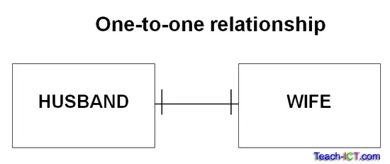
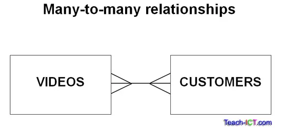

# Module 1

## Konversi ERD dalam Bentuk Tabel Entitas

## Daftar Isi

## 1. Definisi ERD

ERD atau Entity Relational Diagram merupakan sebuah diagram yang digunakan untuk merancang suatu database dengan menunjukan relasi antar objek atau entitas beserta atribut di dalamnya secara mendetail.

Dengan membuat skema ERD yang baik, niscaya akan terbentuk sistem database yang rapi dan terstruktur yang memudahkan kita baik perorangan maupun tim untuk memahami sistem yang akan dilaksanakan nanti. Selain mudah untuk dipahami, skema ERD yang baik akan membantu kita dalam _debugging_ database dari sistem kita apabila terjadi masalah pada database terkait. Nah, ERD yang baik terdiri dari 3 komponen penting yaitu **Entitas, Atribut, dan Relasi.**

### **A. Entitas**

Entitas adalah objek yang dicatat dan disimpan di dalam database. Di satu database biasanya terdiri dari lebih dari satu entity yang unik satu sama lain. Contohnya ketika kita memiliki database sekolah, maka entitas yang ada di dalam database tersebut antara lain guru, siswa, staff, dan lain sebagainya.

Entitas sendiri dibedakan menjadi 2, yaitu entitas kuat dan entitas lemah.

1. Entitas kuat adalah entitas yang bisa berdiri sendiri tanpa perlu adanya entitas lain. Entitas kuat biasanya selalu mempunyai **primary key.**
2. Entitas lemah adalah entitas yang tidak bisa berdiri sendiri, dan keberadaannya bergantung pada entitas kuat. Entitas lemah tidak memilki **primary key** dan biasanya “meminjam” primary key dari entitas lain untuk menegaskan keberadaannya.

Pada contoh diatas, Customer adalah entitas kuat yang dibuktikan melalui keberadaan primary key yaitu C*id dan tidak bergantung pada entitas lain untuk ada. Sedangkan Loan tidak memiliki primary key dan keberadaannya bergantung pada primary key dari Customer. Oleh karena itu, dibuatlah hubungan *“Borrows”\_ agar Loan bisa meminjam primary key dari entitas Customer.

### **B. Atribut**

Atribut adalah hal-hal yang digunakan untuk mendefinisikan suatu entitas. Atribut juga digunakan untuk membedakan entitas yang satu dengan entitas yang lainnya di dalam database.

- **Atribut simpel**, atribut yang memiliki nilai tunggal dan absolut sehingga tidak bisa dipecah menjadi beberapa atribut. Contoh: Alamat rumah, tahun kelahiran, kota asal.
- **Atribut kunci**, atribut yang bernilai unik dan digunakan untuk membedakan entitas di dalam satu grup entitas. Contoh: NRP, NIK.
- **Atribut banyak nilai atau multivalue**, atribut yang memiliki nilai lebih dari satu di dalam suatu entitas. Contoh: nomor telepon, hobi, kendaraan bermotor.
- **Atribut gabungan / atribut komposit**, atribut yang isinya merupakan gabungan dari lebih dari satu atribut. Contoh: alamat rumah (terdiri dari nama jalan, kota, provinsi, negara, dll).
- **Atribut derivatif**: atribut yang dihasilkan melalui atribut lainnya, biasanya tidak dituliskan di dalam ERD. Contoh: umur bisa didapatkan melalui tanggal lahir.

### Primary Key dan Foreign Key

1. **Primary key** adalah atribut yang **unik** dan **tidak boleh kosong atau bernilai NULL** yang digunakan untuk mengidentifikasi setiap baris data di dalam tabel. Fungsi utama primary key adalah meminimalisir redundansi data dan menghubungkan entitas dengan entitas lain, karena itulah perlu adanya primary key pada setiap data yang dimasukkan ke dalam database. Berikut adalah beberapa ketentuan yang perlu diperhatikan ketika menentukan primary key pada suatu entitas dalam ERD:
   1. **Unik:** Nilai dari primary key harus unik untuk setiap entitas atau baris data dalam tabel. Dengan kata lain, tidak ada dua entitas yang bisa memiliki nilai primary key yang sama.
   2. **Tidak boleh NULL:** Primary key tidak boleh memiliki nilai null atau kosong. Ini berarti setiap entitas harus memiliki nilai primary key.

Perlu diingat, pemilihan primary key yang tepat sangat penting dalam desain database yang baik. Primary key yang dipilih dengan baik akan mempermudah proses pengambilan data (query), meminimalkan redundansi data, dan membantu menjaga integritas data.

2. **Foreign key** adalah atribut dalam suatu tabel yang menautkan atau merujuk ke primary key di tabel lain. Fungsi utama dari foreign key adalah membangun hubungan atau relasi antara dua tabel dalam basis data relasional. Foreign key mengizinkan tabel untuk saling terhubung dan menciptakan keterkaitan antar data di dalam basis data.

### **Relasi**

Dalam diagram ERD, hubungan antara entitas digambarkan dengan menggunakan garis yang menghubungkan entitas. Kardinalitas adalah sifat dari hubungan ini, yang menggambarkan jumlah entitas yang terlibat dalam hubungan tersebut. Ada empat jenis kardinalitas utama:

1. **Satu-ke-Satu (One-to-One)**: Ini berarti setiap entitas dalam satu set entitas hanya terhubung dengan satu entitas dalam set entitas lain, dan sebaliknya. Contohnya seperti data mahasiswa dengan NIM (Nomor Induk Siswa).

2. **Satu-ke-Banyak (One-to-Many)**: Ini berarti setiap entitas dalam satu set entitas dapat terhubung dengan banyak entitas dalam set entitas lain, tetapi setiap entitas dalam set entitas lain hanya terhubung dengan satu entitas dalam set entitas pertama. Contoh dari implementasi one to many ini adalah jurusan dengan mahasiswanya.

3. **Banyak-ke-Satu (Many-to-One)**: Ini adalah kebalikan dari satu-ke-banyak, di mana banyak entitas dalam satu set entitas dapat terhubung dengan satu entitas dalam set entitas lain. Dalam diagram ERD, ini juga direpresentasikan dengan garis dari banyak entitas ke satu entitas, dengan tanda "N" (atau "M") ditempatkan di sisi banyak entitas dan tanda "1" ditempatkan di sisi satu set entitas.

4. **Banyak-ke-Banyak (Many-to-Many)**: Ini berarti banyak entitas dalam satu set entitas dapat terhubung dengan banyak entitas dalam set entitas lain, dan sebaliknya. Contoh dari relasi ini adalah mahasiswa dengan data terkait UKM (Unit Kegiatan Mahasiswa).

## 2. ERD Chen

Notasi Chen menggunakan simbol persegi panjang untuk merepresentasikan entitas, dengan garis-garis yang menghubungkan entitas dan atribut untuk menunjukkan hubungan antar mereka.

Bentuk Notasi ERD Chen:

Contoh ERD Chen:

## 3. ERD Crow’s Foot

Notasi Crow's Foot menggunakan simbol tiga garis untuk entitas, dengan simbol kaki burung (crow's foot) yang menunjukkan entitas yang banyak dan garis tunggal yang menunjukkan entitas yang satu.

Bentuk Notasi ERD Crow’s Foot

## 4. Spesialisasi dan Generalisasi

### i. Spesialisasi

Dalam spesialisasi, sebuah entitas dibagi menjadi sub-entitas berdasarkan karakteristiknya. Ini adalah pendekatan up-bottom di mana entitas tingkat yang lebih tinggi dispesialisasikan menjadi dua atau lebih entitas tingkat yang lebih rendah.

Sebagai contoh, sebuah entitas EMPLOYEE dalam sistem manajemen Karyawan dapat dispesialisasikan menjadi DEVELOPER, dan TESTER seperti yang ditunjukkan dalam gambar dibawah. Ketika kita melakukan spesialisasi, atribut-atribut yang umum untuk semua sub-entitas tetap menjadi bagian dari entitas tingkat yang lebih tinggi (misalnya, E_SALARY, dan E_NAME), sementara atribut-atribut yang khusus hanya untuk sub-entitas tertentu menjadi bagian dari sub-entitas itu sendiri (misalnya, TES_TYPE untuk TESTER).

### ii. Generalisasi

Generalisasi dalam sistem basis data adalah tentang mengenali pola-pola umum dalam informasi yang kita miliki dan menyederhanakannya dengan membuat entitas yang lebih umum untuk menampung atribut-atribut yang sama, sambil tetap memungkinkan untuk memiliki entitas tambahan yang spesifik untuk kebutuhan khusus. Generalisasi adalah pendekatan bottom-up.

Sebagai contoh, STUDENT dan FACULTY dapat digeneralisasikan menjadi entitas tingkat yang lebih tinggi dan disebut PERSON. Pada ERD dibawah, kita menyadari bahwa ada beberapa atribut yang sama di antara semua kelompok ini, seperti P_NAME dan P_ADD. Nah, daripada menyimpan informasi ini berulang kali untuk setiap kelompok, kita dapat membuat entitas "PERSON" yang memiliki atribut-atribut ini. Kemudian, kita bisa membuat entitas tambahan yang spesifik untuk setiap kelompok, seperti "STUDENT" dengan atribut tambahan seperti S_FEE, "FACULTY" dengan atribut tambahan seperti SPECIALIZATION, dan seterusnya.

### iii. Agregasi

Agregasi adalah konsep di mana kita menggabungkan beberapa entitas dan hubungan ke dalam satu entitas tingkat yang lebih tinggi. Ini digunakan ketika kita perlu menggambarkan hubungan antara sebuah entitas dan sebuah hubungan, yang tidak dapat direpresentasikan secara langsung dalam diagram Entity-Relationship (ER).

Sebagai contoh, seorang Karyawan yang bekerja pada sebuah proyek mungkin memerlukan beberapa mesin. Jadi, hubungan REQUIRE antara hubungan WORKS_FOR dan entitas MACHINERY diperlukan. Dengan menggunakan agregasi, hubungan WORKS_FOR dengan entitas-entitasnya EMPLOYEE dan PROJECT diagregasi menjadi sebuah entitas tunggal dan hubungan REQUIRE diciptakan antara entitas yang diagregasi dan MACHINERY.

## References

- https://www.geeksforgeeks.org/introduction-of-er-model/
- https://www.geeksforgeeks.org/structural-constraints-of-relationships-in-er-model/?ref=lbp
- https://www.geeksforgeeks.org/generalization-specialization-and-aggregation-in-er-model/?ref=lbp
- https://www.dicoding.com/blog/memahami-erd/
- https://medium.com/@mluthfiridhwan/mengenal-entity-relationship-diagram-erd-4fd9646f14a7
