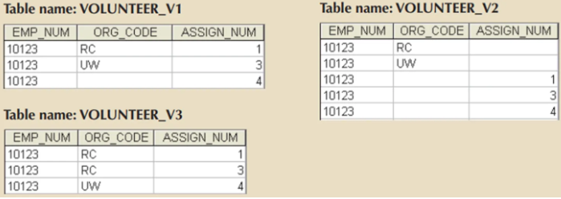
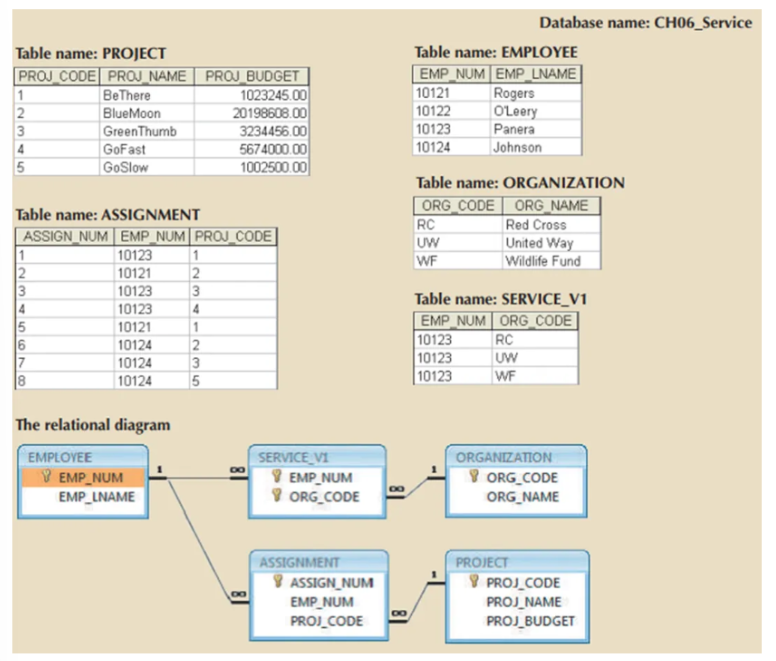

# Module 2

## Outline
- [Normalisasi Overview](#Normalisasi)  
- [NF1] (#NF1)  
- [NF2](#NF2)  
- [Kontribusi](#kontribusi)  
- [Lisensi](#lisensi)

# Normalisasi

> Normalization is an important process in database design that helps improve the database’s efficiency, consistency, and accuracy which is also a process for evaluating and correcting table structure to minimize and eliminate redundancies.

Normalisasi pada Entity-Relationship Diagram (ERD) adalah proses desain database yang bertujuan untuk mengurangi redundansi data dan memastikan struktur data yang efisien serta terhindar dari anomali. Normalisasi melibatkan pemisahan tabel yang besar menjadi tabel yang lebih kecil dan lebih terfokus pada entitas atau objek yang berbeda.

Tujuan utama normalisasi basis data adalah untuk menghindari kerumitan, menghilangkan duplikasi, dan mengatur data secara konsisten. Elemen - elemen yang biasa digunakan meliputi entitas, atribut, primary key, foreign key, dan composite key.

- Primary key adalah kolom yang secara unik mengidentifikasi baris data dalam tabel tersebut. Contohnya seperti seperti ID karyawan, ID mahasiswa, dan sebagainya.

- Foreign key merupakan bidang yang berhubungan dengan kunci utama dalam tabel lain.

- Composite key sama saja seperti kunci utama, hanya saja kunci ini tidak memiliki satu kolom saja, tetapi memiliki beberapa kolom.

Ada beberapa tahap yang dapat dilalui dalam melakukan normalisasi database

> ⬆️ level NF → ⬆️ relasi join table → ⬆️ resources yang diperlukan untuk melakukan relasi = query berjalan lambat dan menghambat process.

Maksud dari pernyataan tersebut adalah semakin tinggi level normalisasi dalam database (⬆️ level NF), maka:

- Semakin banyak relasi antar tabel (⬆️ relasi join table) → Karena normalisasi memecah data ke dalam tabel-tabel yang lebih kecil untuk menghindari redundansi dan memastikan integritas data. Akibatnya, untuk mengambil data yang sebelumnya ada dalam satu tabel, kini harus menggunakan JOIN antar beberapa tabel.

Berikut adalah karakteristik-karakteristik yang harus dimiliki oleh tabel-tabel setelah proses normalisasi:

1. Setiap Tabel Mewakili Satu Subjek: Setiap tabel harus mewakili satu subjek atau entitas tertentu dalam basis data. Misalnya, jika Anda memiliki data pelanggan, maka tabel pelanggan harus berisi informasi yang relevan hanya tentang pelanggan, bukan campuran data tentang pelanggan dan pesanan mereka.
   
2. Setiap Sel Hanya Memiliki Satu Nilai: Setiap sel dalam tabel harus mengandung hanya satu nilai, bukan sekelompok nilai. Hal ini memastikan bahwa data dalam tabel tidak ambigu dan mudah diakses dan dikelola.
   
3. Tidak Ada Data yang Disimpan di Lebih dari Satu Tabel: Untuk menghindari redudansi dan konsistensi data, setiap data item (nilai atau informasi) harus disimpan hanya di satu tabel. Jika informasi yang sama diperlukan di tabel lain, gunakan relasi dan Foreign Key untuk menghubungkan tabel-tabel tersebut.
   
4. Semua Atribut Non-Prime Bergantung pada Primary Key: Atribut-atribut non-prime (atribut yang bukan bagian dari Primary Key) dalam sebuah tabel harus sepenuhnya bergantung pada Primary Key tabel tersebut. Ini memastikan bahwa data dalam tabel tetap konsisten dan relevan dengan Primary Key.
   
5. Tidak Ada Anomali dalam Operasi Insert, Update, atau Delete: Normalisasi juga bertujuan untuk menghilangkan anomali dalam operasi-operasi dasar seperti penyisipan (insertion), pembaruan (update), dan penghapusan (deletion) data. Anomali-anomali ini dapat terjadi saat struktur basis data tidak ter-normalisasi dengan baik, dan dapat mengakibatkan ketidak-konsistenan dan ketidak-integritasian data.

Dengan memastikan tabel-tabel dalam basis data memenuhi karakteristik-karakteristik di atas, kita dapat mencapai struktur data yang efisien, konsisten, dan mudah dikelola, serta menjaga integritas dan konsistensi data dalam jangka panjang.

ada tipe functional dependencies:
1. **Partial dependencies** adalah saat attribute itu dependent kepada sebuah subset primary key.
2. **Transitive dependencies** adalah saat attribute itu dependent kepada attribute lainnya yang bukan bagian dari primary key. dia lebih susah untuk di identifikasikan diantara dataset.

# NF1

Suatu relasi berada dalam bentuk NF1 jika setiap atribut dalam relasi tersebut merupakan atribut bernilai tunggal. 
Untuk mengikuti Bentuk Normal Pertama (1NF) dalam database, aturan sederhana ini harus diikuti:

1. Setiap Kolom Harus Memiliki Nilai Tunggal
   Setiap kolom dalam tabel hanya boleh berisi satu nilai dalam satu sel. Tidak ada sel yang boleh berisi beberapa nilai. Jika satu sel berisi lebih dari satu nilai, tabel tersebut tidak mengikuti 1NF.

    **Contoh:** Tabel dengan kolom seperti [Penulis 1], [Penulis 2], dan [Penulis 3] untuk ID buku yang sama tidak berada dalam 1NF karena mengulang jenis informasi yang sama (penulis). Sebaliknya, semua penulis harus dicantumkan dalam baris terpisah.

2. Semua Nilai dalam Kolom Harus Bertipe Sama
   Setiap kolom harus menyimpan tipe data yang sama. Anda tidak dapat mencampur tipe informasi yang berbeda dalam kolom yang sama.

    **Contoh:** Jika kolom dimaksudkan untuk tanggal lahir (DOB), Anda tidak dapat menggunakannya untuk menyimpan nama. Setiap jenis informasi harus memiliki kolomnya sendiri.

3. Setiap Kolom Harus Memiliki Nama yang Unik
   Setiap kolom dalam tabel harus memiliki nama yang unik. Hal ini menghindari kebingungan saat mengambil, memperbarui, atau menambahkan data.
   
     **Contoh:** Jika dua kolom memiliki nama yang sama, sistem basis data mungkin tidak tahu kolom mana yang harus digunakan.

4. Urutan Data Tidak Penting
   Dalam 1NF, urutan penyimpanan data dalam tabel tidak memengaruhi cara kerja tabel. Anda dapat mengatur baris dengan cara apa pun tanpa melanggar aturan.

***

Langkah-langkah : 

1. Eliminasi group yang berulang-ulang dan pastikan setiap baris Hanya Mendefinisikan Satu Instance Entitas
   
   Hal ini berarti memastikan bahwa tidak ada kelompok entri yang berulang dalam satu baris tabel. setiap baris harus mewakili satu entitas tunggal, bukan gabungan entitas atau data yang ambigu. Sebelum normalisasi, tabel mungkin memiliki kelompok entri yang diulang untuk entitas yang sama, misalnya:
   

***

**Contoh :** 

- Berikut ada contoh dari tabel UNF (Unnormalized Form)

- Mengubah multivalued attribute menjadi single-valued attribute

- Identifikasikan Primary Key, dari tabel diatas tidak ada nilai yang unik yang dapat digunakan menjadi PK. Pada kasus ini primary key nya dapat terdiri dari PROJ_NUM and EMP_NUM.

- Setelah itu kita dapat Mengidentifikasikan dependencies nya. (PROJ_NUM, EMP_NUM) → PROJ_NAME, EMP_NAME, JOB_CLASS, CHG_HOUR, HOURS 

# NF2

Bentuk 2NF didasarkan pada konsep ketergantungan fungsional penuh. Ini adalah cara untuk mengatur tabel basis data sehingga mengurangi redundansi dan memastikan konsistensi data. Agar tabel berada dalam 2NF, tabel tersebut harus terlebih dahulu memenuhi persyaratan Bentuk Normal Pertama (1NF), yang berarti semua kolom harus berisi nilai tunggal yang tidak dapat dibagi tanpa kelompok yang berulang. Selain itu, tabel tidak boleh memiliki ketergantungan parsial.

***Need to Note!***

- Konversi ke Normalisasi Tingkat Kedua (2NF) hanya terjadi ketika Normalisasi Tingkat Pertama (1NF) memiliki Primary Key yang terdiri dari beberapa atribut (composite PK).

- Jika Normalisasi Tingkat Pertama (1NF) memiliki Primary Key yang terdiri dari satu atribut saja, maka tabel tersebut otomatis berada dalam Normalisasi Tingkat Kedua (2NF).

- Tabel dikatakan berada dalam Normalisasi Tingkat Kedua (2NF) jika:

    a. Tabel tersebut sudah dalam Normalisasi Tingkat Pertama (1NF).

    b. Tidak ada ketergantungan parsial dalam tabel tersebut.

Langkah-langkah konversi dari Normalisasi Tingkat Pertama (1NF) ke Normalisasi Tingkat Kedua (2NF) adalah sebagai berikut:

1. **Buat Tabel Baru untuk Menghilangkan Ketergantungan Parsial:** Langkah pertama adalah membuat tabel baru untuk menghilangkan ketergantungan parsial yang ada dalam tabel yang sudah dalam Normalisasi Tingkat Pertama (1NF). Ketergantungan parsial terjadi ketika atribut non-Key hanya bergantung sebagian pada Primary Key.

2. **Ulangi Pemetaan Atribut yang Bergantung:** Setelah tabel baru dibuat untuk menghilangkan ketergantungan parsial, atribut-atribut yang bergantung harus diarahkan kembali ke tabel yang sesuai. Hal ini dilakukan untuk memastikan bahwa setiap atribut non-Key bergantung sepenuhnya pada Primary Key dan tidak ada ketergantungan parsial yang tersisa.

  - Untuk setiap komponen Primary Key:

    a. Buat tabel baru dengan salinan komponen tersebut sebagai Primary Key
    
    b. Dari Primary Key gabungan(composite) (PROJ_NUM, EMP_NUM):

      Kita dapat membuat tiga tabel baru dengan Primary Key sebagai berikut:

      1. PROJ_NUM
         
      2. EMP_NUM
         
      3. PROJ_NUM, EMP_NUM

Dalam konteks normalisasi, langkah-langkah ini berguna untuk menghilangkan ketergantungan parsial dan memastikan bahwa setiap tabel dalam basis data memiliki Primary Key yang sesuai dan tidak redundan. Dengan memisahkan Primary Key gabungan (composite) menjadi komponen yang terpisah, kita dapat mengelompokkan data dengan lebih efisien dan mengurangi risiko anomali dalam operasi insert, update, dan delete.

# NF3

Normalisasi data dalam bentuk NF3  bertujuan untuk menghilangkan seluruh atribut yang tidak berhubungan dengan primary key. Normalisasi pada tingkat ini menghilangkan ketergantungan transitif. Syarat dari bentuk normal ketiga atau 3NF adalah :

- Sudah dalam bentuk NF2

- Tidak mengandung ketergantungan transitif

**Contoh** dari ketergantungan transitif :

- Jika tarif per jam untuk suatu klasifikasi pekerjaan yang dipegang oleh karyawan berbeda-beda 

- Maka harus memperbarui semua rekaman yang terkait, jika tidak memperbarui beberapa rekaman karyawan, maka karyawan yang berbeda dengan deskripsi pekerjaan yang sama akan menghasilkan tarif per jam yang berbeda.

Dari contoh tersebut membahas atribut tarif per jam yang memiliki ketergantungan pada atribut klasifikasi pekerjaan yang bukan PK. Hal ini bisa diatasi dengan membuat tabel baru untuk menormalisasikannya. Ketergantungan tersebut jika dibiarkan dapat menghasilkan inkonsistensi data.

# BCNF (3.5)

Normalisasi data yang sering disebut juga dengan BCNF 3.5. BCNF merupakan singkatan dari BCNF merupakan singkatan dari Boyce-Codd Normal Form yang memiliki hubungan erat dengan NF3. Normalisasi ini menghandle anomali dan overlooping yang tidak dapat di handle dalam bentuk 3NF. Normalisasi database bentuk ini tergantung dari kasus yang disediakan, tidak semua tabel wajib di normalisasi dalam bentuk BCNF.

Syarat dari BCNF adalah :

- Setiap determinan dalam tabel adalah kunci kandidat (candidate key).

Ketika tabel hanya memiliki satu candidate key, maka BCNF sama dengan Normalisasi Tingkat Ketiga (3NF). Namun, BCNF dapat dilanggar jika tabel memiliki lebih dari satu candidate key.
Dengan kata lain, BCNF memastikan bahwa setiap determinan dalam tabel secara independen menentukan setiap atribut lainnya dalam tabel, tanpa ada ketergantungan yang tidak perlu. Hal ini membantu mengurangi redundansi data dan memastikan integritas data yang lebih baik dalam basis data.

Sejak BCNF merupakan kasus khusus dari Normalisasi Tingkat Ketiga (3NF), bagaimana mungkin tabel berada dalam 3NF tapi melanggar BCNF?

Jawabannya :

- Salah satu atribut Key menjadi determinan dari atribut Key lainnya.
  
- Kondisi ini tidak melanggar 3NF (tidak ada ketergantungan transitif).
  
- Namun, tidak memenuhi BCNF.

Dalam konteks ini, tabel dapat memenuhi semua syarat Normalisasi Tingkat Ketiga (3NF) karena tidak ada ketergantungan transitif yang menyebabkan anomali data. Namun, untuk memenuhi BCNF, tabel harus memastikan bahwa setiap determinan dalam tabel adalah candidate key, dan tidak ada ketergantungan fungsional di antara atribut key. Jika ada situasi di mana salah satu atribut key menjadi determinan dari atribut Key lainnya, maka tabel tersebut akan melanggar BCNF meskipun tetap memenuhi syarat 3NF.

- A+B → C, D
  
- A+C → B, D
  
- C → B

dikarenakan terdapat dependency antara C dan B, table nya gagal untuk memenuhi BCNF.

Untuk memenuhi BCNF, kita dapat melakukan langkah-langkah berikut:

1. Mengubah kunci utama menjadi A+C, karena ini akan menghilangkan ketergantungan parsial dalam kunci gabungan.
   
2. Memisahkan tabel menjadi dua tabel, yaitu tabel yang memiliki ketergantungan pada kunci utama (A+C) dan tabel yang memiliki ketergantungan pada atribut C.

[Klik disini untuk penjelasan lebih lanjut lainnya tentang BCNF!](https://youtu.be/NNjUhvvwOrk?si=zYpgF0IKjK9_VgiS)

# NF4

Ketergantungan multivariabel (multivalued dependencies) terjadi ketika satu kunci menghasilkan dua atau lebih nilai dari dua atribut lainnya yang independen satu sama lain. Dalam konteks Normalisasi Tingkat Keempat (4NF), tidak ada baris yang mengandung dua atau lebih ketergantungan multivariabel berarti tidak ada situasi di mana satu kunci menghasilkan beberapa nilai dari dua atribut lainnya yang independen.

Dengan kata lain, jika sebuah tabel tidak memiliki ketergantungan multivariabel, maka setiap nilai kunci hanya menghasilkan satu nilai untuk setiap atribut yang terkait, dan tidak ada hubungan yang kompleks di antara nilai-nilai tersebut. Hal ini membantu menjaga integritas dan struktur data yang lebih terorganisir dalam basis data.

Untuk memenuhi Normalisasi Tingkat Keempat (4NF), tabel harus memenuhi dua syarat utama:

1. Sudah dalam Normalisasi Tingkat Ketiga (3NF).

2. Tidak memiliki ketergantungan multivariabel (multivalued dependencies), yang berarti tidak ada baris yang mengandung dua atau lebih ketergantungan multivariabel.

**Contohnya**

- Karyawan dapat memiliki banyak penugasan dan juga dapat terlibat dalam beberapa organisasi pelayanan.

- Ini mengacu pada ketergantungan multivariabel ketika satu kunci menentukan nilai-nilai ganda dari dua atribut lainnya dan atribut-atribut tersebut independen satu sama lain.

**Solusinya adalah:**

- Membuat tabel baru untuk komponen ketergantungan multivariabel.

- Dalam contoh ini, kita dapat membuat tabel untuk ASSIGNMENT dan SERVICES_V1.

