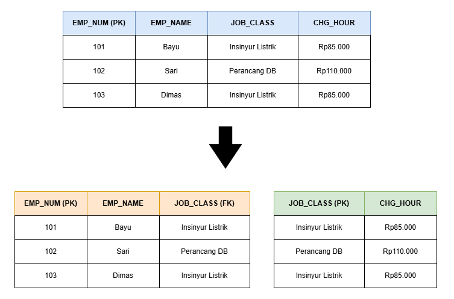
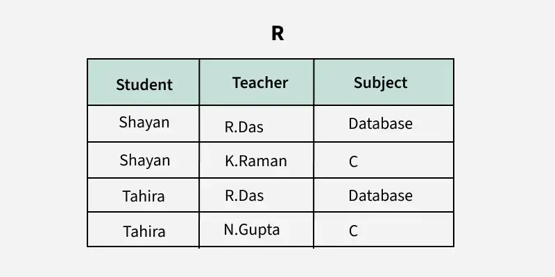
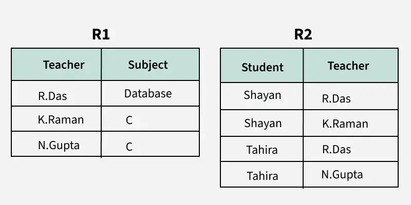
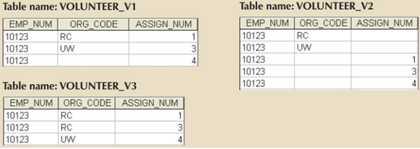
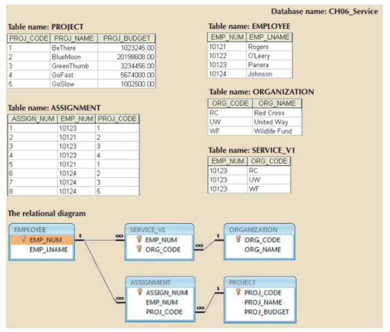
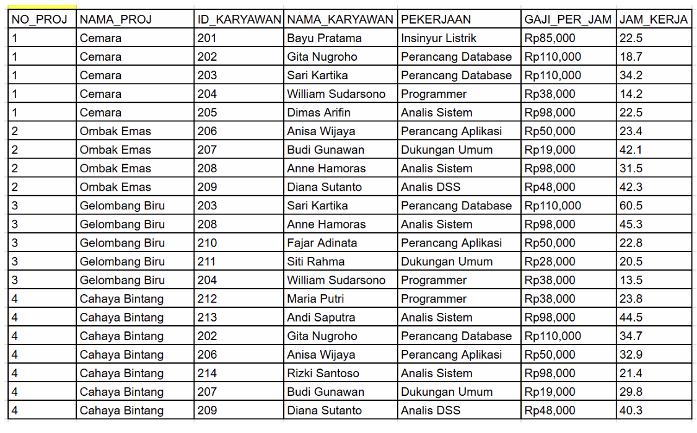
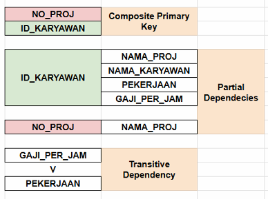
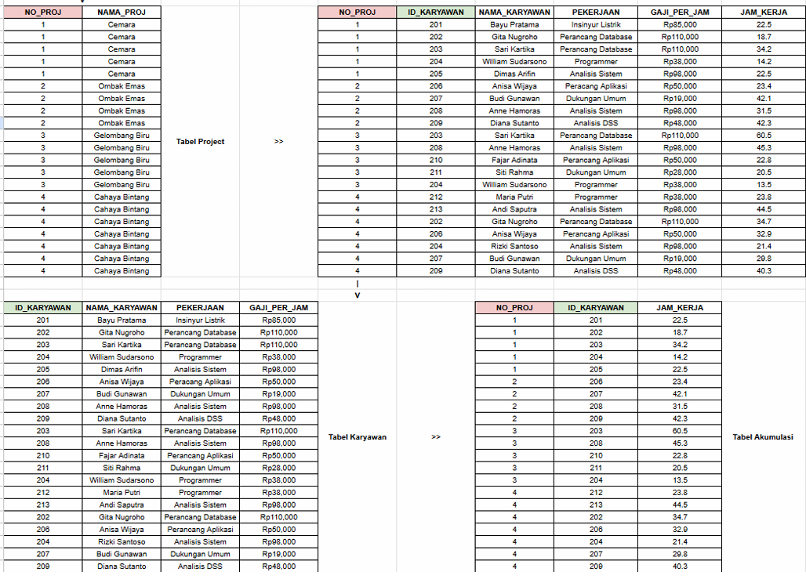
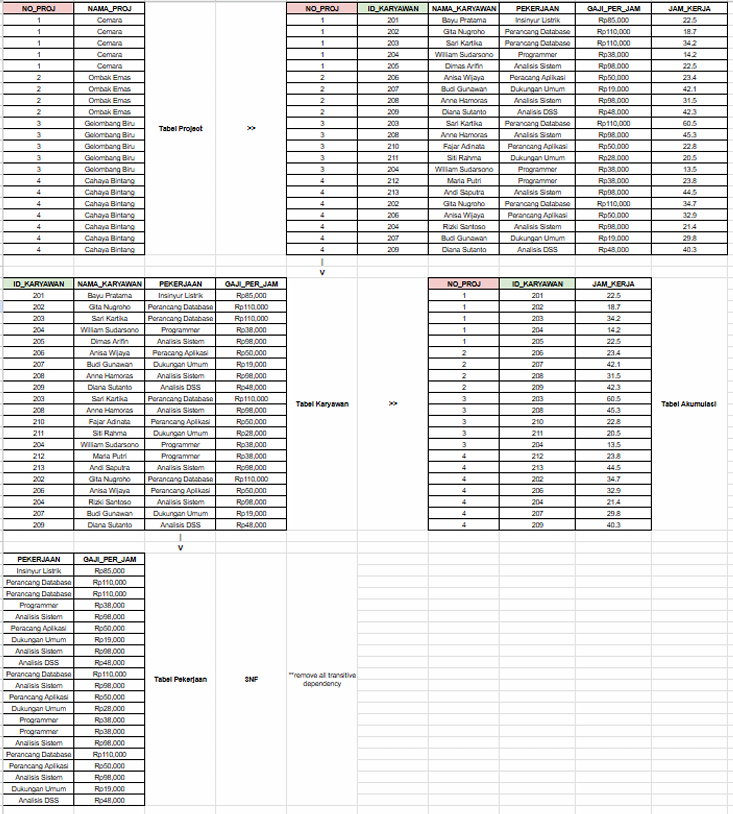

# Module 2

## Outline
- [Normalisasi Overview](#Normalisasi)  
- [Functional Dependency](#functional-dependency)
- [NF1](#NF1)  
- [NF2](#NF2)  
- [NF3](#NF3)  
- [BCNF](#bcnf-35)
- [NF4](#nf4)
- [Contoh Soal](#contoh-soal)

# Normalisasi

> Normalization is an important process in database design that helps improve the database's efficiency, consistency, and accuracy which is also a process for evaluating and correcting table structure to minimize and eliminate redundancies.


Normalisasi pada Entity-Relationship Diagram (ERD) adalah proses desain database yang bertujuan untuk mengurangi redundansi data dan memastikan struktur data yang efisien serta terhindar dari anomali. Normalisasi melibatkan pemisahan tabel yang besar menjadi tabel yang lebih kecil dan lebih terfokus pada entitas atau objek yang berbeda.

Tujuan utama normalisasi basis data adalah untuk menghindari kerumitan, menghilangkan duplikasi, dan mengatur data secara konsisten. Elemen - elemen yang biasa digunakan meliputi entitas, atribut, primary key, foreign key, dan composite key.

## Mengapa Normalisasi Penting?

Bayangkan sebuah toko online yang menyimpan semua datanya dalam satu tabel besar seperti ini:

| ID_ORDER | NAMA_PELANGGAN | ALAMAT_PELANGGAN | NAMA_PRODUK | HARGA | QTY |
|---|---|---|---|---|---|
| 1 | Bayu | Jl. Merdeka 10 | Laptop | 8.000.000 | 1 |
| 2 | Bayu | Jl. Merdeka 10 | Mouse | 150.000 | 2 |
| 3 | Sari | Jl. Sudirman 5 | Laptop | 8.000.000 | 1 |

**Masalah yang timbul:**

- **Redundansi:** Alamat Bayu disimpan dua kali. Jika Bayu pindah, harus update semua barisnya -- kalau ada yang terlewat, data menjadi tidak konsisten.
- **Anomali Insert:** Tidak bisa menyimpan data pelanggan baru kalau belum punya pesanan.
- **Anomali Delete:** Jika order ID 3 dihapus, informasi bahwa Laptop harganya 8 juta juga ikut hilang.
- **Anomali Update:** Mengubah harga Laptop di satu baris tapi tidak di baris lain menghasilkan inkonsistensi.

**Normalisasi adalah solusinya** -- proses sistematis untuk memecah tabel besar menjadi tabel-tabel yang lebih kecil dan terstruktur guna menghilangkan masalah di atas.

> Normal forms are defined structures for relations with a set of constraints that relations must satisfy in order to detect data redundancy and correct anomalies.

---

## Konsep Dasar

- Primary key adalah kolom yang secara unik mengidentifikasi baris data dalam tabel tersebut. Contohnya seperti seperti ID karyawan, ID mahasiswa, dan sebagainya.

- Foreign key merupakan bidang yang berhubungan dengan kunci utama dalam tabel lain.

- Composite key sama saja seperti kunci utama, hanya saja kunci ini tidak memiliki satu kolom saja, tetapi memiliki beberapa kolom.

- **Candidate Key:** Kolom (atau kombinasi kolom) yang *bisa* menjadi Primary Key -- nilainya unik dan tidak null. Sebuah tabel bisa memiliki lebih dari satu candidate key, dan salah satunya dipilih menjadi Primary Key.

---

Ada beberapa tahap yang dapat dilalui dalam melakukan normalisasi database


Setiap normal form membangun di atas syarat normal form sebelumnya secara kumulatif. Dengan kata lain, setiap relasi dalam 3NF juga pasti berada dalam 2NF, dan setiap relasi dalam 2NF juga pasti berada dalam 1NF -- seperti himpunan yang bersarang satu sama lain.

> 🢁 level NF ➡ 🢁 relasi join table ➡ 🢁 resources yang diperlukan untuk melakukan relasi = query berjalan lambat dan menghambat process.


Maksud dari pernyataan tersebut adalah semakin tinggi level normalisasi dalam database (🢁 level NF), maka:

- Semakin banyak relasi antar tabel (🢁 relasi join table) ➡ Karena normalisasi memecah data ke dalam tabel-tabel yang lebih kecil untuk menghindari redundansi dan memastikan integritas data. Akibatnya, untuk mengambil data yang sebelumnya ada dalam satu tabel, kini harus menggunakan JOIN antar beberapa tabel.

### Real Life Practices -- Memahami Trade-off: Normalisasi vs Performa

Ini adalah konsep yang **sangat penting** dalam praktik desain database nyata.

Untuk memahami ini secara konkret, bayangkan kita ingin mengambil data: *"Nama karyawan beserta nama proyek yang mereka kerjakan"*

**Dengan tabel UNF (semua dalam 1 tabel):**
```sql
SELECT NAMA_KARYAWAN, NAMA_PROJ FROM tabel_besar;
-- 1 tabel, langsung selesai
```

**Setelah normalisasi ke 3NF (data dipecah ke beberapa tabel):**
```sql
SELECT k.NAMA_KARYAWAN, p.NAMA_PROJ
FROM KARYAWAN k
JOIN AKUMULASI a ON k.ID_KARYAWAN = a.ID_KARYAWAN
JOIN PROJECT p ON a.NO_PROJ = p.NO_PROJ;
-- 3 tabel, butuh 2 operasi JOIN
```

Setiap operasi JOIN membutuhkan waktu dan memori server untuk mencocokkan baris dari dua tabel. Semakin banyak JOIN, semakin berat beban query.

### Perbandingan Level NF

| Level NF | Jumlah Tabel | Redundansi Data | Kecepatan READ | Kecepatan WRITE/UPDATE | Integritas Data |
|---|---|---|---|---|---|
| UNF / 1NF | Sedikit (1-2) | Sangat Tinggi | >> Cepat | << Lambat + rawan anomali | [✗] Rendah |
| 2NF | Sedang | Sedang | ~ Sedang | ~ Lebih baik | ~ Sedang |
| 3NF | Lebih banyak | Rendah | ~ Agak lambat | >> Cepat & Paling konsisten | [✔] Tinggi |
| BCNF / 4NF | Paling banyak | Sangat Rendah | << Paling lambat | >> Lebih konsisten dan koheren | [✔] Sangat Tinggi |

### Kapan Menggunakan Level NF yang Mana?

Pilihan level normalisasi adalah **keputusan desain**, bukan selalu "semakin tinggi semakin baik":

- **Sistem operasional (OLTP)** -- seperti aplikasi transaksi, e-commerce, sistem akademik ➡ gunakan **3NF**. Operasi tulis (insert/update) sering terjadi, sehingga integritas data lebih diprioritaskan.

- **Sistem analitik (OLAP/Data Warehouse)** ➡ sering sengaja menggunakan level normalisasi yang **lebih rendah** (bahkan kembali ke bentuk denormalisasi). Karena operasi yang sering dilakukan adalah READ data dalam jumlah besar, kecepatan query lebih diprioritaskan daripada integritas.

### Strategi Optimasi Performa pada Database Ternormalisasi (in real practices)
 
Ketika sudah memilih desain yang ternormalisasi namun performa tetap perlu dijaga, ada beberapa strategi yang bisa diterapkan **tanpa harus mengorbankan normalisasi**:
 
1. **Selective Denormalization** -- Identifikasi pola akses data yang paling sering, lalu pertimbangkan untuk menduplikasi data *hanya* di bagian tersebut secara strategis guna mengurangi operasi JOIN pada query kritis.
 
2. **Indexing** -- Terapkan index pada kolom yang sering di-query dan kolom yang digunakan sebagai kondisi JOIN. Index yang tepat bisa meningkatkan performa query secara signifikan tanpa mengubah struktur tabel sama sekali.
 
3. **Materialized Views** -- Untuk query kompleks yang sering dijalankan, buat *materialized view* sebagai hasil pre-komputasi. Ini sangat efektif untuk kebutuhan pelaporan (reporting) yang berulang.
 
4. **Query Optimization** -- Investasikan waktu untuk mengoptimalkan query SQL itu sendiri. Kadang, menulis ulang query atau menggunakan konstruksi SQL yang berbeda (seperti CTE atau subquery) bisa menghasilkan peningkatan performa tanpa perlu menyentuh skema database.
 
5. **Caching** -- Implementasikan caching di level aplikasi untuk data yang sering diakses. Ini mengurangi beban ke database dan mempercepat response time untuk request yang berulang.
 
> **[i] Catatan:** Strategi-strategi di atas adalah alternatif sebelum memutuskan untuk denormalisasi penuh. Mulailah dengan desain yang ternormalisasi, ukur performanya dengan data realistis, lalu terapkan strategi yang sesuai berdasarkan bottleneck yang benar-benar terjadi.

### [!] Common Mistakes dalam Normalisasi

- **Over-normalization:** Memecah tabel terlalu jauh tanpa alasan logis -- menambah kompleksitas tanpa manfaat nyata. Contoh: membuat tabel terpisah untuk setiap atribut sederhana seperti `nama` atau `email` padahal tidak ada kebutuhan many-to-one.

- **Under-normalization (karena malas):** Menyimpan data seperti daftar skill dalam satu kolom dengan format `"JavaScript,Python,SQL"` -- terlihat mudah di awal, tapi menjadi mimpi buruk saat perlu di-query.

- **Premature denormalization:** Mengorbankan normalisasi untuk performa *sebelum* ada bukti masalah performa yang nyata. Mulailah dengan desain yang ternormalisasi dengan baik, ukur performanya, baru denormalisasi area yang bermasalah berdasarkan data aktual -- bukan asumsi.

---

### Berikut adalah karakteristik-karakteristik yang harus dimiliki oleh tabel-tabel setelah proses normalisasi:

1. **Setiap Tabel Mewakili Satu Subjek**: Setiap tabel harus mewakili satu subjek atau entitas tertentu dalam basis data. Misalnya, jika Anda memiliki data pelanggan, maka tabel pelanggan harus berisi informasi yang relevan hanya tentang pelanggan, bukan campuran data tentang pelanggan dan pesanan mereka.
   
2. **Setiap Sel Hanya Memiliki Satu Nilai**: Setiap sel dalam tabel harus mengandung hanya satu nilai, bukan sekelompok nilai. Hal ini memastikan bahwa data dalam tabel tidak ambigu dan mudah diakses dan dikelola.
   
3. **Tidak Ada Data yang Disimpan di Lebih dari Satu Tabel**: Untuk menghindari redudansi dan konsistensi data, setiap data item (nilai atau informasi) harus disimpan hanya di satu tabel. Jika informasi yang sama diperlukan di tabel lain, gunakan relasi dan Foreign Key untuk menghubungkan tabel-tabel tersebut.
   
4. **Semua Atribut Non-Prime Bergantung pada Primary Key**: Atribut-atribut non-prime (atribut yang bukan bagian dari Primary Key) dalam sebuah tabel harus sepenuhnya bergantung pada Primary Key tabel tersebut. Ini memastikan bahwa data dalam tabel tetap konsisten dan relevan dengan Primary Key.
   
5. **Tidak Ada Anomali dalam Operasi Insert, Update, atau Delete**: Normalisasi juga bertujuan untuk menghilangkan anomali dalam operasi-operasi dasar seperti penyisipan (insertion), pembaruan (update), dan penghapusan (deletion) data. Anomali-anomali ini dapat terjadi saat struktur basis data tidak ter-normalisasi dengan baik, dan dapat mengakibatkan ketidak-konsistenan dan ketidak-integritasian data.

Dengan memastikan tabel-tabel dalam basis data memenuhi karakteristik-karakteristik di atas, kita dapat mencapai struktur data yang efisien, konsisten, dan mudah dikelola, serta menjaga integritas dan konsistensi data dalam jangka panjang.

---

# Functional Dependency

Sebelum masuk ke level NF, kita perlu memahami **Functional Dependency (FD)** -- ini adalah fondasi dari seluruh teori normalisasi.

## Apa itu Functional Dependency?

**Functional Dependency** terjadi ketika nilai suatu atribut *secara unik menentukan* nilai atribut lainnya.

**Notasi:** `A ➡ B` dibaca: *"A menentukan B"* atau *"B bergantung pada A"*

---

## Jenis-jenis Functional Dependency

Ada dua jenis ketergantungan yang menjadi target eliminasi dalam normalisasi:

### 1. Partial Dependency (Ketergantungan Parsial)

Partial dependencies adalah saat attribute itu dependent kepada sebuah subset primary key.

> **Partial dependency hanya bisa terjadi jika tabel memiliki Composite Primary Key.**

**Contoh:**

Misalkan PK adalah `(NO_PROJ, ID_KARYAWAN)`:

```
(NO_PROJ, ID_KARYAWAN) ➡ JAM_KERJA        [✔] Full dependency -- bergantung pada kedua PK
 NO_PROJ               ➡ NAMA_PROJ         [!] Partial dependency -- hanya bergantung pada NO_PROJ
 ID_KARYAWAN           ➡ NAMA_KARYAWAN     [!] Partial dependency -- hanya bergantung pada ID_KARYAWAN
```

`NAMA_PROJ` tidak butuh tahu `ID_KARYAWAN` untuk ditentukan -- cukup tahu `NO_PROJ`. Inilah partial dependency.

**Masalah yang ditimbulkan:** Jika nama proyek berubah, harus update di setiap baris yang mengandung proyek tersebut -- berpotensi inkonsistensi.

---

### 2. Transitive Dependency (Ketergantungan Transitif)

Transitive dependencies adalah saat attribute itu dependent kepada attribute lainnya yang bukan bagian dari primary key. dia lebih susah untuk di identifikasikan diantara dataset.

**Pola:** `PK ➡ A ➡ B` (B bergantung pada A, bukan langsung pada PK)

**Contoh:**

```
ID_KARYAWAN ➡ PEKERJAAN ➡ GAJI_PER_JAM
```

- `ID_KARYAWAN ➡ PEKERJAAN` [✔] -- Karyawan punya satu jenis pekerjaan
- `PEKERJAAN ➡ GAJI_PER_JAM` [✔] -- Setiap jenis pekerjaan punya tarif gaji tetap
- Akibatnya: `GAJI_PER_JAM` bergantung secara *transitif* pada `ID_KARYAWAN` melalui `PEKERJAAN`

Contoh lain yang sering dijumpai: pada tabel order, `customer_name` dan `customer_address` bergantung pada `customer_id`, sedangkan `customer_id` bergantung pada `order_id` -- sehingga terbentuk transitive dependency `order_id ➡ customer_id ➡ customer_name`.

**Masalah yang ditimbulkan:** Jika tarif gaji Insinyur Listrik naik dari Rp85.000 menjadi Rp90.000, harus update semua baris karyawan yang berprofesi Insinyur Listrik. Jika ada yang terlewat ➡ inkonsistensi data.

---

> [*] **Ringkasan:**
> - **Partial Dependency** ➡ dieliminasi saat normalisasi ke **2NF**
> - **Transitive Dependency** ➡ dieliminasi saat normalisasi ke **3NF**

---

# NF1

Suatu relasi berada dalam bentuk NF1 jika setiap atribut dalam relasi tersebut merupakan atribut bernilai tunggal. 
Untuk mengikuti Bentuk Normal Pertama (1NF) dalam database, aturan sederhana ini harus diikuti:

1. Setiap Kolom Harus Memiliki Nilai Tunggal
   Setiap kolom dalam tabel hanya boleh berisi satu nilai dalam satu sel. Tidak ada sel yang boleh berisi beberapa nilai. Jika satu sel berisi lebih dari satu nilai, tabel tersebut tidak mengikuti 1NF.

    **Contoh:** Tabel dengan kolom seperti [Penulis 1], [Penulis 2], dan [Penulis 3] untuk ID buku yang sama tidak berada dalam 1NF karena mengulang jenis informasi yang sama (penulis). Sebaliknya, semua penulis harus dicantumkan dalam baris terpisah.

2. Semua Nilai dalam Kolom Harus Bertipe Sama
   Setiap kolom harus menyimpan tipe data yang sama. Anda tidak dapat mencampur tipe informasi yang berbeda dalam kolom yang sama.

    **Contoh:** Jika kolom dimaksudkan untuk tanggal lahir (DOB), Anda tidak dapat menggunakannya untuk menyimpan nama. Setiap jenis informasi harus memiliki kolomnya sendiri.

3. Setiap Kolom Harus Memiliki Nama yang Unik
   Setiap kolom dalam tabel harus memiliki nama yang unik. Hal ini menghindari kebingungan saat mengambil, memperbarui, atau menambahkan data.
   
     **Contoh:** Jika dua kolom memiliki nama yang sama, sistem basis data mungkin tidak tahu kolom mana yang harus digunakan.

4. Urutan Data Tidak Penting
   Dalam 1NF, urutan penyimpanan data dalam tabel tidak memengaruhi cara kerja tabel. Anda dapat mengatur baris dengan cara apa pun tanpa melanggar aturan.

***

Langkah-langkah : 

1. Eliminasi group yang berulang-ulang dan pastikan setiap baris Hanya Mendefinisikan Satu Instance Entitas
   
   Hal ini berarti memastikan bahwa tidak ada kelompok entri yang berulang dalam satu baris tabel. setiap baris harus mewakili satu entitas tunggal, bukan gabungan entitas atau data yang ambigu. Sebelum normalisasi, tabel mungkin memiliki kelompok entri yang diulang untuk entitas yang sama, misalnya:
   


2. Ubah multivalued attribute menjadi single-valued

***

**Contoh :** 

- Berikut ada contoh dari tabel UNF (Unnormalized Form)


- Mengubah multivalued attribute menjadi single-valued attribute


- Identifikasikan Primary Key, dari tabel diatas tidak ada nilai yang unik yang dapat digunakan menjadi PK. Pada kasus ini primary key nya dapat terdiri dari PROJ_NUM and EMP_NUM.

- Setelah itu kita dapat Mengidentifikasikan dependencies nya. (PROJ_NUM, EMP_NUM) ➡ PROJ_NAME, EMP_NAME, JOB_CLASS, CHG_HOUR, HOURS 


**Tabel ini memenuhi 1NF karena:**
- [✔] Setiap sel bernilai tunggal (atomic)
- [✔] Tidak ada repeating group
- [✔] Setiap baris dapat dikenali secara unik melalui composite key `(PROJ_NUM, EMP_NUM)`
- [✔] Urutan baris tidak memengaruhi fungsi tabel

> [!] **Namun**, tabel ini belum 2NF -- karena composite key `(PROJ_NUM, EMP_NUM)` memiliki **partial dependency** (PROJ_NAME hanya bergantung pada PROJ_NUM, EMP_NAME hanya bergantung pada EMP_NUM).

# NF2

Bentuk 2NF didasarkan pada konsep ketergantungan fungsional penuh. Ini adalah cara untuk mengatur tabel basis data sehingga mengurangi redundansi dan memastikan konsistensi data. Agar tabel berada dalam 2NF, tabel tersebut harus terlebih dahulu memenuhi persyaratan Bentuk Normal Pertama (1NF), yang berarti semua kolom harus berisi nilai tunggal yang tidak dapat dibagi tanpa kelompok yang berulang. Selain itu, tabel tidak boleh memiliki ketergantungan parsial.

***Need to Note!***

- Konversi ke Normalisasi Tingkat Kedua (2NF) hanya terjadi ketika Normalisasi Tingkat Pertama (1NF) memiliki Primary Key yang terdiri dari beberapa atribut (composite PK).

- Jika Normalisasi Tingkat Pertama (1NF) memiliki Primary Key yang terdiri dari satu atribut saja, maka tabel tersebut otomatis berada dalam Normalisasi Tingkat Kedua (2NF).

- Tabel dikatakan berada dalam Normalisasi Tingkat Kedua (2NF) jika:

    a. Tabel tersebut sudah dalam Normalisasi Tingkat Pertama (1NF).

    b. Tidak ada ketergantungan parsial dalam tabel tersebut.

Langkah-langkah konversi dari Normalisasi Tingkat Pertama (1NF) ke Normalisasi Tingkat Kedua (2NF) adalah sebagai berikut:

1. **Identifikasi semua partial dependency**

   Dari tabel 1NF dengan PK `(PROJ_NUM, EMP_NUM)`:

   ```
   PROJ_NUM              ➡ PROJ_NAME          [!] Partial dependency
   EMP_NUM               ➡ EMP_NAME           [!] Partial dependency
   EMP_NUM               ➡ JOB_CLASS          [!] Partial dependency
   EMP_NUM               ➡ CHG_HOUR           [!] Partial dependency
   (PROJ_NUM, EMP_NUM)   ➡ HOURS              [✔] Full dependency
   ```

   Artinya: `PROJ_NAME`, `EMP_NAME`, `JOB_CLASS`, dan `CHG_HOUR` **tidak membutuhkan kedua PK** untuk ditentukan nilainya -- ini adalah partial dependency yang harus dieliminasi.

2. **Buat Tabel Baru untuk Menghilangkan Ketergantungan Parsial:** Langkah pertama adalah membuat tabel baru untuk menghilangkan ketergantungan parsial yang ada dalam tabel yang sudah dalam Normalisasi Tingkat Pertama (1NF). Ketergantungan parsial terjadi ketika atribut non-Key hanya bergantung sebagian pada Primary Key.

   Untuk setiap komponen Composite PK, buat tabel tersendiri:

   - **Tabel PROJECT** ➡ PK: `PROJ_NUM`, berisi: `PROJ_NAME`
   - **Tabel EMPLOYEE** ➡ PK: `EMP_NUM`, berisi: `EMP_NAME`, `JOB_CLASS`, `CHG_HOUR`
   - **Tabel ASSIGNMENT** (tabel hubungan) ➡ PK: `(PROJ_NUM, EMP_NUM)`, berisi: `HOURS`

3. **Pindahkan atribut yang bergantung ke tabel yang sesuai:** Setelah tabel baru dibuat untuk menghilangkan ketergantungan parsial, atribut-atribut yang bergantung harus diarahkan kembali ke tabel yang sesuai. Hal ini dilakukan untuk memastikan bahwa setiap atribut non-Key bergantung sepenuhnya pada Primary Key dan tidak ada ketergantungan parsial yang tersisa.

Dalam konteks normalisasi, langkah-langkah ini berguna untuk menghilangkan ketergantungan parsial dan memastikan bahwa setiap tabel dalam basis data memiliki Primary Key yang sesuai dan tidak redundan. Dengan memisahkan Primary Key gabungan (composite) menjadi komponen yang terpisah, kita dapat mengelompokkan data dengan lebih efisien dan mengurangi risiko anomali dalam operasi insert, update, dan delete.


**Verifikasi:** Tabel ASSIGNMENT sekarang memenuhi 2NF karena:
- [✔] Sudah dalam 1NF
- [✔] Satu-satunya atribut non-key (`HOURS`) bergantung penuh pada composite key `(PROJ_NUM, EMP_NUM)` -- tidak ada partial dependency

> [!] **Namun**, tabel EMPLOYEE **belum 3NF** -- masih ada transitive dependency: `EMP_NUM ➡ JOB_CLASS ➡ CHG_HOUR`.

# NF3

Normalisasi data dalam bentuk NF3  bertujuan untuk menghilangkan seluruh atribut yang tidak berhubungan dengan primary key. Normalisasi pada tingkat ini menghilangkan ketergantungan transitif. Syarat dari bentuk normal ketiga atau 3NF adalah :

- Sudah dalam bentuk NF2

- Tidak mengandung ketergantungan transitif

Secara formal, tabel berada dalam 3NF jika memenuhi kondisi: untuk setiap functional dependency non-trivial `X ➡ Y`, berlaku bahwa **X adalah superkey**, *atau* **Y adalah prime attribute** (bagian dari candidate key).

3NF penting karena menghilangkan redundansi yang tersisa setelah 2NF, mencegah anomali update, dan memastikan semua functional dependencies dipertahankan sehingga tidak ada informasi yang hilang saat dekomposisi tabel.

## Mengidentifikasi Transitive Dependency

**Contoh** dari ketergantungan transitif :

Perhatikan tabel EMPLOYEE hasil 2NF:

| EMP_NUM (PK) | EMP_NAME | JOB_CLASS | CHG_HOUR |
|---|---|---|---|
| 101 | Bayu | Insinyur Listrik | Rp85.000 |
| 102 | Sari | Perancang DB | Rp110.000 |
| 103 | Dimas | Insinyur Listrik | Rp85.000 |

**Analisis dependency:**

```
EMP_NUM  ➡ JOB_CLASS    [✔] Bergantung langsung pada PK
JOB_CLASS ➡ CHG_HOUR    [!] CHG_HOUR bergantung pada JOB_CLASS, bukan pada EMP_NUM!
```

Ini adalah **transitive dependency**: `EMP_NUM ➡ JOB_CLASS ➡ CHG_HOUR`



- Jika tarif per jam untuk suatu klasifikasi pekerjaan yang dipegang oleh karyawan berbeda-beda 

- Maka harus memperbarui semua rekaman yang terkait, jika tidak memperbarui beberapa rekaman karyawan, maka karyawan yang berbeda dengan deskripsi pekerjaan yang sama akan menghasilkan tarif per jam yang berbeda.

Dari contoh tersebut membahas atribut tarif per jam yang memiliki ketergantungan pada atribut klasifikasi pekerjaan yang bukan PK. Hal ini bisa diatasi dengan membuat tabel baru untuk menormalisasikannya. Ketergantungan tersebut jika dibiarkan dapat menghasilkan inkonsistensi data.

---

## Langkah-langkah Transformasi ke 3NF

**Langkah 1: Identifikasi semua transitive dependency**

```
JOB_CLASS ➡ CHG_HOUR    [!] Transitive dependency ditemukan
```

**Langkah 2: Pindahkan atribut yang terlibat ke tabel baru**

Buat tabel baru dengan `JOB_CLASS` sebagai PK:

- **Tabel JOB** ➡ PK: `JOB_CLASS`, berisi: `CHG_HOUR`
- **Tabel EMPLOYEE** (diperbarui) ➡ PK: `EMP_NUM`, berisi: `EMP_NAME`, `JOB_CLASS` *(sebagai FK ke tabel JOB)*

**Langkah 3: Pertahankan Foreign Key sebagai penghubung**

`JOB_CLASS` tetap ada di tabel EMPLOYEE sebagai Foreign Key yang merujuk ke tabel JOB -- sehingga relasi antar data tetap terjaga.

**Tabel EMPLOYEE setelah 3NF memenuhi syarat karena:**
- [✔] Sudah dalam 2NF
- [✔] Tidak ada atribut non-key (`EMP_NAME`, `JOB_CLASS`) yang bergantung pada atribut non-key lainnya
- [✔] `CHG_HOUR` sudah dipindah ke tabel JOB yang tepat

> [i] **Catatan:** Setelah 3NF, untuk mendapatkan informasi lengkap karyawan beserta tarifnya, kita perlu melakukan JOIN antara tabel EMPLOYEE dan tabel JOB -- ini adalah trade-off yang sudah kita bahas di bagian Overview.

# BCNF (3.5)

Normalisasi data yang sering disebut juga dengan BCNF 3.5. BCNF merupakan singkatan dari BCNF merupakan singkatan dari Boyce-Codd Normal Form yang memiliki hubungan erat dengan NF3. Normalisasi ini menghandle anomali dan overlooping yang tidak dapat di handle dalam bentuk 3NF. Normalisasi database bentuk ini tergantung dari kasus yang disediakan, tidak semua tabel wajib di normalisasi dalam bentuk BCNF.

Syarat dari BCNF adalah :

- Setiap determinan dalam tabel adalah kunci kandidat (candidate key).

**Syarat BCNF secara formal:** Untuk setiap functional dependency non-trivial `X ➡ Y`, **X harus merupakan superkey**.

Perbedaan dengan 3NF: jika 3NF masih mengizinkan `X ➡ Y` selama Y adalah prime attribute, BCNF lebih ketat -- X *tetap harus* superkey tanpa pengecualian.

Ketika tabel hanya memiliki satu candidate key, maka BCNF sama dengan Normalisasi Tingkat Ketiga (3NF). Namun, BCNF dapat dilanggar jika tabel memiliki lebih dari satu candidate key.
Dengan kata lain, BCNF memastikan bahwa setiap determinan dalam tabel secara independen menentukan setiap atribut lainnya dalam tabel, tanpa ada ketergantungan yang tidak perlu. Hal ini membantu mengurangi redundansi data dan memastikan integritas data yang lebih baik dalam basis data.

## Kapan 3NF Tidak Cukup?

Sejak BCNF merupakan kasus khusus dari Normalisasi Tingkat Ketiga (3NF), bagaimana mungkin tabel berada dalam 3NF tapi melanggar BCNF?

Jawabannya :

- Salah satu atribut Key menjadi determinan dari atribut Key lainnya.
  
- Kondisi ini tidak melanggar 3NF (tidak ada ketergantungan transitif).
  
- Namun, tidak memenuhi BCNF.

Dalam konteks ini, tabel dapat memenuhi semua syarat Normalisasi Tingkat Ketiga (3NF) karena tidak ada ketergantungan transitif yang menyebabkan anomali data. Namun, untuk memenuhi BCNF, tabel harus memastikan bahwa setiap determinan dalam tabel adalah candidate key, dan tidak ada ketergantungan fungsional di antara atribut key. Jika ada situasi di mana salah satu atribut key menjadi determinan dari atribut Key lainnya, maka tabel tersebut akan melanggar BCNF meskipun tetap memenuhi syarat 3NF.

## Contoh Abstrak

- A+B ➡ C, D
  
- A+C ➡ B, D
  
- C ➡ B

dikarenakan terdapat dependency antara C dan B, table nya gagal untuk memenuhi BCNF.

## Contoh Konteks Nyata -- Jadwal Mengajar

Perhatikan relasi R dengan atribut `(STUDENT, TEACHER, SUBJECT)`:



**Functional Dependencies:**
```
(STUDENT, TEACHER)  ➡ SUBJECT    [✔] Candidate key 1
(STUDENT, SUBJECT)  ➡ TEACHER    [✔] Candidate key 2
TEACHER             ➡ SUBJECT    [!] TEACHER menentukan SUBJECT, tapi TEACHER bukan candidate key!
```

Relasi ini sudah berada dalam 3NF (tidak ada transitive dependency pada non-prime attribute), namun **melanggar BCNF** -- karena pada FD `TEACHER ➡ SUBJECT`, TEACHER bukan superkey. Akibatnya: jika kita menghapus data Bayu, informasi bahwa Bu Rina mengajar Database ikut hilang -- ini adalah anomali delete.

## Solusi

Untuk memenuhi BCNF, kita dapat melakukan langkah-langkah berikut:

1. **Pisahkan tabel** berdasarkan determinan yang melanggar:

   **Dekomposisi menjadi 2 tabel:**



2. Atau **ubah kunci utama** menjadi A+C (pada contoh abstrak), karena ini akan menghilangkan ketergantungan parsial dalam kunci gabungan.

> [!] **Catatan penting:** BCNF decomposition tidak selalu bisa mempertahankan semua functional dependency (*dependency preserving*), namun selalu memenuhi *lossless join* -- tidak ada informasi yang hilang saat tabel digabung kembali. Selain itu, tidak semua tabel wajib dinormalisasi ke BCNF -- hanya diterapkan jika anomali yang ditargetkan memang ada dalam tabel tersebut.

[Klik disini untuk penjelasan lebih lanjut lainnya tentang BCNF!](https://youtu.be/NNjUhvvwOrk?si=zYpgF0IKjK9_VgiS)

# NF4

Ketergantungan multivariabel (multivalued dependencies) terjadi ketika satu kunci menghasilkan dua atau lebih nilai dari dua atribut lainnya yang independen satu sama lain. Dalam konteks Normalisasi Tingkat Keempat (4NF), tidak ada baris yang mengandung dua atau lebih ketergantungan multivariabel berarti tidak ada situasi di mana satu kunci menghasilkan beberapa nilai dari dua atribut lainnya yang independen.

**Multivalued Dependency (MVD)** adalah generalisasi dari functional dependency, namun keduanya berbeda: pada FD, satu nilai A menentukan tepat satu nilai B; pada MVD, satu nilai A menentukan *sekumpulan* nilai B secara independen dari atribut lainnya.

**Notasi MVD:** `A ➡ B` dibaca: *"A multi-determines B"*

**Syarat MVD terjadi:** MVD `A ➡ B` membutuhkan minimal 3 atribut, dan B serta C (atribut ketiga) harus **independen satu sama lain**.

## Kapan MVD Terjadi?

MVD terjadi ketika: untuk satu nilai A, terdapat banyak nilai B **dan** banyak nilai C, dimana B dan C **tidak saling bergantung satu sama lain** (independen).

**Contoh nyata:** Sebuah kursus bisa memiliki banyak instruktur, dan sebuah kursus juga bisa memiliki banyak penulis buku teks. Namun instruktur dan penulis buku teks tidak saling bergantung -- pilihan instruktur tidak menentukan penulis buku, dan sebaliknya. Ini menciptakan dua MVD independen:

```
Course ➡ Instructor
Course ➡ TextBook_Author
```

Jika disimpan dalam satu tabel, muncul *cartesian product effect*: jika sebuah kursus punya 3 instruktur dan 2 penulis buku, dibutuhkan **3 x 2 = 6 baris** hanya untuk merepresentasikan semua kombinasi -- padahal tidak ada hubungan nyata antara instruktur dan penulis.

Dengan kata lain, jika sebuah tabel tidak memiliki ketergantungan multivariabel, maka setiap nilai kunci hanya menghasilkan satu nilai untuk setiap atribut yang terkait, dan tidak ada hubungan yang kompleks di antara nilai-nilai tersebut. Hal ini membantu menjaga integritas dan struktur data yang lebih terorganisir dalam basis data.

## Syarat 4NF

Untuk memenuhi Normalisasi Tingkat Keempat (4NF), tabel harus memenuhi dua syarat utama:

1. Sudah dalam Normalisasi Tingkat Ketiga (3NF) / BCNF.

2. Tidak memiliki ketergantungan multivariabel (multivalued dependencies), yang berarti tidak ada baris yang mengandung dua atau lebih ketergantungan multivariabel.

**Contohnya**



- Karyawan dapat memiliki banyak penugasan dan juga dapat terlibat dalam beberapa organisasi pelayanan.

- Ini mengacu pada ketergantungan multivariabel ketika satu kunci menentukan nilai-nilai ganda dari dua atribut lainnya dan atribut-atribut tersebut independen satu sama lain.

**Analisis MVD:**
```
EMP_NUM ➡ ORG_CODE      (satu karyawan bisa di banyak organisasi)
EMP_NUM ➡ ASSIGN_NUM    (satu karyawan bisa punya banyak penugasan)
```

ORG_CODE dan ASSIGN_NUM **independen satu sama lain** -- pilihan organisasi tidak menentukan penugasan, dan sebaliknya. Namun keduanya sama-sama ditentukan oleh EMP_NUM.

**Masalah:** Jika karyawan bergabung ke organisasi baru, kita harus menambah baris baru untuk *setiap kombinasi* dengan ASSIGN_NUM yang ada -- sangat tidak efisien dan rawan inkonsistensi.

**Solusinya adalah:**

- Membuat tabel baru untuk komponen ketergantungan multivariabel.

- Dalam contoh ini, kita dapat membuat tabel untuk ASSIGNMENT dan SERVICES_V1.

  - **Tabel SERVICE** ➡ berisi: `EMP_NUM`, `ORG_CODE`
  - **Tabel ASSIGNMENT** ➡ berisi: `EMP_NUM`, `ASSIGN_NUM`

Dengan pemisahan ini, menambah organisasi baru untuk seorang karyawan cukup menambah **satu baris** di tabel SERVICE -- tidak perlu menyentuh tabel ASSIGNMENT sama sekali.



**Manfaat dekomposisi 4NF:**
- **Tidak ada redundansi kombinasi:** Organisasi dan penugasan disimpan di tabel terpisah -- tidak ada pasangan yang tidak perlu.
- **Tidak ada anomali:** Menambah organisasi baru tidak mempengaruhi data penugasan, dan sebaliknya.
- **Setiap tabel fokus pada satu MVD:** Masing-masing tabel hasil dekomposisi kini berada dalam BCNF dan 4NF.

# Contoh Soal

## Dataset



Diberikan sebuah tabel normalisasi data, tentukan:

1. Dalam bentuk apakah tabel saat ini?

1. Identifikasi Primary Key, Partial Dependencies, dan Transitive Dependencies. 

2. Tabel Hasil Transformasi menjadi NF2 

3. Tabel Hasil Transformasi menjadi NF3

---

## Pembahasan

### Pertanyaan 1 -- Identifikasi Level NF Saat Ini

**Jawaban: Tabel berada dalam 1NF**

Tabel ini memenuhi syarat 1NF karena:
- [✔] Setiap sel bernilai tunggal (atomic) -- tidak ada sel berisi lebih dari satu nilai
- [✔] Tidak ada repeating group (kolom berulang untuk jenis data yang sama)
- [✔] Setiap baris dapat dikenali secara unik

**Namun, tabel ini BELUM 2NF** karena memiliki Composite Primary Key `(NO_PROJ, ID_KARYAWAN)` dengan partial dependencies di dalamnya.

---

### Pertanyaan 2 -- Identifikasi Dependencies



**Primary Key:** Composite Key `(NO_PROJ, ID_KARYAWAN)`

**Partial Dependencies yang ditemukan:**
```
NO_PROJ      ➡ NAMA_PROJ                               [!] Partial
ID_KARYAWAN  ➡ NAMA_KARYAWAN, PEKERJAAN, GAJI_PER_JAM  [!] Partial
```

Penjelasan: `NAMA_PROJ` hanya butuh tahu `NO_PROJ` untuk ditentukan -- tidak perlu tahu `ID_KARYAWAN`. Begitu pula `NAMA_KARYAWAN`, `PEKERJAAN`, dan `GAJI_PER_JAM` hanya bergantung pada `ID_KARYAWAN`.

**Full Dependency yang ada:**
```
(NO_PROJ, ID_KARYAWAN) ➡ JAM_KERJA    [✔] Full dependency
```

`JAM_KERJA` memang membutuhkan **kedua** nilai PK -- berapa jam seorang karyawan (`ID_KARYAWAN`) bekerja di sebuah proyek (`NO_PROJ`) adalah data unik per kombinasi keduanya.

**Transitive Dependency yang ditemukan:**
```
ID_KARYAWAN ➡ PEKERJAAN ➡ GAJI_PER_JAM    [!] Transitive
```

`GAJI_PER_JAM` tidak bergantung langsung pada `ID_KARYAWAN`, melainkan bergantung pada `PEKERJAAN` -- dan `PEKERJAAN` yang bergantung pada `ID_KARYAWAN`. Semua karyawan dengan pekerjaan yang sama akan selalu memiliki `GAJI_PER_JAM` yang sama.

---

### Pertanyaan 3 -- Transformasi ke 2NF

**Langkah:** Pisahkan setiap partial dependency ke tabel tersendiri.

Dari analisis di atas, kita buat **3 tabel**:

**Tabel PROJECT** (dari partial dependency pada `NO_PROJ`):

| NO_PROJ (PK) | NAMA_PROJ |
|---|---|
| 1 | Cemara |
| 2 | Ombak Emas |
| 3 | Gelombang Biru |
| 4 | Cahaya Bintang |

**Tabel KARYAWAN** (dari partial dependency pada `ID_KARYAWAN`):

| ID_KARYAWAN (PK) | NAMA_KARYAWAN | PEKERJAAN | GAJI_PER_JAM |
|---|---|---|---|
| 201 | Bayu Pratama | Insinyur Listrik | Rp85.000 |
| 202 | Gita Nugroho | Perancang Database | Rp110.000 |
| ... | ... | ... | ... |

**Tabel AKUMULASI** (full dependency -- tabel hubungan):

| NO_PROJ (PK, FK) | ID_KARYAWAN (PK, FK) | JAM_KERJA |
|---|---|---|
| 1 | 201 | 22.5 |
| 1 | 202 | 18.7 |
| ... | ... | ... |

**Hasil tabel setelah 2NF:**



**Verifikasi:** Tabel KARYAWAN sudah 2NF karena semua atribut non-key (`NAMA_KARYAWAN`, `PEKERJAAN`, `GAJI_PER_JAM`) bergantung penuh pada PK tunggal `ID_KARYAWAN`. Tabel AKUMULASI sudah 2NF karena `JAM_KERJA` bergantung penuh pada composite key `(NO_PROJ, ID_KARYAWAN)`.

> [!] **Namun**, tabel KARYAWAN **belum 3NF** -- masih ada transitive dependency: `ID_KARYAWAN ➡ PEKERJAAN ➡ GAJI_PER_JAM`.

---

### Pertanyaan 4 -- Transformasi ke 3NF

**Langkah:** Pisahkan transitive dependency ke tabel baru.

Karena `PEKERJAAN ➡ GAJI_PER_JAM`, kita pisahkan ke tabel tersendiri:

**Tabel PEKERJAAN** (tabel baru untuk transitive dependency):

| PEKERJAAN (PK) | GAJI_PER_JAM |
|---|---|
| Insinyur Listrik | Rp85.000 |
| Perancang Database | Rp110.000 |
| Programmer | Rp38.000 |
| Analis Sistem | Rp98.000 |
| Perancang Aplikasi | Rp50.000 |
| Dukungan Umum | Rp19.000 |
| Analis DSS | Rp48.000 |

**Tabel KARYAWAN** (diperbarui -- `GAJI_PER_JAM` dihapus, `PEKERJAAN` dijadikan FK):

| ID_KARYAWAN (PK) | NAMA_KARYAWAN | PEKERJAAN (FK) |
|---|---|---|
| 201 | Bayu Pratama | Insinyur Listrik |
| 202 | Gita Nugroho | Perancang Database |
| ... | ... | ... |

**Hasil tabel setelah 3NF:**



**Verifikasi akhir:**
- [✔] Tabel PROJECT: 3NF -- PK tunggal `NO_PROJ`, tidak ada dependency lain
- [✔] Tabel KARYAWAN: 3NF -- tidak ada transitive dependency (`GAJI_PER_JAM` sudah dipindah)
- [✔] Tabel PEKERJAAN: 3NF -- PK tunggal `PEKERJAAN`, hanya ada satu atribut non-key
- [✔] Tabel AKUMULASI: 3NF -- tidak ada atribut non-key selain `JAM_KERJA`

> [i] **Manfaat nyata:** Sekarang jika tarif Insinyur Listrik naik, kita cukup **update satu baris** di tabel PEKERJAAN -- semua karyawan Insinyur Listrik otomatis ter-update karena mereka mengacu ke tabel yang sama via FK.

***

# References

- https://www.geeksforgeeks.org/introduction-of-database-normalization/ *(GeeksforGeeks -- Introduction of Database Normalization)*

- https://www.geeksforgeeks.org/first-normal-form-1nf/ *(GeeksforGeeks -- First Normal Form)*

- https://www.geeksforgeeks.org/second-normal-form-2nf/ *(GeeksforGeeks -- Second Normal Form)*

- https://www.geeksforgeeks.org/third-normal-form-3nf/ *(GeeksforGeeks -- Third Normal Form)*

- https://www.geeksforgeeks.org/boyce-codd-normal-form-bcnf/ *(GeeksforGeeks -- Boyce-Codd Normal Form)*

- https://www.geeksforgeeks.org/introduction-of-4th-and-5th-normal-form-in-dbms/ *(GeeksforGeeks -- 4th Normal Form)*

- https://medium.com/@artemkhrenov/understanding-database-normalization-from-1nf-to-bcnf-3893fac16fc9 *(Artem Khrienov -- Understanding Database Normalization: From 1NF to BCNF)*

- https://medium.com/@renan.de.moraes777/normalization-in-action-balancing-structure-and-performance-in-data-modeling-36760ee933df *(Renan De Moraes -- Normalization in Action)*

- https://youtu.be/NNjUhvvwOrk?si=zYpgF0IKjK9_VgiS *(YouTube -- Normalization in DBMS)*