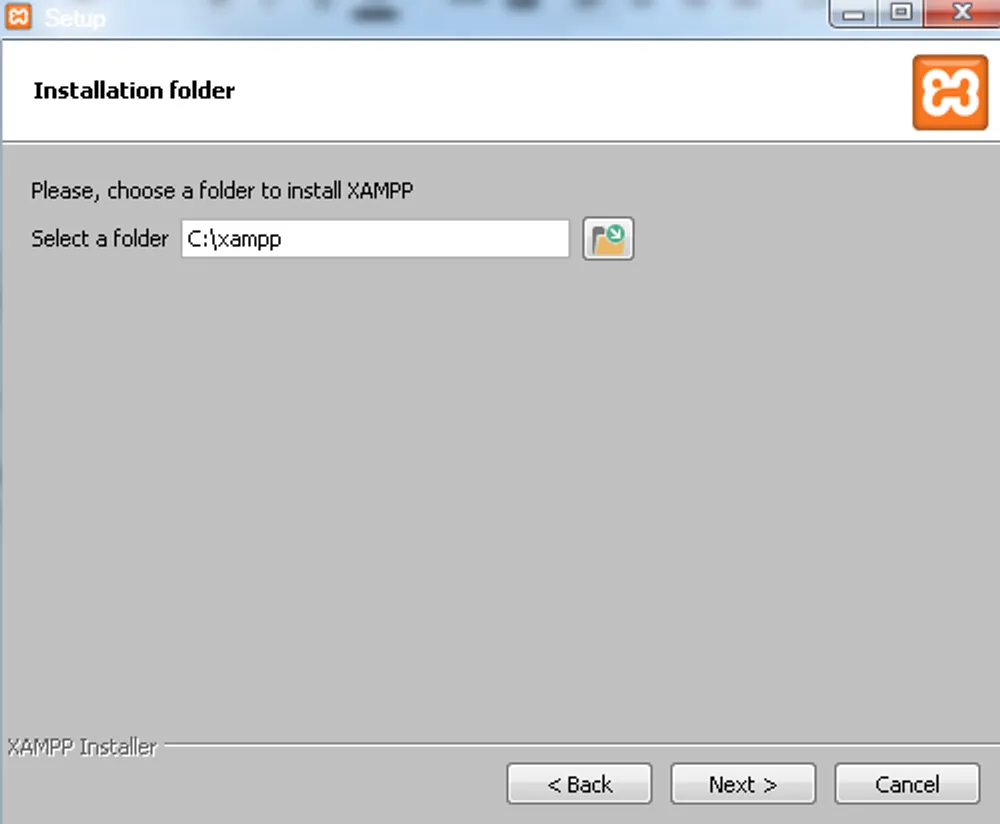
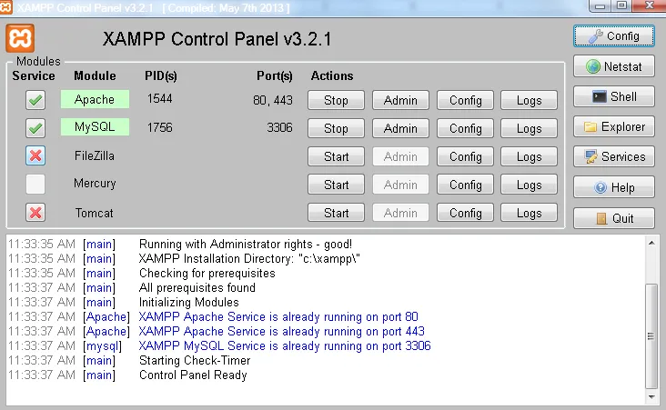
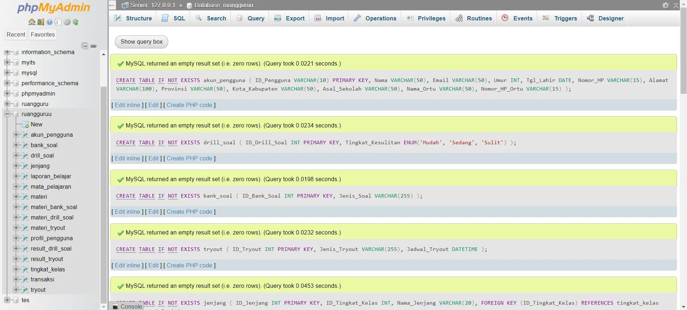
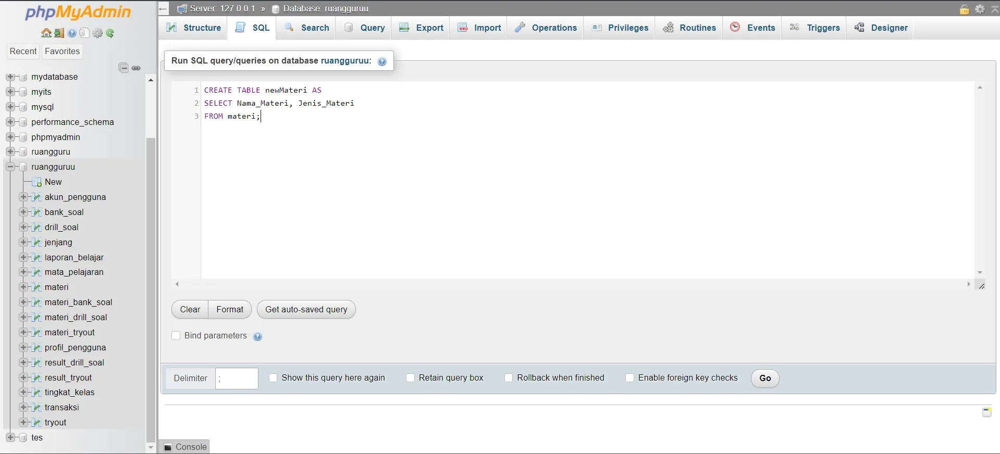
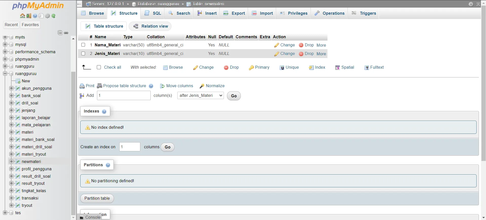

# Module 3

# Pengenalan MySQL

Setiap bahasa pemrograman memiliki fungsi yang berbeda. Begitu pula dengan Structured Query Language (SQL). SQL adalah bahasa query yang dirancang untuk pengambilan informasi tertentu dari database. Meskipun saat ini sudah ada berbagai jenis database, seperti MySQL, Microsoft SQL Server, dan PostgreSQL. Akan tetapi mayoritas database tersebut tetap menggunakan dasar SQL.


Lalu, apakah SQL tetap berguna jika digunakan bersamaan dengan bahasa pemrograman yang lain? Jawabannya iya. Sebagai contoh, jika menggunakan bahasa pemrograman Python, biasanya tetap membutuhkan SQL untuk mengambil data dari database. Maka, dapat disimpulkan bahwa SQL adalah salah satu bahasa query dasar dalam pengelolaan database.

MySQL masuk ke dalam jenis RDBMS (Relational Database Management System). Maka dari itu, istilah semacam baris, kolom, tabel, dipakai pada MySQL. Contohnya di dalam MySQL sebuah database terdapat satu atau beberapa tabel.

# Kelebihan MySQL

1. **Mendukung Integrasi dengan Bahasa Pemrograman Lain**

_Website_ atau perangkat lunak terkadang dikembangkan dengan menggunakan berbagai macam bahasa pemrograman, jadi kita tidak perlu khawatir jika menggunakan MySQL. Maka dari itu, MySQL bisa membantu kita untuk mengembangkan perangkat lunak yang lebih efektif dan tentu saja lebih mudah dengan integrasi antarbahasa pemrograman.

2. **_Open Source_**

MySQL adalah aplikasi yang memiliki lisensi GPL gratis di bawah pengelolaan Oracle. Jadi, kita bisa dengan mudah mencari solusi jika ada masalah karena terdapat banyak komunitas dan dokumentasi yang membahas tentang MySQL.

3. **Tidak Membutuhkan RAM Besar**

MySQL dapat dipasang pada server dengan spesifikasi kecil. Jadi tidak perlu khawatir jika hanya mempunyai server dengan kapasitas 1 GB karena kita masih bisa menggunakan MySQL sebagai _database_.

4. **Mendukung Multi User**

MySQL dapat dipakai oleh beberapa user dalam waktu bersamaan tanpa membuatnya crash atau berhenti bekerja. Ini dapat dimanfaatkan ketika mengerjakan proyek yang sifatnya tim sehingga seluruh tim dapat bekerja dalam waktu bersamaan tanpa harus menunggu user lain selesai.

5. **Struktur Tabel yang Fleksibel**

MySQL mempunyai struktur tabel yang mudah dipakai dan fleksibel. Contohnya saat MySQL memproses `ALTER TABLE` dan lain sebagainya. Jika dibandingkan dengan database lain seperti Oracle dan PostgreSQL, MySQL tergolong lebih mudah.

6. **Tipe Data yang Bervariasi**

Kelebihan lain dari MySQL adalah mendukung berbagai macam data yang bisa digunakan di MySQL. Contohnya float, integer, date, char, text, timestamp, double, dan lain sebagainya. Jadi manajemen database sistem ini sangat membantu untuk mengembangkan perangkat lunak yang berguna untuk pengelolaan database di server.

7. **Keamanan yang Terjamin**

Open source bukan berarti MySQL menyediakan keamanan yang buruk. Malah sebaliknya, MySQL mempunyai fitur keamanan yang cukup apik. Ada beberapa lapisan keamanan yang diterapkan oleh MySQL, seperti level nama host, dan subnetmask. Selain itu MySQL juga dapat mengatur hak akses user dengan enkripsi password tingkat tinggi.

# Kekurangan MySQL

1. **Sulit Mengelola Data yang Besar**

Seperti yang diketahui, MySQL adalah *software* yang ramah dengan spesifikasi rendah. Maka itu, fitur yang ditawarkan tidak selengkap dengan aplikasi lainnya. Jika kamu ingin menggunakan *database* yang cukup besar, ada baiknya untuk menggunakan sistem manajemen *database* selain MySQL seperti PostgreSQL, Oracle Database, Miscrosoft SQL Server, Amazon Aurora, Google BigQuery, Apache Cassandra, dll).

2. **Kurangnya *Technical Support***

Dikarenakan bersifat *open source*, MySQL tidak memiliki *technical support* yang memadai. Hal ini mempersulit pengguna untuk menghubungi *technical support*. Terlebih, saat pengguna sedang memiliki masalah pengoperasian *software* dan membutuhkan bantuan dari *technical support*.

3. **Kurang Baik untuk Aplikasi Berbasis *Game* dan *Mobile***

Kebanyakan *developer game* dan *mobile* tidak menggunakan MySQL dikarenakan manajemen *database* MySQL kurang cocok untuk mengelola aplikasi tersebut. Akan lebih cocok jika menggunakan *database server* bersifat *cloud* yang *real time*.

# Instalasi MySQL

Berikut ini merupakan langkah-langkah yang dilakukan untuk melakukan download dan instalasi sebuah aplikasi MySQL. Aplikasi MySQL yang satu ini bersifat stand alone, di mana MySQL yang disediakan oleh developer MySQL ini dapat dibuka secara implisit di terminal/command prompt OS. Instalasi MySQL versi ini bersifat opsional, karena nantinya kita akan lebih sering menggunakan aplikasi XAMPP (Aplikasi AMP yang menggabungkan Apache, MySQL, dan PHPMyAdmin). Namun, apabila ingin coba menginstall, berikut merupakan langkah-langkahnya:

1. Download Aplikasi MySQL Community Server http://dev.mysql.com/downloads/mysql/ dan kemudian pilih package yang ingin diinstall sesuai dengan OS (Windows, MacOS, Ubuntu, dll) yang digunakan.

2. Ikuti Petunjuk Penginstallan pada https://www.mysqltutorial.org/install-mysql/

Aplikasi MySQL ini terbilang cukup mudah untuk menjalankannya. Salah satu caranya adalah dengan menggunakan Command Line mySQL yang terinstall pada OS yang digunakan. Selain itu, aplikasi ini juga dapat digunakan pada aplikasi lain seperti DbForge Studio, MySQL Workbench, dll.

# Client MySQL menggunakan XAMPP

Seperti yang telah dijelaskan sebelumnya, XAMPP berguna untuk menjalankan MySQL pada localhost atau komputer tanpa harus ada koneksi internet. Tujuannya untuk menjalankan atau melakukan pengetesan sebuah database supaya lebih cepat ketika diakses jika dibandingkan dengan cara online. XAMPP merupakan aplikasi cross platform: Apache, MySQL, PHP dan Perl. XAMPP juga memberikan solusi sederhana dan cukup ringan dijalankan, memungkinkan Anda membuat web server lokal untuk melakukan pengetesan website.

## Instalasi XAMPP

1. Download XAMPP melalui website Apache Friends pada https://www.apachefriends.org/index.html. Pilih salah satu OS yang sesuai dengan perangkat yang dimiliki:


2. Lakukan instalasi setelah Anda selesai mengunduh. Selama proses instalasi mungkin Anda akan melihat pesan yang menanyakan apakah Anda yakin akan menginstalnya. Silakan tekan 'Yes' untuk melanjutkan instalasi. Kemudian klik tombol 'Next':


3. Pada tampilan selanjutnya akan muncul pilihan mengenai komponen mana dari XAMPP yang ingin dan tidak ingin Anda instal. Beberapa pilihan seperti Apache dan PHP adalah bagian penting untuk menjalankan website dan akan otomatis diinstal. Silakan centang MySQL dan phpMyAdmin, untuk pilihan lainnya biarkan saja.


4. Berikutnya silakan pilih folder tujuan dimana XAMPP ingin Anda instal, pada tutorial ini pada direktori C:\xampp.



5. Pada halaman selanjutnya, akan ada pilihan apakah Anda ingin menginstal Bitnami untuk XAMPP, dimana nantinya dapat Anda gunakan untuk install WordPress, Drupal, dan Joomla seccara otomatis


6. Pada langkah ini proses instalasi XAMPP akan dimulai. Silakan klik tombol 'Next'.


7. Setelah berhasil diinstal, akan muncul notifikasi untuk langsung menjalankan control panel. Silakan klik 'Finish'


## Cara Menjalankan XAMPP

Setelah instalasi XAMPP selesai, maka aplikasi XAMPP dapat segera digunakan dan dijalankan. Silakan buka aplikasi XAMPP kemudian klik tombol Start pada Apache dan MySQL. Jika berhasil dijalankan, Apache dan MySQL akan berwarna hijau seperti gambar di bawah ini. Untuk melakukan pengecekan, silakan akses link http://localhost atau 127.0.0.1 melalui browser.



# Cara mengakses MySQL

Setelah XAMPP berhasil diakses, maka Anda bisa mengakses tabel SQL pada phpMyAdmin. phpMyAdmin adalah aplikasi berbasis web yang digunakan untuk melakukan pengelolaan database MySQL dan atau tool yang paling populer untuk mengelola database MySQL.

Untuk mengakses phpMyAdmin, Anda hanya perlu mengetik link http://localhost/phpmyadmin, maka akan muncul tampilan seperti ini:


# Tipe Data pada MySQL

Apa sih tipe data itu? Tipe data di MySQL merupakan jenis nilai yang ditampung pada variabel yang berupa numerik (angka), teks, ataupun gambar. Tipe data dalam database digunakan untuk mendefinisikan suatu kolom atau field. Jenis-jenis tipe data bermacam-macam dan secara umum tipe data pada mysql ada empat kelompok yaitu Numeric, String, Date dan Tipe Data Blob.

Penggunaan typedata pada database memiliki beberapa fungsi yaitu:

- Untuk memberikan batasan atau format pada kolom table suatu database.
- Untuk membatasi data yang di-insert pada suatu kolom.
- Memberikan dampak hasil yang konsisten pada suatu kolom.

Pada database tipe data akan terlihat seperti fungsi/function pada umumnya di pemrograman, oleh karena itu terdapat tipe data pada database yang wajib Anda set/menentukan nilai parameter, dan ada juga tipe data yang tidak memerlukan parameter.

Parameter pada tipe data ini digunakan untuk menentukan jumlah character berapa batas maksimal dari jumlah character. Ada juga parameter yang digunakan untuk mem-fix-kan jumlah character misal 5, maka tidak boleh kurang dan tidak boleh lebih. Untuk tipe data boolean parameter nya digunakan untuk mendefinisakan option atau pilihan dari suatu kasus yang logik.

**Contoh tipe data yang perlu ditentukan parameter nya:**

- Attibut `id` dengan maksimal penggunaan 2 digit bilangan bulat. `id INT(2)`
- Attibut `username` dengan maksimal penggunaan 20 digit string. `username VARCHAR (20)`

**Contoh tipedata yang tidak perlu ditentukan parameter nya:**

- Attibut `birthday` dengan tipe data `Date`. `birthday DATE`
- Attribut `address` dengan tipe data `Text`. `address TEXT`

Pada database terdapat 5 jenis tipe data itu di kelompokan berdasarkan fungsinya, yaitu String, Numeric, Date, Boolean, dan Binary. Berikut masing-masing penjelasan dari tipe data, dan contoh dari tipe data pada MYSQL:

## Tipe Data String

String adalah tipe data yang digunakan pada kolom yang menyimpan data dalam bentuk huruf atau karakter, kalimat, text, dan semacamnya. Kolom yang diinisialisaikan tipe datanya berupa string maka dapat juga menyimpan data dalam bentuk source code, HTML, XML, JSON dan semacamnya dengan format text tertentu misal UTF8. Berikut ini beberapa contoh tipe data string yang dapat anda gunakan di DBMS MYSQL:

| No. | Tipe Data  | Fungsi                                                                                                                                                       |
| --- | ---------- | ------------------------------------------------------------------------------------------------------------------------------------------------------------ |
| 1.  | CHAR       | Menyimpan data string (huruf, angka, spesial karakter) ukuran panjang karakter atau digit huruf yang tetap. Memiliki kapasitas jangkauan 0 s/d 255 karakter. |
| 2.  | VARCHAR    | Menyimpan String dengan digit huruf yang dinamis dan jumlah maksimal yang telah ditentukan. Dengan kapasitas jangkauan 0 s/d 65535 karakter.                 |
| 3.  | TEXT       | Menyimpan String dengan panjang maksimal 65.535 bytes                                                                                                        |
| 4.  | TINYTEXT   | Menyimpan String dengan panjang maksimal 255 karakter                                                                                                        |
| 5.  | MEDIUMTEXT | Menyimpan data berupa String dengan panjang maksimal 16,777,215 karakter                                                                                     |
| 6.  | LONGTEXT   | Menyimpan data berupa String dengan panjang maksimal 4,294,967,295 karakter                                                                                  |

## Tipe Data Numeric/Angka

Numeric, dari namanya sudah pasti numeric berarti digunakan pada kolom yang menyimpan data berupa angka. Tipe Data numeric memiliki beberpa format penulisan, misalkan bilangan desimal, bilangan bulat, dll. Berikut ini beberapa contoh format dari tipe data numeric:

Tabel Tipe Data Numeric (Angka)
| No. | Tipe Data | Fungsi | Jangkauan/Range | Ukuran |
|-----|-------------------|--------------------------------------------------------------------------------------------------|----------------------------------------------------------------------------------|----------|
| 1. | TINYINT | Bilangan bulat (Positif/Negatif) | -128 s/d 127 | 1 Byte |
| 2. | SMALLINT | Bilangan bulat (Positif/Negatif) | -32.768 s/d 32.767 | 2 Byte |
| 3. | MEDIUMINT | Bilangan bulat (Positif/Negatif) | -8.388.608 s/d 8.388.607 | 3 Byte |
| 4. | INT | Bilangan bulat (Positif/Negatif) | -2.147.483.648 s/d 2.147.483.647 | 4 Byte |
| 5. | BIGINT | Bilangan bulat (Positif/Negatif) | -9.223.372.036.854.775.808 s/d 9.223.372.036.854.775.807 | 8 Byte |
| 6. | FLOAT | Bilangan pecahan presisi tunggal | 3.402823466E+38 s/d -1.175494351E-38, 0, dan 1.175494351E-38 s/d 3.402823466E+38 | 4 Byte |
| 7. | DOUBLE | Bilangan pecahan presisi ganda | -1.79…E+308 s/d -2.22…E-308, 0, dan 2.22…E-308 s/d 1.79…E+308 | 8 Byte |
| 8. | DECIMAL / NUMERIC | Bilangan pecahan (Positif/Negatif)<br>Bilangan desimal dengan nilai tergantung besaran M dan D | -1.79…E+308 s/d -2.22…E-308, 0, dan 2.22…E-308 s/d 1.79…E+308 | M Byte |

Untuk membuat tipe data bilangan bulat menjadi positif, hanya perlu ditambahkan kata `UNSIGNED`

## Tipe Data Date / Waktu

Date adalah tipe data untuk kolom yang digunakan untuk menyimpan data yang memiliki format waktu bisa berupa tanggal atau pun jam.

Tabel Tipe Data Date (Waktu)
| No. | Tipe Data | Fungsi | Jangkauan/Range |
|-----|-----------|------------------------------------------------------------------------------------------|----------------------------------------|
| 1. | DATE | Menyimpan data tanggal dengan Format (YYYY-MM-DD), Tahun-Bulan-Hari. | 1000-01-01 s/d 9999-12-31 |
| 2. | TIME | Menyimpan String dengan digit huruf yang dinamis dan jumlah maksimal yang telah ditentukan. Dengan kapasitas jangkauan 0 s/d 65535 karakter. | -838:59:59 s/d +838:59:59 |
| 3. | DATETIME | Menyimpan String dengan panjang maksimal 65.535 bytes | 1000-01-01 00:00:00 s/d 9999-12-31 23:59:59 |
| 4. | YEAR | Menyimpan String dengan panjang maksimal 255 karakter | 1900 s/d 2155 |

## Tipe Data Binary

Binary adalah tipe data yang memungkinkan suatu kolom database dapat menyimpan suatu binary file, Misalkan : Document: Text Document (.doc, .odf), sparesheet (.xls, .ods) Multi Media: Gambar (.jpg, .png, .gif), video (.mp4, .mkv), music (.mp3, .acc)

Berikut tabel beberapa contoh tipe data binary yang dapat digunakan pada DBMS MYSQL:

| No. | Tipe Data  | Fungsi                               | Ukuran              |
| --- | ---------- | ------------------------------------ | ------------------- |
| 1.  | BIT        | Menyimpan data biner                 | 64 digit biner      |
| 2.  | TINYBLOB   | Menyimpan gambar ukuran kecil        | 255 bytes           |
| 3.  | BLOB       | Menyimpan gambar ukuran standar      | 65.535 bytes        |
| 4.  | MEDIUMBLOB | Menyimpan gambar ukuran cukup besar  | 16.777.215 bytes    |
| 5.  | LONGBLOB   | Menyimpan gambar ukuran sangat besar | 4.294.967.295 bytes |

**Contoh Pengaplikasian Tipe Data pada Console MySQL**


# SQL Command Types

Perintah-perintah SQL adalah seperti instruksi untuk sebuah tabel. Mereka digunakan untuk berinteraksi dengan basis data dengan melakukan operasi-operasi tertentu. SQL dapat melakukan berbagai tugas seperti membuat tabel, menambahkan data ke tabel, menghapus tabel, memodifikasi tabel, dan menetapkan izin untuk pengguna.

Perintah-perintah SQL ini terutama dikategorikan menjadi lima kategori:

DDL – Data Definition Language

DQL – Data Query Language

DML – Data Manipulation Language

DCL – Data Control Language

TCL – Transaction Control Language


## **1. Data Manipulation Language (DML)**

Perintah-perintah SQL yang berurusan dengan manipulasi data yang ada dalam basis data termasuk dalam DML atau Bahasa Manipulasi Data dan ini mencakup sebagian besar pernyataan SQL. Ini adalah komponen dari pernyataan SQL yang mengontrol akses ke data dan ke basis data.

| Command      | Description                                                    |
| ------------ | -------------------------------------------------------------- |
| INSERT       | Digunakan untuk memasukkan data ke dalam sebuah tabel          |
| UPDATE       | Digunakan untuk memperbarui data yang ada dalam sebuah tabel   |
| DELETE       | Digunakan untuk menghapus catatan dari sebuah tabel basis data |
| CALL         | Memanggil sebuah subprogram                                    |
| EXPLAIN CALL | Ini menggambarkan akses ke data                                |
| LOCK         | Kontrol kesamaan tabel                                         |

| Command / Kategori      |                         | Description                                                                        |
| ----------------------- | ----------------------- | ---------------------------------------------------------------------------------- |
| **Comparison operator** | =, <, >, <=, >=, <>, != | Digunakan pada conditional expressions                                             |
| **Logical Operators**   |                         | Digunakan pada conditional expressions                                             |
|                         | **BETWEEN**             | Memeriksa apakah nilai atribut berada dalam rentang                                |
|                         | **IN**                  | Memeriksa apakah nilai atribut cocok dengan nilai yang terdapat dalam daftar nilai |
|                         | **LIKE**                | Memeriksa apakah nilai atribut cocok dengan pola string yang diberikan             |
|                         | **IS NULL**             | Memeriksa apakah nilai atribut adalah null                                         |
|                         | **EXISTS**              | Memeriksa apakah nilai subquery mengembalikan baris                                |
|                         | **DISTINCT**            | Batasi nilai ke nilai unik (unique value)                                          |
| **Aggregate Functions** |                         | Digunakan dengan `SELECT` untuk mengembalikan ringkasan matematika pada kolom:     |
|                         | COUNT                   | Mengembalikan jumlah baris dengan nilai bukan nol untuk kolom tertentu             |
|                         | MIN                     | Mengembalikan nilai atribut minimum yang ditemukan di kolom tertentu               |
|                         | MAX                     | Mengembalikan nilai atribut maksimum yang ditemukan di kolom tertentu              |
|                         | SUM                     | Mengembalikan jumlah semua nilai untuk kolom tertentu                              |
|                         | AVG                     | Mengembalikan rata-rata semua nilai untuk kolom tertentu                           |

## **2. Data Definition Language (DDL)**

DDL (Data Definition Language) adalah salah satu bentuk SQL yang bisa digunakan untuk menciptakan atau membuat database, tabel, struktur tabel, merubah struktur database, menghapus tabel, menghapus database serta membuat relasi antar tabel. Oleh sebab itu, DDL ini mempunyai sejumlah perintah sebagai berikut:

| Command  | Deskripsi                                                                                    |
| -------- | -------------------------------------------------------------------------------------------- |
| CREATE   | Membuat sesuatu yang baru dalam basis data, seperti tabel baru.                              |
| DROP     | Menghapus sesuatu dari basis data, seperti tabel yang tidak lagi diperlukan.                 |
| ALTER    | Mengubah struktur yang sudah ada dalam basis data, misalnya menambahkan kolom baru ke tabel. |
| TRUNCATE | Menghapus semua data dari sebuah tabel, tapi tabel itu sendiri tetap ada.                    |
| COMMENT  | Menambahkan komentar atau catatan ke dalam basis data untuk memberikan keterangan tambahan.  |
| RENAME   | Mengubah nama objek yang sudah ada dalam basis data, seperti mengubah nama tabel.            |

### CREATE

`CREATE` adalah perintah yang digunakan saat kita akan membuat sebuah objek. Dalam perintah ini dapat diklasifikasikan kembali sebagai berikut:

- CREATE DATABASE
- CREATE FUNCTION
- CREATE PROCEDURE
- CREATE TABLE
- CREATE TRIGGER
- CREATE VIEW

### ALTER

`ALTER` adalah perintah yang dipakai manakala hendak mengubah struktur suatu tabel atau memodifikasi bentuk kolom, mengganti ataupun sekedar menambah tabel yang sebelumnya sudah ada. Perintah ALTER dapat dibagi menjadi beberapa macam berikut:

- ALTER DATABASE
- ALTER FUNCTION
- ALTER PROCEDURE
- ALTER TABLE
- ALTER VIEW

### RENAME

`RENAME TABLE` merupakan perintah yang dibuat untuk mengganti/mengubah nama dari sebuah table.

### DROP

`DROP` adalah perintah yang bisa digunakan terkait dengan penghapusan objek yang terdapat dalam database. `DROP` dapat diklasifikasikan menjadi beberapa macam, yaitu:

- DROP DATABASE
- DROP FUNCTION
- DROP PROCEDURE
- DROP TABLE
- DROP TRIGGER
- DROP VIEW

### TRUNCATE

Perintah `TRUNCATE` akan menghapus semua baris dari sebuah tabel dengan tetap mempertahankan struktur tabel yang mendasarinya. Perintah `TRUNCATE` hanya berlaku untuk objek tabel dalam database. Tidak seperti perintah `DROP`, perintah `TRUNCATE` tidak menghapus tabel yang sebenarnya dari database, hanya data yang tersimpan di dalamnya.

Contoh:

`TRUNCATE TABLE payments;`

Misalkan tabel payments punya 100 rows input value. Jika kita mengeksekusi perintah tersebut, maka tabel payments tetap ada namun hanya 100 rows input valuenya saja yang dihapus.

Penerapannya pada query MySQL akan dibahas pada modul-modul selanjutnya.

## **3. Data Control Language (DCL)**

Perintah kontrol data digunakan untuk mengontrol akses ke objek data, seperti memberikan izin kepada satu pengguna untuk hanya melihat tabel PRODUCT dan memberikan izin kepada pengguna lain untuk mengubah data dalam tabel PRODUCT.

| Command | Description                                                                                |
| ------- | ------------------------------------------------------------------------------------------ |
| GRANT   | Perintah ini memberikan hak akses pengguna ke basis data.                                  |
| REVOKE  | Perintah ini mencabut hak akses pengguna yang diberikan dengan menggunakan perintah GRANT. |

## **4. Data Query Language (DQL)**

Pernyataan DQL digunakan untuk mengambil data dari basis data menggunakan kueri. DQL termasuk pernyataan SELECT. Tujuannya adalah untuk mendapatkan data yang sesuai dengan kueri yang diberikan dan menentukan urutan atau pengaturan data tersebut. DQL memungkinkan kita untuk mengambil data dari basis data agar bisa digunakan untuk berbagai operasi.

| Command |          | Description                                                        |
| ------- | -------- | ------------------------------------------------------------------ |
| SELECT  |          | Memilih atribut dari baris dalam satu atau lebih tabel atau view   |
|         | FROM     | Menentukan tabel dari mana data harus diambil                      |
|         | WHERE    | Membatasi pemilihan baris berdasarkan conditional expression       |
|         | GROUP BY | Baris kelompok yang dipilih berdasarkan satu atau lebih atribut    |
|         | HAVING   | Membatasi pemilihan baris yang dikelompokkan berdasarkan condition |
|         | ORDER BY | Order baris yang dipilih berdasarkan satu atau lebih atribut       |

## **5. Transaction Control Language (TCL)**

Transaksi adalah serangkaian tugas yang dikelompokkan menjadi satu paket. Ketika Anda menjalankan transaksi, Anda melakukan satu set tugas yang harus berhasil diselesaikan untuk menghasilkan hasil yang diinginkan. Jika salah satu tugas dalam transaksi gagal, maka seluruh transaksi akan dibatalkan atau dikembalikan ke keadaan sebelum transaksi dimulai. Jadi, transaksi hanya memiliki dua kemungkinan hasil: berhasil atau gagal.

| Command   | Description                                          |
| --------- | ---------------------------------------------------- |
| BEGIN     | Membuka transaksi.                                   |
| COMMIT    | Melakukan commit pada transaksi.                     |
| ROLLBACK  | Membatalkan transaksi dalam kasus terjadi kesalahan. |
| SAVEPOINT | Menetapkan titik simpan dalam sebuah transaksi.      |

Pembuatan sebuah database pada aplikasi XAMPP dapat melalui 2 metode, yaitu menggunakan console dan User Interface (UI). Dengan menggunakan console, maka kita perlu untuk memasukkan query pda SQL yang disediakan. Sedangkan untuk metode UI, kita hanya perlu menggunakan UI yang tersedia dari membuat nama database, sampai membuat atribut yang diinginkan. Untuk membuat database, pastikan bahwa aplikasi XAMPP telah berjalan dan Apache dan MySQL sudah running (status: hijau).

## **6. Membuat Database (melalui console dan UI)**

### Console

1. Buka http://localhost/phpmyadmin pada web browser

2. Pilih menu SQL pada toolbar di bagian atas

3. Buat sebuah database kosong, misalnya sebuah database bernama `ruangguruu` maka ketikkan query `CREATE DATABASE` ruangguruu;


4. Database yang baru dibuat akan muncul pada sebelah kiri tampilan seperti berikut:


### User Interface (UI)

1. Klik **_New_** pada bagian kiri tampilan phpMyAdmin.
2. Isi nama database dan klik create untuk membuat database baru.


## **7. Membuat Table**

**Melalui Console**

- Klik database yang telah dibuat sebelumnya.
- Masuk ke dalam menu SQL dan ketikkan query dengan format berikut:

```sql
CREATE TABLE tableName (
	column1 dataType(value) Constrain,
	column2 dataType(value) Constrain,
	column3 dataType(value) Constrain,
  ....
  ....
);
```

Contoh:

```sql
CREATE TABLE IF NOT EXISTS akun_pengguna (
    ID_Pengguna VARCHAR(10) PRIMARY KEY,
    Nama VARCHAR(50),
    Email VARCHAR(50),
    Umur INT,
    Tgl_Lahir DATE,
    Nomor_HP VARCHAR(15),
    Alamat VARCHAR(100),
    Provinsi VARCHAR(50),
    Kota_Kabupaten VARCHAR(50),
    Asal_Sekolah VARCHAR(50),
    Nama_Ortu VARCHAR(50),
    Nomor_HP_Ortu VARCHAR(15)
);

CREATE TABLE IF NOT EXISTS drill_soal (
    ID_Drill_Soal INT PRIMARY KEY,
    Tingkat_Kesulitan ENUM('Mudah', 'Sedang', 'Sulit')
);

CREATE TABLE IF NOT EXISTS bank_soal (
    ID_Bank_Soal INT PRIMARY KEY,
    Jenis_Soal VARCHAR(255)
);

CREATE TABLE IF NOT EXISTS tryout (
    ID_Tryout INT PRIMARY KEY,
    Jenis_Tryout VARCHAR(255),
    Jadwal_Tryout DATETIME
);

CREATE TABLE IF NOT EXISTS jenjang (
    ID_Jenjang INT PRIMARY KEY,
    ID_Tingkat_Kelas INT,
    Nama_Jenjang VARCHAR(20),
    FOREIGN KEY (ID_Tingkat_Kelas) REFERENCES tingkat_kelas (ID_Tingkat_Kelas)
);

CREATE TABLE IF NOT EXISTS mata_pelajaran (
    ID_Mapel VARCHAR(10) PRIMARY KEY,
    ID_Jenjang INT,
    Nama_Mapel VARCHAR(50),
    FOREIGN KEY (ID_Jenjang) REFERENCES jenjang(ID_Jenjang)
);

CREATE TABLE IF NOT EXISTS materi (
    ID_Materi VARCHAR(10) PRIMARY KEY,
    ID_Mapel VARCHAR(10),
    Nama_Materi VARCHAR(50),
    Jenis_Materi VARCHAR(10),
    FOREIGN KEY (ID_Mapel) REFERENCES mata_pelajaran(ID_Mapel)
);

CREATE TABLE IF NOT EXISTS result_tryout (
    ID_Result_Tryout INT PRIMARY KEY,
    ID_Tryout INT,
    Nilai DECIMAL(5,2),
    Reward_XP INT,
    Reward_Gold INT,
    Durasi_Pengerjaan TIME,
    FOREIGN KEY (ID_Tryout) REFERENCES tryout(ID_Tryout)
);

CREATE TABLE IF NOT EXISTS result_drill_soal (
    ID_Result_Drill_Soal INT PRIMARY KEY,
    ID_Drill_Soal INT,
    Nilai DECIMAL(5,2),
    Reward_XP INT,
    Reward_Gold INT,
    Durasi_Pengerjaan TIME,
    FOREIGN KEY (ID_Drill_Soal) REFERENCES drill_soal(ID_Drill_Soal)
);

CREATE TABLE IF NOT EXISTS laporan_belajar (
    ID_Laporan_Belajar INT PRIMARY KEY,
    ID_Result_Drill_Soal INT,
    ID_Result_Tryout INT,
    Total_Durasi_Belajar TIME,
    Avg_Drill_Soal DECIMAL(5,2),
    Avg_Tryout DECIMAL(5,2),
    FOREIGN KEY (ID_Result_Drill_Soal) REFERENCES result_drill_soal(ID_Result_Drill_Soal),
    FOREIGN KEY (ID_Result_Tryout) REFERENCES result_tryout(ID_Result_Tryout)
);

CREATE TABLE IF NOT EXISTS profil_pengguna (
    ID_Profil INT PRIMARY KEY,
    ID_Pengguna VARCHAR(10),
    ID_Laporan_Belajar INT,
    Pengikut INT,
    Mengikuti INT,
    Total_XP INT,
    Total_Gold INT,
    Tingkat_Liga VARCHAR(10),
    Trofi VARCHAR(10),
    Streak_Hari INT,
    FOREIGN KEY (ID_Pengguna) REFERENCES akun_pengguna(ID_Pengguna),
    FOREIGN KEY (ID_Laporan_Belajar) REFERENCES laporan_belajar(ID_Laporan_Belajar)
);

CREATE TABLE IF NOT EXISTS transaksi (
    ID_Transaksi INT PRIMARY KEY,
    ID_Jenjang INT,
    Produk_Paket VARCHAR(50),
    Harga DECIMAL(10, 2),
    Metode_Pembayaran VARCHAR(50),
    FOREIGN KEY (ID_Jenjang) REFERENCES jenjang(ID_Jenjang)
);

CREATE TABLE IF NOT EXISTS tingkat_kelas (
    ID_Tingkat_Kelas INT PRIMARY KEY,
    Tingkat_Kelas VARCHAR(10),
    ID_Profil INT,
    Mode_Pembelajaran ENUM('Merdeka', 'K13'),
    Kurikulum ENUM('Merdeka', 'Tematik'),
    Jurusan ENUM('Multimedia', 'Akuntansi'),
    Paket ENUM('TPS', 'Tes Literasi', 'Persiapan Kuliah', 'Persiapan Ujian Mandiri'),
    FOREIGN KEY (ID_Profil) REFERENCES profil_pengguna(ID_Profil)
);

CREATE TABLE IF NOT EXISTS materi_tryout (
    ID_Materi_Tryout INT PRIMARY KEY,
    ID_Materi VARCHAR(255),
    ID_Tryout INT,
    FOREIGN KEY (ID_Materi) REFERENCES materi(ID_Materi),
    FOREIGN KEY (ID_Tryout) REFERENCES tryout(ID_Tryout)
);

CREATE TABLE IF NOT EXISTS materi_drill_soal (
    ID_Materi_Drill_Soal INT PRIMARY KEY,
    ID_Materi VARCHAR(255),
    ID_Drill_Soal INT,
    FOREIGN KEY (ID_Materi) REFERENCES materi(ID_Materi),
    FOREIGN KEY (ID_Drill_Soal) REFERENCES drill_soal(ID_Drill_Soal)
);

CREATE TABLE IF NOT EXISTS materi_bank_soal (
    ID_Materi_Bank_Soal INT PRIMARY KEY,
    ID_Materi VARCHAR(255),
    ID_Bank_Soal INT,
    FOREIGN KEY (ID_Materi) REFERENCES materi(ID_Materi),
    FOREIGN KEY (ID_Bank_Soal) REFERENCES bank_soal(ID_Bank_Soal)
);
```

- Jika berhasil, maka tampilan akan menjadi seperti ini:



Selain dapat membuat table kosongan baru, kita juga dapat membuat table berdasarkan table yang sudah ada dan menentukan kolom mana saja yang akan kita ambil dengan format berikut:

```sql
CREATE TABLE newTableName AS
    SELECT column1, column2, ...
    FROM existingTableName
    WHERE ....;
```

Contoh:

```sql
CREATE TABLE newMateri AS
    SELECT Nama_materi, Jenis_Materi
    FROM materi;
```




Maka akan terbentuk table baru bernama `newmateri` yang berisi kolom `Nama_Materi` dan `Jenis_Materi` dari table `materi`.

CONTOH:

membuat table baru:

```sql
CREATE TABLE buku (
    id_buku INT PRIMARY KEY AUTO_INCREMENT,
    judul VARCHAR(255) NOT NULL,
    pengarang VARCHAR(255) NOT NULL,
    penerbit VARCHAR(255) NOT NULL,
    tahun_terbit INT NOT NULL,
    ketersediaan BOOLEAN NOT NULL
);
```

membuat table dari table yang sudah ada:

```sql
CREATE TABLE database_buku AS
SELECT judul, pengarang, ketersediaan
FROM buku;
```

Melalui UI

- Klik **_New_** pada bagian kiri tampilan phpMyAdmin.
- Isi nama database dan klik create untuk membuat database baru.


- Isi nama tabel dan jumlah kolom yang diinginkan, kemudian klik create untuk membuat tabel baru di dalam database tersebut.


- Kita dapat mengatur detail setiap kolom pada tabel tersebut seperti nama, tipe data, indeks, values dan sebagainya.


- Jika sukses, maka tampilan UI akan menjadi seperti berikut:


## **8. Constraint Table**

Dalam SQL kita mungkin sering atau pernah mendengar istilah yang bernama constraint atau batasan. Tujuan penggunaan constraint tersebut adalah untuk memastikan integritas sebuah data yang akan disimpan pada sebuah tabel dengan cara membatasi jenis data yang akan masuk.

Cara kerja sebuah constraint atau batasan adalah dengan mendefinisikan sebuah aturan constraint pada level tabel atau pada umumnya ditentukan pada sebuah kolom. Dengan menggunakan fungsi constraint ini, kita dapat menjaga konsistensi data dan validitas dari data itu sendiri.

**NOT NULL**

Constraint atau batasan ini digunakan untuk memastikan bahwa sebuah kolom tidak bisa menerima sebuah nilai NULL. Nilai NULL sendiri merupakan sebuah data yang tidak memiliki nilai dan hal ini dapat membuat data yang tidak relevan atau tidak konsisten.

Dengan menggunakan constraint NOT NULL ini, kita dapat menghindari jenis data yang tidak relevan tersebut. Dikarenakan jika user memasukan data ke dalam kolom yang mempunyai aturan NOT NULL constraint, maka database akan menggagalkan operasi tersebut.

**PRIMARY KEY**

Constraint atau batasan ini mungkin yang paling sering kita dengar dalam menggunakan SQL. PRIMARY KEY sendiri digunakan untuk mengidentifikasi setiap baris pada tabel. Untuk kegunaan dan fungsi dari primary key ini akan lebih lanjut dibahas pada artikel terpisah.

Jenis constraint ini juga secara tidak langsung menggunakan kombinasi NOT NULL dan UNIQUE dikarenakan kolom yang menggunakan constraint ini tidak boleh NULL dan harus berbeda antar data. Sebuah tabel dapat memiliki lebih dari satu primary key.

**FOREIGN KEY**

Sama dengan PRIMARY KEY, jenis constraint ini adalah salah satu yang mungkin kita sering dengar. Constraint ini digunakan untuk membuat hubungan antar tabel dengan cara mereferensikan primary key yang terdapat pada tabel lain.

**UNIQUE**

Jenis constraint atau batasan ini digunakan untuk memastikan semua nilai pada kolom tersebut unik atau tidak sama. Dengan menggunakan aturan ini, kita dapat memastikan bahwa kolom tersebut tidak memiliki duplikasi dan konsisten. Jika ada input data yang baru yang nilainya telah ada dalam database, maka database akan menggagalkan operasi tersebut.

**CHECK**

Jenis constraint atau batasan ini digunakan untuk pengecekan sebuah data ketika suatu data baru akan diinputkan. Jika programmer memasukan sebuah nilai yang tidak memenuhi kondisi dari constraint CHECK ini, seperti tipe data yang berbeda ataupun jumlah karakter yang tidak sesuai, maka database akan menggagalkan operasi tersebut.

**DEFAULT**

Jenis constraint atau batasan ini digunakan untuk menuliskan nilai default pada sebuah kolom. Ketika menginput data, apabila programmer tidak menuliskan input untuk sebuah kolom yang memiliki constraint DEFAULT, maka secara otomatis nilai default yang sudah ditentukan akan diisikan pada kolom tersebut.

```sql
CREATE TABLE CUSTOMER (
CUS_CODE_NUMBER PRIMARY KEY,
CUS_LNAME VARCHAR(15) NOT NULL,
CUS_FNAME VARCHAR(15) NOT NULL,
CUS_INITIAL CHAR(1),
CUS_AREACODE CHAR(3) 	DEFAULT '615' NOT NULL
CHECK(CUS_AREACODE IN ('615','713','931')),
CUS_PHONE CHAR(8) NOT NULL,
CUS_BALANCE_NUMBER(9,2) DEFAULT 0.00,
CONSTRAINT CUS_UI1 UNIQUE (CUS_LNAME, CUS_FNAME));
```

Dalam potongan query tersebut, atribut `CUS_AREACODE` diberi nilai default '615'. Oleh karena itu, jika baris tabel `CUSTOMER` baru ditambahkan dan pengguna akhir tidak memasukkan kode area, maka nilai '615' akan dicatat. Juga, kondisi `CHECK` membatasi nilai kode area pelanggan menjadi 615, 713, dan 931; nilai lainnya akan ditolak. Terdapat perintah `CONSTRAINT CUS_UI1 UNIQUE` pada `CUS_LNAME` dan `CUS_FNAME` untuk mencegah 2 nama agar tidak sama. Atribut `CUS_CODE_NUMBER` merupakan `PRIMARY KEY` dari tabel `CUSTOMER`. Atribut yang memiliki constraint `NOT NULL` tidak bisa menerima input nilai `NULL` sehingga dapat mengurangi potensi data irrelevan dan inkonsisten.

# **Referensi**

- [DML Full Form - GeeksforGeeks](https://www.geeksforgeeks.org/dml-full-form/?ref=header_search)
- https://www.w3schools.com/sql/sql_constraints.asp
- https://www.w3schools.com/sql/sql_create_table.asp
- https://revou.co/panduan-teknis/sql-constraint
- [SQL | DDL, DQL, DML, DCL and TCL Commands - GeeksforGeeks](https://www.geeksforgeeks.org/sql-ddl-dql-dml-dcl-tcl-commands/?ref=gcse)
- https://www.mysqltutorial.org/install-mysql/
- https://blog.devart.com/how-to-connect-to-mysql-server.html#dbforge-studio-for-mysql
- https://docs.oracle.com/en/java/java-components/advanced-management-console/2.21/install-guide/mysql-database-installation-and-configuration-advanced-management-console.html#GUID-00D8401C-C5EF-4F7C-B211-8B268BA0DB91
- https://www.sinauo.com/2020/04/macam-macam-type-data-database-mysql.html
- https://www.niagahoster.co.id/blog/cara-membuat-database-di-mysql/#4_Membuat_Database_di_phpMyAdmin
- https://www.w3schools.com/mysql/default.asp
- https://dev.mysql.com/doc/refman/8.3/en/data-types.html
