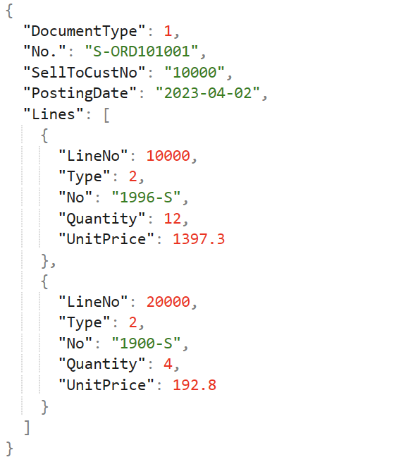
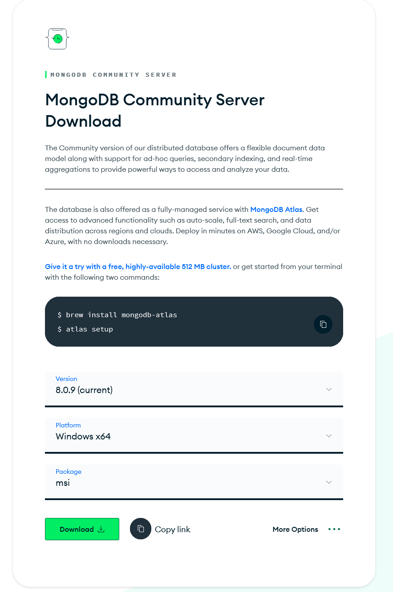
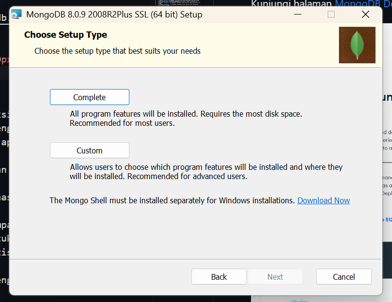
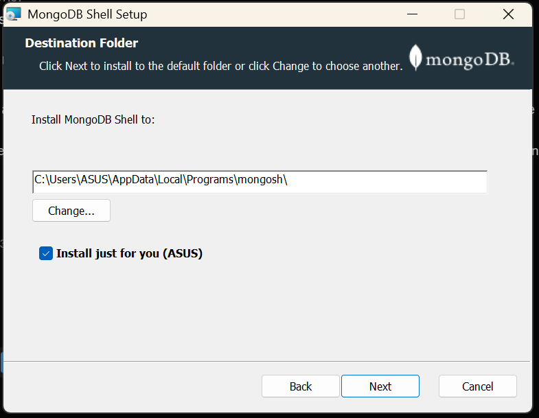
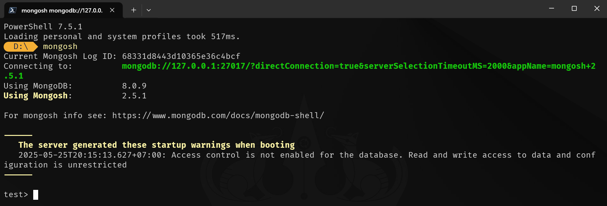
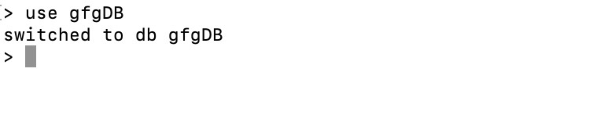
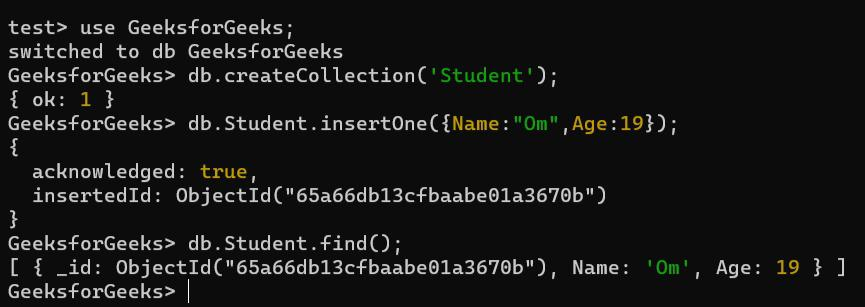

# Modul 6: JSON dan MongoDB

## Daftar Isi

1. [Pengenalan: SQL vs NoSQL](#1-pengenalan-sql-vs-nosql)
2. [Pengenalan JSON](#2-pengenalan-json)
3. [Instalasi MongoDB](#3-instalasi-mongodb)
4. [Konsep Dasar MongoDB](#4-konsep-dasar-mongodb)
5. [Operasi CRUD](#5-operasi-crud)
   - 5.1 [Create — Menyisipkan Data](#51-create--menyisipkan-data) 
     - 5.1.a [`insertOne()`](#51a-insertone--satu-dokumen)
     - 5.1.b [`insertMany()`](#51b-insertmany--banyak-dokumen-sekaligus)
   - 5.2 [Read — Membaca Data](#52-read--membaca-data) 
     - 5.2.a [`findOne()`](#52a-findone--satu-dokumen-pertama-yang-cocok)
     - 5.2.b [`find()`](#52b-find--semua-dokumen-yang-cocok)
   - 5.3 [Update — Memperbarui Data](#53-update--memperbarui-data)
     - 5.3.a [`updateOne()`](#53a-updateone--perbarui-satu-dokumen-pertama-yang-cocok)
     - 5.3.b [`updateMany()`](#53b-updatemany--perbarui-semua-dokumen-yang-cocok)
     - 5.3.c [`replaceOne()`](#53c-replaceone--mengganti-seluruh-isi-dokumen)
   - 5.4 [Delete — Menghapus Data](#54-delete--menghapus-data) 
     - 5.4.a [`deleteOne()`](#54a-deleteone--hapus-satu-dokumen-pertama-yang-cocok)
     - 5.4.b [`deleteMany()`](#54b-deletemany--hapus-semua-dokumen-yang-cocok)
6. [Aggregation Pipeline](#6-aggregation-pipeline)
   - 6.1 [Konsep Pipeline](#61-konsep-pipeline)
   - 6.2 [`$match`](#62-match--filter)
   - 6.3 [`$group`](#63-group--pengelompokan)
   - 6.4 [`$project`](#64-project--memilih--mengubah-field)
   - 6.5 [`$sort`](#65-sort--mengurutkan)
   - 6.6 [`$limit` & `$skip`](#66-limit--skip)
   - 6.7 [`$unwind`](#67-unwind--memecah-array)
   - 6.8 [`$count`](#68-count--menghitung-dokumen)
   - 6.9 [`$lookup`](#69-lookup--join-antar-collection)
   - 6.10 [`$out`](#611-out--menyimpan-hasil)
7. [Latihan Soal Presensi](#7-Latihan-soal ( utk presensi seslab ))
8. [Ringkasan Perintah](#8-ringkasan-perintah)
9. [Glosarium Sintaks](#9-glosarium-sintaks)

---

## 1. Pengenalan: SQL vs NoSQL

MongoDB adalah salah satu basis data **NoSQL** (_Not Only SQL_) yang populer. Berbeda dengan basis data relasional (MySQL, PostgreSQL) yang menyimpan data dalam tabel dengan skema kaku, MongoDB menyimpan data sebagai dokumen **BSON** (_Binary JSON_) dengan skema fleksibel.

### Kenapa NoSQL Muncul?

Aplikasi modern menghasilkan volume data besar (_Big Data_), butuh akses cepat (_real-time_), dan sering memiliki skema dinamis. Tantangan tersebut tidak selalu mudah dijawab oleh basis data relasional konvensional.

### Karakteristik Utama MongoDB

- **Skema Fleksibel**: tidak perlu mendefinisikan struktur tabel di awal. Field baru dapat ditambahkan kapan saja.
- **Skalabilitas Horizontal**: kapasitas ditingkatkan dengan menambahkan server baru (_sharding_), bukan memperbesar satu server.
- **Orientasi Dokumen**: data disimpan sebagai dokumen BSON, sangat ramah bagi pengembang yang sudah terbiasa dengan JSON.

### Perbandingan MongoDB vs MySQL

| Fitur                  | MongoDB (NoSQL - Document)                | MySQL (SQL - Relasional)                          |
| ---------------------- | ----------------------------------------- | ------------------------------------------------- |
| Tipe Database          | NoSQL (Orientasi Dokumen)                 | SQL (Relasional)                                  |
| Model Data             | Skema fleksibel (collection & document)   | Data terstruktur (tabel & baris)                  |
| Bahasa Kueri           | MongoDB Query Language (MQL)              | Structured Query Language (SQL)                   |
| Skalabilitas           | Horizontal (_sharding_)                   | Vertikal (umumnya), mendukung replikasi           |
| Performa               | Tinggi untuk dataset besar, baca cepat    | Baik untuk kueri kompleks dan _joins_             |
| Integritas Data        | _Eventual consistency_ (umumnya)          | Konsistensi kuat (ACID compliance)                |
| Skema                  | Dinamis, dapat berubah                    | Tetap, didefinisikan di awal                      |
| Transaksi              | Dukungan terbatas untuk multi-dokumen     | Dukungan penuh ACID untuk multi-baris             |
| Cocok untuk            | Big Data, CMS, Analitik Real-time         | Sistem Perbankan, E-commerce, Aplikasi Enterprise |

### Kapan Pakai MongoDB?

Gunakan MongoDB ketika dibutuhkan:

- Skema data yang fleksibel dan sering berubah.
- Skalabilitas tinggi untuk data yang terus berkembang.
- Penanganan data tidak terstruktur atau semi-terstruktur secara cepat.

NoSQL bukan solusi universal. Untuk transaksi yang menuntut konsistensi sangat ketat (perbankan, akuntansi) dan relasi antar data kompleks, basis data relasional tetap lebih cocok.

---

## 2. Pengenalan JSON

**JSON (JavaScript Object Notation)** adalah format pertukaran data berbasis teks yang ringan dan mudah dibaca manusia. Meskipun berakar dari JavaScript, JSON bersifat independen terhadap bahasa pemrograman dan umum dipakai untuk mentransmisikan data antar sistem.

MongoDB menggunakan **BSON** (ekstensi biner JSON) untuk penyimpanan internal, jadi memahami JSON adalah prasyarat utama.

### Struktur Dasar

JSON terdiri atas dua struktur utama:

1. **Objek** — pasangan _key/value_ yang tidak berurutan, diapit kurung kurawal `{}`. Setiap _key_ adalah string, diikuti `:`, lalu nilainya. Pasangan dipisah koma.

   ```json
   { "nama": "Budi", "usia": 30, "kota": "Jakarta" }
   ```

2. **Array** — kumpulan nilai berurutan, diapit kurung siku `[]`, dipisah koma.

   ```json
   ["apel", "mangga", "jeruk"]
   ```



### Tipe Data JSON

| Tipe        | Contoh                          |
| ----------- | ------------------------------- |
| **String**  | `"Halo Dunia"`                  |
| **Number**  | `100`, `3.14`                   |
| **Boolean** | `true`, `false`                 |
| **Null**    | `null`                          |
| **Array**   | `[1, 2, 3]`                     |
| **Object**  | `{ "key": "value" }`            |

### Contoh JSON Kompleks (Nested)

```json
{
  "nama": "Budi",
  "usia": 30,
  "hobi": ["membaca", "memasak"],
  "alamat": {
    "kota": "Jakarta",
    "kodePos": "12345"
  },
  "menikah": false,
  "pasangan": null
}
```

> BSON menambahkan tipe yang tidak ada di JSON murni, seperti `ObjectId`, `Date`, `Binary`, dan `Decimal128`. Tipe-tipe ini dipakai MongoDB agar penyimpanan lebih efisien.

---

## 3. Instalasi MongoDB

Pada Windows, dibutuhkan dua paket terpisah: **MongoDB Community Server** dan **MongoDB Shell** (`mongosh`). MongoDB Compass (GUI) bersifat opsional.

> Sejak MongoDB versi >= 5, Server dan Shell adalah dua program terpisah.

### a. Install MongoDB Community Server

Kunjungi [MongoDB Download Center](https://www.mongodb.com/download-center/community) lalu unduh installer.



Ikuti langkah awal instalasi dan setujui _End License Agreement_. Pada _Setup Type_, pilih **Complete**.



Biarkan _service config_ pada nilai default. **Catat path instalasi**, akan dibutuhkan nanti.


Centang opsi install MongoDB Compass jika dibutuhkan (GUI). **Direkomendasikan untuk pembelajaran, tetapi praktikum tetap menggunakan `mongosh`.**

### b. Install MongoDB Shell (`mongosh`)

Kunjungi [MongoDB Tools Download](https://www.mongodb.com/try/download/shell). Pilih paket **MSI** untuk kemudahan instalasi.


Klik _next_, lalu boleh biarkan atau ubah path instalasi. Catat path-nya.



### c. Tambahkan ke Environment Variable

Buka _Edit System Environment Variables_, lalu tambahkan path `mongosh` ke variabel `Path`. Klik OK pada setiap perubahan.


### d. Verifikasi

Buka terminal baru, ketik perintah:

```shell
mongosh
```

Jika berhasil terhubung ke server lokal, instalasi selesai.



---

## 4. Konsep Dasar MongoDB

### Hierarki Penyimpanan

```
Database  →  Collection  →  Document
```

Padanan dengan SQL:

| MongoDB    | SQL (Relasional) |
| ---------- | ---------------- |
| Database   | Database         |
| Collection | Table            |
| Document   | Row              |
| Field      | Column           |

- **Database**: wadah utama, berisi banyak _collection_.
- **Collection**: kumpulan dokumen. Mirip tabel di SQL, tapi tanpa skema kaku.
- **Document**: unit data berformat BSON (mirip JSON). Unit terkecil di MongoDB.
- **Field**: pasangan _key/value_ di dalam dokumen.

### `_id` dan ObjectId

Setiap dokumen wajib memiliki field `_id` yang **unik** dalam satu collection. Jika tidak diisi manual, MongoDB akan otomatis membuat nilai bertipe **ObjectId** — sebuah identifier 12-byte yang dijamin unik berdasarkan timestamp, machine ID, process ID, dan counter.

Contoh: `ObjectId("6011c71f781ba1a1c1ffc5b2")`

### MongoDB Cursor

Saat memanggil `find()`, MongoDB tidak langsung mengembalikan semua dokumen. Yang dikembalikan adalah **cursor** — sebuah penunjuk yang dapat diiterasi. Hal ini efisien untuk dataset besar karena dokumen diambil bertahap. Method seperti `.toArray()`, `.forEach()`, atau `.next()` bisa dipakai pada cursor.

### Tipe Data BSON

Selain tipe JSON standar, BSON mendukung:

- `ObjectId` — identifier dokumen.
- `Date` — tanggal/waktu.
- `Binary Data` — data biner mentah.
- `Decimal128` — angka desimal presisi tinggi (cocok untuk uang).
- `Timestamp` — internal timestamp MongoDB.
- `Regex`, `JavaScript`, dan lainnya.

### Perintah Navigasi Dasar

```shell
show dbs                  # daftar semua database
use nama_database         # pindah / buat database
show collections          # daftar collection di database aktif
db.namaCollection.find()  # lihat isi collection
```



> Database dan collection dibuat otomatis saat dokumen pertama disisipkan. Membuat collection eksplisit dengan `db.createCollection("nama")` bersifat opsional.



---

## 5. Operasi CRUD

CRUD = **Create, Read, Update, Delete**. Inilah operasi inti yang harus dikuasai sebelum melangkah ke topik lanjutan.

### Peta Fungsi CRUD

Total **9 fungsi** yang akan dipelajari di bab ini:

| Operasi  | Jumlah | Fungsi                                                  |
| -------- | :----: | ------------------------------------------------------- |
| Create   |   2    | `insertOne()`, `insertMany()`                           |
| Read     |   2    | `findOne()`, `find()`                                   |
| Update   |   3    | `updateOne()`, `updateMany()`, `replaceOne()`           |
| Delete   |   2    | `deleteOne()`, `deleteMany()`                           |

> Pola penamaan konsisten: akhiran `One` berarti satu dokumen, `Many` berarti banyak dokumen. Hanya `replaceOne()` yang sedikit berbeda karena _replace_ memang hanya disediakan versi tunggal.

### 5.1 Create — Menyisipkan Data

> **2 fungsi utama**: `insertOne()` (5.1.a), `insertMany()` (5.1.b).

#### 5.1.a `insertOne()` — satu dokumen

**Sintaks:**

```javascript
db.namaCollection.insertOne({ field1: value1, field2: value2, ... });
```

**Contoh:**

```javascript
db.mahasiswa.insertOne({
  nim: "21120001",
  nama: "Andi",
  ipk: 3.5
});
```

#### 5.1.b `insertMany()` — banyak dokumen sekaligus

Lebih efisien daripada memanggil `insertOne()` berulang kali untuk volume data besar.

**Sintaks:**

```javascript
db.namaCollection.insertMany([
  { ... },
  { ... }
]);
```

**Contoh:**

```javascript
db.mahasiswa.insertMany([
  { nim: "21120002", nama: "Budi", ipk: 3.2 },
  { nim: "21120003", nama: "Citra", ipk: 3.8 },
  { nim: "21120004", nama: "Dedi", ipk: 2.9 }
]);
```

> Metode lawas `db.collection.insert()` masih ada, tetapi disarankan menggunakan `insertOne()` atau `insertMany()`.

### 5.2 Read — Membaca Data

> **2 fungsi utama**: `findOne()` (5.2.a), `find()` (5.2.b).

#### 5.2.a `findOne()` — satu dokumen pertama yang cocok

**Sintaks:**

```javascript
db.namaCollection.findOne(<filter>, <projection>);
```

**Contoh kueri sederhana:**

```javascript
db.student.findOne({ name: "Avinash" });
```

Output:

```javascript
{ "_id": ObjectId("6011c71f781ba1a1c1ffc5b2"), "name": "Avinash", "language": "python" }
```

**Contoh proyeksi (pilih field tertentu):**

```javascript
db.student.findOne({ name: "Vishal" }, { _id: 0, name: 1, language: 1 });
```

Output:

```javascript
{ "name": "Vishal", "language": "python" }
```

> Pada proyeksi, `1` = tampilkan, `0` = sembunyikan. `_id` ditampilkan secara default kecuali diset `0`.

#### 5.2.b `find()` — semua dokumen yang cocok

Mengembalikan **cursor** ke seluruh dokumen yang cocok. Tanpa argumen (`{}`), akan mengembalikan semua dokumen.

```javascript
db.mahasiswa.find({});                       // semua dokumen
db.mahasiswa.find({ ipk: { $gte: 3.5 } });   // IPK >= 3.5
```

Untuk hasil yang rapi:

```javascript
db.mahasiswa.find().pretty();
```

> Pada `mongosh` modern, output sudah otomatis ditampilkan rapi tanpa perlu `.pretty()`.

#### Operator Kueri Penting

| Operator | Arti                  | Contoh                                    |
| -------- | --------------------- | ----------------------------------------- |
| `$eq`    | sama dengan           | `{ ipk: { $eq: 3.5 } }`                   |
| `$ne`    | tidak sama dengan     | `{ ipk: { $ne: 3.5 } }`                   |
| `$gt`    | lebih besar           | `{ ipk: { $gt: 3.0 } }`                   |
| `$gte`   | lebih besar / sama    | `{ ipk: { $gte: 3.0 } }`                  |
| `$lt`    | lebih kecil           | `{ ipk: { $lt: 3.0 } }`                   |
| `$lte`   | lebih kecil / sama    | `{ ipk: { $lte: 3.0 } }`                  |
| `$in`    | ada di dalam list     | `{ nama: { $in: ["Andi","Budi"] } }`      |
| `$nin`   | tidak ada di list     | `{ nama: { $nin: ["Andi"] } }`            |
| `$and`   | dan                   | `{ $and: [{...}, {...}] }`                |
| `$or`    | atau                  | `{ $or: [{...}, {...}] }`                 |
| `$not`   | bukan                 | `{ ipk: { $not: { $gt: 3 } } }`           |
| `$exists`| field ada / tidak     | `{ alamat: { $exists: true } }`           |
| `$regex` | cocok regex           | `{ nama: { $regex: /^A/ } }`              |

### 5.3 Update — Memperbarui Data

> **3 fungsi utama**: `updateOne()` (5.3.a), `updateMany()` (5.3.b), `replaceOne()` (5.3.c).

#### 5.3.a `updateOne()` — perbarui satu dokumen pertama yang cocok

**Sintaks:**

```javascript
db.namaCollection.updateOne(
  <filter>,         // dokumen mana yang diupdate
  <update>,         // perubahan yang diterapkan (pakai operator update)
  { upsert: <bool> } // opsional: buat dokumen baru jika tidak ada yang cocok
);
```

**Contoh skenario:** mengubah gaji Budi menjadi 5.500.000 dan menambahkan field `status`.

Data input (collection `karyawan`):

```json
[
  { "_id": 1, "nama": "Budi", "departemen": "IT", "gaji": 5000000 },
  { "_id": 2, "nama": "Ani", "departemen": "HR", "gaji": 6000000 }
]
```

Perintah:

```javascript
db.karyawan.updateOne(
  { nama: "Budi" },
  { $set: { gaji: 5500000, status: "Aktif" } }
);
```

Hasil:

```json
[
  { "_id": 1, "nama": "Budi", "departemen": "IT", "gaji": 5500000, "status": "Aktif" },
  { "_id": 2, "nama": "Ani", "departemen": "HR", "gaji": 6000000 }
]
```

**Contoh `upsert`:** jika data tidak ditemukan, buat dokumen baru.

```javascript
db.karyawan.updateOne(
  { nama: "Citra" },
  { $set: { departemen: "Marketing", gaji: 4000000 } },
  { upsert: true }
);
```

#### 5.3.b `updateMany()` — perbarui semua dokumen yang cocok

**Sintaks:**

```javascript
db.namaCollection.updateMany(<filter>, <update>, { upsert: <bool> });
```

**Contoh skenario:** menaikkan gaji semua karyawan IT sebesar 10%.

```javascript
db.karyawan.updateMany(
  { departemen: "IT" },
  { $mul: { gaji: 1.10 } }
);
```

#### 5.3.c `replaceOne()` — mengganti seluruh isi dokumen

`replaceOne()` mengganti **seluruh** isi dokumen pertama yang cocok, kecuali field `_id`. Dokumen pengganti **tidak boleh** mengandung operator update seperti `$set`.

**Sintaks:**

```javascript
db.namaCollection.replaceOne(<filter>, <dokumen_pengganti>, { upsert: <bool> });
```

**Contoh:**

```javascript
db.karyawan.replaceOne(
  { nama: "Ani" },
  { nama: "Ani Suryani", departemen: "Human Resources", gaji: 6200000, kontak: "0812345678" }
);
```

> Field yang ada di dokumen lama tapi tidak disertakan di dokumen pengganti akan **hilang**. Misalnya, jika Ani sebelumnya punya field `alamat`, field tersebut akan hilang setelah `replaceOne()`.

#### Operator Update yang Sering Dipakai

| Operator       | Fungsi                                                     |
| -------------- | ---------------------------------------------------------- |
| `$set`         | mengatur nilai field (membuat field baru jika belum ada)   |
| `$unset`       | menghapus field                                            |
| `$inc`         | menambah / mengurangi nilai numerik                        |
| `$mul`         | mengalikan nilai numerik                                   |
| `$rename`      | mengubah nama field                                        |
| `$min`         | update hanya jika nilai baru lebih kecil dari yang ada     |
| `$max`         | update hanya jika nilai baru lebih besar dari yang ada     |
| `$currentDate` | set field ke tanggal/waktu sekarang                        |
| `$push`        | tambah elemen ke akhir array                               |
| `$pop`         | hapus elemen pertama (-1) atau terakhir (1) dari array     |
| `$pull`        | hapus elemen array yang cocok kondisi                      |
| `$addToSet`    | tambah elemen ke array jika belum ada (mencegah duplikat)  |

### 5.4 Delete — Menghapus Data

> **2 fungsi utama**: `deleteOne()` (5.4.a), `deleteMany()` (5.4.b).

> **Peringatan**: operasi delete **permanen**. Selalu pastikan filter benar sebelum menjalankan.

#### 5.4.a `deleteOne()` — hapus satu dokumen pertama yang cocok

**Sintaks:**

```javascript
db.namaCollection.deleteOne(<filter>);
```

**Contoh skenario:** hapus produk dengan nama "Produk C".

Data input (collection `inventaris`):

```json
[
  { "_id": "P001", "nama": "Produk A", "jumlah": 100 },
  { "_id": "P002", "nama": "Produk B", "jumlah": 150 },
  { "_id": "P003", "nama": "Produk C", "jumlah": 0 }
]
```

Perintah:

```javascript
db.inventaris.deleteOne({ nama: "Produk C" });
```

Hasil:

```json
[
  { "_id": "P001", "nama": "Produk A", "jumlah": 100 },
  { "_id": "P002", "nama": "Produk B", "jumlah": 150 }
]
```

#### 5.4.b `deleteMany()` — hapus semua dokumen yang cocok

**Sintaks:**

```javascript
db.namaCollection.deleteMany(<filter>);
```

**Contoh skenario:** hapus semua produk yang stoknya 0.

```javascript
db.inventaris.deleteMany({ jumlah: 0 });
```

**Hapus semua dokumen di collection** (filter kosong):

```javascript
db.namaCollection.deleteMany({});  // PERINGATAN: menghapus seluruh isi collection
```


---

## 6. Aggregation Pipeline

Agregasi adalah cara MongoDB **memproses, menggabungkan, dan meringkas data** dari satu atau lebih collection. Konsepnya seperti _alur pemrosesan_ (pipeline): data masuk, diproses bertahap melalui beberapa **stage**, lalu hasil akhir keluar di ujung.

### 6.1 Konsep Pipeline

Bayangkan _pipeline_ sebagai sebuah pipa berisi beberapa stasiun pemrosesan. Setiap dokumen melewati stasiun-stasiun tersebut secara berurutan. Output dari satu stage menjadi input bagi stage berikutnya.

**Sintaks Dasar:**

```javascript
db.namaCollection.aggregate([
  { $stage1: { /* parameter */ } },
  { $stage2: { /* parameter */ } },
  // ... dan seterusnya
]);
```

**Stage yang umum dipakai (10 stage akan dibahas di bab ini):**

| Stage      | Fungsi singkat                                            |
| ---------- | --------------------------------------------------------- |
| `$match`   | Filter dokumen (mirip `find`)                             |
| `$group`   | Mengelompokkan dokumen, kalkulasi total / rata-rata / dll |
| `$project` | Memilih, mengubah, atau membuat field baru                |
| `$sort`    | Mengurutkan dokumen                                       |
| `$limit`   | Membatasi jumlah dokumen                                  |
| `$skip`    | Melewatkan N dokumen pertama                              |
| `$unwind`  | Memecah array menjadi beberapa dokumen                    |
| `$lookup`  | Menggabungkan dengan collection lain (mirip JOIN)         |
| `$count`   | Menghitung jumlah dokumen                                 |
| `$out`     | Menyimpan hasil ke collection baru                        |

**Contoh menggabungkan beberapa stage:** cari produk kategori "Buah" dengan harga > 3000, urutkan dari termahal, tampilkan hanya nama dan harga.

Data input (collection `produk`):

```json
[
  { "nama": "Apel Fuji", "kategori": "Buah", "harga": 5000, "stok": 50 },
  { "nama": "Mangga Harum Manis", "kategori": "Buah", "harga": 7000, "stok": 30 },
  { "nama": "Bayam Segar", "kategori": "Sayur", "harga": 2000, "stok": 100 },
  { "nama": "Jeruk Sunkist", "kategori": "Buah", "harga": 6000, "stok": 40 }
]
```

Perintah:

```javascript
db.produk.aggregate([
  { $match: { kategori: "Buah", harga: { $gt: 3000 } } },
  { $sort: { harga: -1 } },
  { $project: { _id: 0, namaProduk: "$nama", hargaProduk: "$harga" } }
]);
```

Hasil:

```json
[
  { "namaProduk": "Mangga Harum Manis", "hargaProduk": 7000 },
  { "namaProduk": "Jeruk Sunkist", "hargaProduk": 6000 },
  { "namaProduk": "Apel Fuji", "hargaProduk": 5000 }
]
```

---

### 6.2 `$match` — Filter

Menyaring dokumen. Hanya yang memenuhi kriteria diteruskan ke stage berikutnya. Sintaksnya identik dengan filter pada `find()`.

**Sintaks:**

```javascript
{ $match: { <kriteria> } }
```

**Contoh:** ambil penjualan dengan jumlah lebih dari 5.

Data input (`penjualan`):

```json
[
  { "produk_id": 101, "jumlah": 10, "tanggal": ISODate("2023-03-15") },
  { "produk_id": 102, "jumlah": 3, "tanggal": ISODate("2023-03-15") },
  { "produk_id": 103, "jumlah": 7, "tanggal": ISODate("2023-03-16") }
]
```

Perintah:

```javascript
db.penjualan.aggregate([
  { $match: { jumlah: { $gt: 5 } } }
]);
```

Hasil:

```json
[
  { "produk_id": 101, "jumlah": 10, "tanggal": ISODate("2023-03-15") },
  { "produk_id": 103, "jumlah": 7, "tanggal": ISODate("2023-03-16") }
]
```

> **Tips**: letakkan `$match` di awal pipeline agar dokumen yang tidak relevan tersaring sejak awal — ini membuat pipeline jauh lebih cepat.

---

### 6.3 `$group` — Pengelompokan

Mengelompokkan dokumen berdasarkan ekspresi `_id`. Untuk setiap grup, dapat dipakai _accumulator expression_ seperti `$sum`, `$avg`, `$min`, `$max`, `$push`, `$addToSet`, `$first`, `$last`.

**Sintaks:**

```javascript
{
  $group: {
    _id: <ekspresi_pengelompokan>,
    namaFieldHasil1: { <accumulator>: <ekspresi> },
    namaFieldHasil2: { <accumulator>: <ekspresi> }
  }
}
```

**Contoh:** hitung total dan rata-rata jumlah terjual per produk.

Data input (`penjualan`):

```json
[
  { "produk_id": 101, "jumlah": 10, "pelanggan": "A" },
  { "produk_id": 102, "jumlah": 5, "pelanggan": "B" },
  { "produk_id": 101, "jumlah": 12, "pelanggan": "C" },
  { "produk_id": 103, "jumlah": 7, "pelanggan": "A" },
  { "produk_id": 102, "jumlah": 8, "pelanggan": "D" }
]
```

Perintah:

```javascript
db.penjualan.aggregate([
  {
    $group: {
      _id: "$produk_id",
      totalTerjual: { $sum: "$jumlah" },
      rataRataPerTransaksi: { $avg: "$jumlah" },
      jumlahTransaksi: { $sum: 1 }
    }
  }
]);
```

Hasil:

```json
[
  { "_id": 103, "totalTerjual": 7, "rataRataPerTransaksi": 7, "jumlahTransaksi": 1 },
  { "_id": 102, "totalTerjual": 13, "rataRataPerTransaksi": 6.5, "jumlahTransaksi": 2 },
  { "_id": 101, "totalTerjual": 22, "rataRataPerTransaksi": 11, "jumlahTransaksi": 2 }
]
```

**Contoh:** ambil nama pelanggan pertama dan terakhir yang membeli per produk.

Perintah:

```javascript
db.penjualan.aggregate([
  { $sort: { produk_id: 1 } },
  {
    $group: {
      _id: "$produk_id",
      pelangganPertama: { $first: "$pelanggan" },
      pelangganTerakhir: { $last: "$pelanggan" }
    }
  }
]);
```

Hasil:

```json
[
  { "_id": 101, "pelangganPertama": "A", "pelangganTerakhir": "C" },
  { "_id": 102, "pelangganPertama": "B", "pelangganTerakhir": "D" },
  { "_id": 103, "pelangganPertama": "A", "pelangganTerakhir": "A" }
]
```

#### Accumulator yang Sering Dipakai

| Accumulator  | Fungsi                                            |
| ------------ | ------------------------------------------------- |
| `$sum`       | Menjumlahkan nilai (atau hitung jumlah dokumen)   |
| `$avg`       | Rata-rata                                         |
| `$min`       | Nilai minimum                                     |
| `$max`       | Nilai maksimum                                    |
| `$first`     | Nilai dari dokumen pertama dalam grup             |
| `$last`      | Nilai dari dokumen terakhir dalam grup            |
| `$push`      | Kumpulkan semua nilai ke dalam array              |
| `$addToSet`  | Sama seperti `$push` tapi tanpa duplikat          |

---

### 6.4 `$project` — Memilih / Mengubah Field

Mengubah bentuk dokumen: pilih field, ganti nama, atau buat field baru dari ekspresi. Mirip klausa `SELECT` di SQL, tapi lebih fleksibel.

**Sintaks:**

```javascript
{ $project: { fieldA: 1, fieldB: 0, fieldBaru: <ekspresi> } }
```

- `1` = tampilkan field, `0` = sembunyikan.
- `"$namaField"` dipakai untuk merujuk nilai field yang sudah ada.

**Contoh:** dari data produk dalam Rupiah, ubah jadi Dolar AS (asumsi 1 USD = 15.000 IDR).

Data input:

```json
[{ "_id": 1, "nama": "Apel Fuji", "kategori": "Buah", "harga_rp": 45000, "stok": 50 }]
```

Perintah:

```javascript
db.produk.aggregate([
  {
    $project: {
      _id: 0,
      item_name: "$nama",
      kategori_produk: "$kategori",
      harga_usd: { $divide: ["$harga_rp", 15000] }
    }
  }
]);
```

Hasil:

```json
[{ "item_name": "Apel Fuji", "kategori_produk": "Buah", "harga_usd": 3 }]
```

---

### 6.5 `$sort` — Mengurutkan

Mengurutkan dokumen berdasarkan satu atau lebih field. `1` = ascending (A-Z, kecil-besar), `-1` = descending.

**Sintaks:**

```javascript
{ $sort: { field1: 1, field2: -1 } }
```

**Contoh:** urutkan produk berdasarkan kategori (A-Z), lalu harga (termurah dulu).

Data input:

```json
[
  { "nama": "Bayam", "kategori": "Sayur", "harga": 2000 },
  { "nama": "Apel", "kategori": "Buah", "harga": 5000 },
  { "nama": "Mangga", "kategori": "Buah", "harga": 7000 },
  { "nama": "Kangkung", "kategori": "Sayur", "harga": 1500 }
]
```

Perintah:

```javascript
db.produk.aggregate([
  { $sort: { kategori: 1, harga: 1 } }
]);
```

Hasil:

```json
[
  { "nama": "Apel", "kategori": "Buah", "harga": 5000 },
  { "nama": "Mangga", "kategori": "Buah", "harga": 7000 },
  { "nama": "Kangkung", "kategori": "Sayur", "harga": 1500 },
  { "nama": "Bayam", "kategori": "Sayur", "harga": 2000 }
]
```

---

### 6.6 `$limit` & `$skip`

- `$limit`: ambil hanya N dokumen pertama.
- `$skip`: lewatkan N dokumen pertama.

Kombinasi keduanya umum dipakai untuk **pagination**.

```javascript
db.produk.aggregate([
  { $sort: { harga: -1 } },
  { $skip: 10 },     // lewatkan 10 produk teratas
  { $limit: 5 }      // ambil 5 produk berikutnya
]);
```

---

### 6.7 `$unwind` — Memecah Array

Memecah dokumen yang memiliki field array menjadi beberapa dokumen, satu per elemen array.

**Sintaks:**

```javascript
{ $unwind: "$namaFieldArray" }
```

**Contoh:**

Data input:

```json
[
  { "_id": 1, "nama": "Andi", "hobi": ["membaca", "memasak", "lari"] }
]
```

Perintah:

```javascript
db.user.aggregate([
  { $unwind: "$hobi" }
]);
```

Hasil:

```json
[
  { "_id": 1, "nama": "Andi", "hobi": "membaca" },
  { "_id": 1, "nama": "Andi", "hobi": "memasak" },
  { "_id": 1, "nama": "Andi", "hobi": "lari" }
]
```

> Sangat berguna setelah `$lookup` untuk memecah array hasil _join_.

---

### 6.8 `$count` — Menghitung Dokumen

Menghitung jumlah dokumen yang melewati stage ini. Output berupa satu dokumen dengan field bernama sesuai yang ditentukan.

**Sintaks:**

```javascript
{ $count: "namaFieldHasil" }
```

**Contoh:** hitung berapa produk yang harganya di atas 4000.

```javascript
db.produk.aggregate([
  { $match: { harga: { $gt: 4000 } } },
  { $count: "jumlahProdukMahal" }
]);
```

Hasil:

```json
[{ "jumlahProdukMahal": 2 }]
```

---

### 6.9 `$lookup` — Join Antar Collection

Melakukan _left outer join_ dengan collection lain di database yang sama. Hasil _join_ akan ditambahkan sebagai array pada dokumen.

**Sintaks:**

```javascript
{
  $lookup: {
    from: "collectionTujuan",
    localField: "fieldDiCollectionIni",
    foreignField: "fieldDiCollectionTujuan",
    as: "namaArrayHasil"
  }
}
```

**Contoh:** gabungkan data pesanan dengan info produk.

Collection `pesanan`:

```json
[
  { "_id": 1, "item_id": "A001", "jumlah": 2 },
  { "_id": 2, "item_id": "B002", "jumlah": 1 }
]
```

Collection `produkInfo`:

```json
[
  { "_id": "A001", "nama_produk": "Laptop XYZ", "harga": 15000000 },
  { "_id": "B002", "nama_produk": "Mouse Gaming", "harga": 500000 },
  { "_id": "C003", "nama_produk": "Keyboard Mekanik", "harga": 1200000 }
]
```

Perintah (dijalankan pada `pesanan`):

```javascript
db.pesanan.aggregate([
  {
    $lookup: {
      from: "produkInfo",
      localField: "item_id",
      foreignField: "_id",
      as: "detailProduk"
    }
  }
]);
```

Hasil:

```json
[
  {
    "_id": 1, "item_id": "A001", "jumlah": 2,
    "detailProduk": [{ "_id": "A001", "nama_produk": "Laptop XYZ", "harga": 15000000 }]
  },
  {
    "_id": 2, "item_id": "B002", "jumlah": 1,
    "detailProduk": [{ "_id": "B002", "nama_produk": "Mouse Gaming", "harga": 500000 }]
  }
]
```

> **Tips**: setelah `$lookup`, biasanya digunakan `$unwind` untuk memecah array hasil _join_ (jika hanya ada satu dokumen yang cocok), lalu `$project` untuk menata ulang field.

---


### 6.10 `$out` — Menyimpan Hasil

Stage `$out` harus menjadi **stage terakhir** dalam pipeline. Hasil pipeline akan dituliskan ke collection baru. Jika collection sudah ada, akan **ditimpa**.

**Sintaks:**

```javascript
{ $out: "namaCollectionOutput" }
```

**Contoh:** hitung total penjualan per kategori, simpan ke collection `ringkasanPenjualanKategori`.

```javascript
db.produkDijual.aggregate([
  {
    $group: {
      _id: "$kategori",
      totalUnitTerjualSeluruhProduk: { $sum: "$terjual" },
      totalPendapatanPerKategori: { $sum: "$total_harga" }
    }
  },
  { $sort: { totalPendapatanPerKategori: -1 } },
  { $out: "ringkasanPenjualanKategori" }
]);
```

Hasil tidak tampil di konsol. Cek hasilnya dengan:

```javascript
db.ringkasanPenjualanKategori.find();
```

---

## 7. Latihan soal ( utk presensi seslab )

Coba kerjakan langsung di `mongosh` atau di `MongoDB Compass`:

1. Buat database bernama `kampus`.
2. Buat collection `mahasiswa` dan masukkan minimal 5 dokumen (NIM, nama, jurusan, IPK, angkatan).
3. Tampilkan semua mahasiswa dengan IPK di atas 3.0, hanya tampilkan nama dan IPK.
4. Update IPK salah satu mahasiswa menjadi 4.0.
5. Tambahkan field baru `status: "Aktif"` ke semua mahasiswa.
6. Hapus mahasiswa dengan IPK di bawah 2.5.
7. **(Aggregation)** Hitung rata-rata IPK per jurusan menggunakan `$group`.
8. **(Aggregation)** Buat collection `mataKuliah` (berisi NIM dan nilai), lalu gabungkan dengan `mahasiswa` menggunakan `$lookup` untuk menampilkan nama mahasiswa beserta daftar nilainya.

---

## 8. Ringkasan Perintah

| Operasi             | Perintah                                                |
| ------------------- | ------------------------------------------------------- |
| Pilih database      | `use namaDB`                                            |
| Lihat database      | `show dbs`                                              |
| Lihat collection    | `show collections`                                      |
| Buat collection     | `db.createCollection("nama")`                           |
| Insert satu         | `db.coll.insertOne({...})`                              |
| Insert banyak       | `db.coll.insertMany([{...}, {...}])`                    |
| Cari satu           | `db.coll.findOne({filter}, {projection})`               |
| Cari banyak         | `db.coll.find({filter}, {projection})`                  |
| Update satu         | `db.coll.updateOne({filter}, {$set: {...}})`            |
| Update banyak       | `db.coll.updateMany({filter}, {$set: {...}})`           |
| Replace dokumen     | `db.coll.replaceOne({filter}, {dokumenBaru})`           |
| Hapus satu          | `db.coll.deleteOne({filter})`                           |
| Hapus banyak        | `db.coll.deleteMany({filter})`                          |
| Aggregation         | `db.coll.aggregate([ {stage1}, {stage2}, ... ])`        |

---

## 9. Glosarium Sintaks

Daftar istilah yang sering muncul di modul ini.

| Istilah / Simbol      | Arti singkat                                                                  |
| --------------------- | ----------------------------------------------------------------------------- |
| **NoSQL**             | _Not Only SQL_, basis data non-relasional.                                    |
| **BSON**              | _Binary JSON_, format penyimpanan internal MongoDB.                           |
| **Collection**        | Padanan tabel di SQL; kumpulan dokumen.                                       |
| **Document**          | Padanan baris di SQL; satu unit data dalam format BSON.                       |
| **Field**             | Padanan kolom di SQL; pasangan _key/value_ dalam dokumen.                     |
| **`_id`**             | Field unik wajib di setiap dokumen; otomatis bertipe `ObjectId` jika kosong.  |
| **ObjectId**          | Identifier unik 12-byte yang dibuat MongoDB.                                  |
| **Cursor**            | Penunjuk hasil `find()` yang bisa diiterasi.                                  |
| **Sharding**          | Skalabilitas horizontal dengan membagi data ke banyak server.                 |
| **Pipeline**          | Rangkaian _stage_ pada agregasi; output stage menjadi input stage berikutnya. |
| **Stage**             | Satu langkah dalam pipeline agregasi (mis. `$match`, `$group`).               |
| **Accumulator**       | Operator dalam `$group` (mis. `$sum`, `$avg`).                                |
| **Upsert**            | _Update or insert_; update dokumen, atau buat baru jika tidak ada.            |
| **`$set`**            | Operator update untuk mengatur nilai field.                                   |
| **`$inc`**            | Operator update untuk menambah nilai numerik.                                 |
| **`$gt`, `$lt`, …**   | Operator pembanding (greater than, less than, dst).                           |
| **`$in`**             | Operator: nilai termasuk dalam daftar.                                        |
| **`$and`, `$or`**     | Operator logika.                                                              |
| **`$lookup`**         | Stage agregasi untuk _join_ ke collection lain.                               |
| **`$unwind`**         | Stage agregasi untuk memecah array jadi banyak dokumen.                       |
| **ACID**              | Atomicity, Consistency, Isolation, Durability — prinsip transaksi DB.         |
| **`mongosh`**         | _Shell_ resmi MongoDB versi modern.                                           |
| **MongoDB Compass**   | GUI resmi MongoDB.                                                            |
