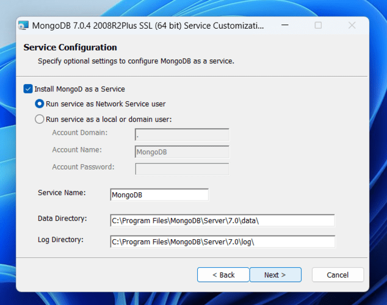
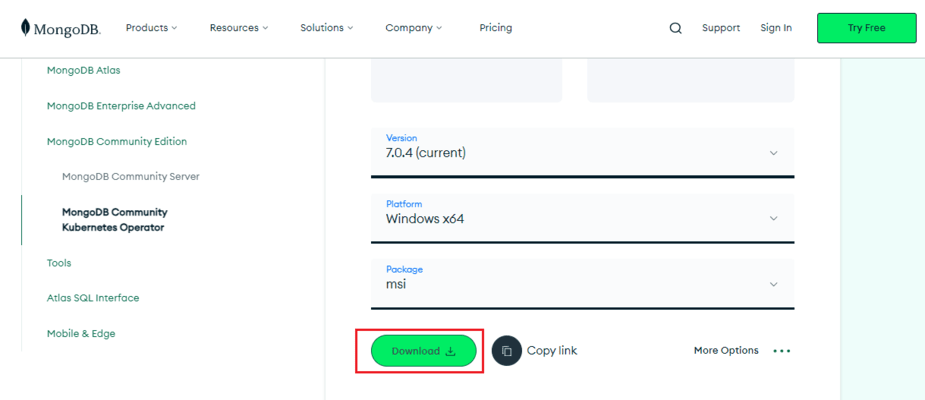
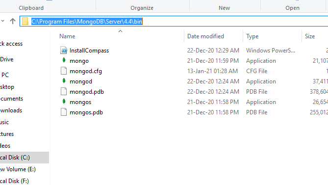
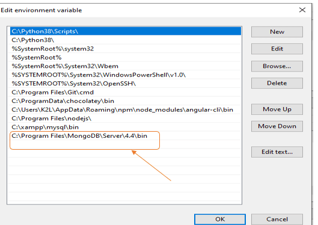
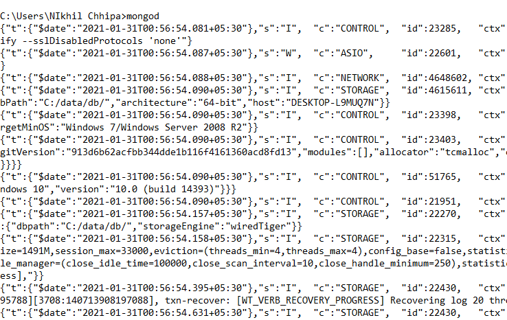
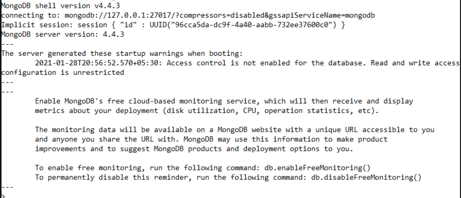

# Modul 8: Create dan Read pada Database NoSQL (MongoDB)

## Intro: MongoDB dan Kenalan Singkat dengan NoSQL

Di modul ini, kita bakal fokus sama **MongoDB**. MongoDB ini adalah salah satu jenis database **NoSQL** (Not Only SQL) yang lagi naik daun. Beda banget sama database relasional tradisional kayak **MySQL** yang datanya harus rapi jali dalam tabel dengan skema yang kaku dari awal, MongoDB ini juaranya buat nangani data yang _unstructured_ (gak beraturan) atau semi-terstruktur. Bayangin aja, datanya disimpan dalam format mirip JSON yang disebut **BSON** (Binary JSON), jadi model datanya super fleksibel dan gampang diubah-ubah.

Nah, kenapa sih ada NoSQL kayak MongoDB ini? Gampangnya, NoSQL muncul karena kebutuhan aplikasi modern yang datanya makin gede (Big Data!), butuh diakses cepet (_real-time_), dan skemanya sering berubah-ubah. Database relasional kadang kewalahan sama tantangan ini.

MongoDB sendiri punya beberapa ciri khas yang bikin dia oke:

- **Skema Fleksibel**: Gak perlu pusing mikirin struktur tabel dari awal. Mau nambah field baru? Gampang! Ini beda sama MySQL yang skemanya harus paten.
- **Skalabilitas Horizontal**: Kalau data makin banyak atau user makin rame, tinggal tambah server aja (istilahnya _sharding_). MySQL umumnya di-_scale_ secara vertikal (servernya yang di-upgrade).
- **Orientasi Dokumen**: Data disimpan sebagai dokumen BSON. Ini bikin gampang buat developer yang udah biasa sama JSON.

Secara umum, database NoSQL (termasuk MongoDB) unggul di:

- **Fleksibilitas Data**: Cocok buat data yang strukturnya macem-macem atau sering berubah.
- **Skalabilitas**: Gampang di-scale buat nangani volume data dan traffic yang gede.
- **Performa**: Biasanya cepet buat baca-tulis data, apalagi buat dataset besar dan kebutuhan baca yang tinggi.

Tapi, bukan berarti NoSQL itu solusi buat semua masalah ya. Database relasional kayak MySQL tetap punya tempatnya, apalagi buat aplikasi yang butuh konsistensi data super ketat (misalnya transaksi perbankan yang butuh ACID compliance penuh) dan relasi antar data yang kompleks.

Berikut perbandingan ringkas antara MongoDB (sebagai NoSQL) dan MySQL (sebagai SQL/Relasional), biar makin kebayang bedanya:

| Fitur           | MongoDB (NoSQL - Document)             | MySQL (SQL - Relasional)                          |
| --------------- | -------------------------------------- | ------------------------------------------------- |
| Tipe Database   | NoSQL (Orientasi Dokumen)              | SQL (Relasional)                                  |
| Model Data      | Skema fleksibel (koleksi & dokumen)    | Data terstruktur (tabel & baris)                  |
| Bahasa Query    | MongoDB Query Language (MQL)           | Structured Query Language (SQL)                   |
| Skalabilitas    | Horizontal (sharding)                  | Vertikal (umumnya), mendukung replikasi           |
| Performa        | Tinggi untuk dataset besar, baca cepat | Bagus untuk query kompleks & _joins_              |
| Integritas Data | _Eventual consistency_ (umumnya)       | Konsistensi kuat (ACID compliance)                |
| Skema           | Dinamis, bisa berubah-ubah             | Tetap, didefinisikan di awal                      |
| Transaksi       | Dukungan terbatas untuk multi-dokumen  | Dukungan penuh ACID untuk multi-baris             |
| Cocok Untuk     | Big Data, CMS, Analitik Real-time      | Sistem Perbankan, E-commerce, Aplikasi Enterprise |

Jadi, intinya MongoDB ini pilihan oke kalau kita butuh:

- Fleksibilitas skema data.
- Skalabilitas tinggi buat data yang terus berkembang.
- Nangani data yang nggak terstruktur atau semi-terstruktur dengan cepat.

Di modul ini, kita akan pelajari lebih lanjut cara kerja dengan MongoDB, mulai dari instalasi sampai operasi dasar Create dan Read.

## Instalasi dan Konfigurasi MongoDB

Untuk instalasi MongoDB pada windows kita harus menginstall 2 program terpisah, yaitu `MongoDB server`, `MongoDB shell`, dan `MongoDB Compass` (opsional)

### Download MongoDB Community Server

Pergi ke halaman [MongoDB Download Center](https://www.mongodb.com/download-center/community)

Buka file msi lalu klik next pada tampilan pertama instalasi, kemudian accept `End-User License Agreement` dan klik next

setelah itu pilih setup opsi **complete**



setelah itu pilih `Run service as Network Service user` dan copy path dari data directorynya, kemudian klik next dan install



Setelah itu kita perlu setting environment variable kita, cari lokasi di mana MongoDB terinstall di laptop kalian dan copy `/bin` pathnya



lalu tambahkan ke environment variable pada laptop kalian

`properties >> Environment Variable >> System Variable >> path >> Edit Environment Variable`



### Running MongoDB Server dan Akses MongoDB Shell

Setelah berhasil setup environment variable, kalian bisa jalankan MongoDB server dengan cara membuka terminal dan run

```
mongod
```

umumnya untuk pertama kali akan dapat error seperti `C:/data/db not found`

jika ada error seperti berikut kalian bisa coba untuk buat folder yang bersangkutan secara manual di direktori kalian. Jika sudah coba run `mongod` kembali

Jika sudah muncul seperti ini, artinya MongoDB server telah berjalan



Setelah itu kita bisa langsung mengakses MongoDB Shell untuk melakukan query database, dengan cara membuat terminal baru dan jalankan command

```
mongosh
```



## Dasar-dasar MongoDB

Bagian ini ngebahas konsep inti kayak dokumen, koleksi, dan query di MongoDB. Kita bakal explore gimana MongoDB nyimpen dan ngambil data, biar kamu bisa manfaatin fleksibilitasnya buat bikin aplikasi modern.

- **Database, Collection, dan Document di MongoDB**: Struktur dasar penyimpanan data. (Database > Collection2 > Document)
- **MongoDB Cursor**: Cara MongoDB ngasih hasil query ke kita, biasanya buat iterasi data yang banyak.
- **Tipe Data di MongoDB**: Jenis-jenis data yang bisa disimpan (string, number, boolean, array, object, dll).
- **Apa itu ObjectId di MongoDB**: Identifier unik untuk setiap dokumen.
- **Apa itu MongoDB Query?**: Cara kita "bertanya" atau meminta data ke database.
- **Pengenalan JSON**: Format standar pertukaran data yang mirip dengan cara MongoDB nyimpen data.
- **Pengenalan BSON dan Tipe-tipenya**: Format biner mirip JSON yang dipake MongoDB buat nyimpen data secara efisien.

## Operasi Dasar: Create di MongoDB

Di bagian ini kita bakal fokus ke operasi **Create (Membuat)** dan **Read (Membaca)** data. Belajar gimana cara masukin dokumen baru dan ngambil dokumen dari koleksi di MongoDB.

- **Metode `insert()` di MongoDB**: Perintah dasar buat masukin satu atau banyak dokumen.
- **Metode `insertOne()` di MongoDB**: Khusus buat masukin satu dokumen.
- **Metode `insertMany()` di MongoDB**: Khusus buat masukin banyak dokumen sekaligus.

Pertama2 tentunya setelah kita dapat mengakses MongoDB Shell kita harus mengakses / membuat database terlebih dahulu dengan menjalankan

```shell
use database_name
```

untuk mengecek database yang kalian sudah buat bisa menjalankan command

```shell
show dbs
```


jika `gfgDB` tidak ada, maka MongoDB akan otomatis membuatnya seketika ketika kita menginsert data kedalamnya

### Buat Collection MongoDB

Dalam MongoDB, collection itu layaknya grup dokumen / seperti schema dalam database. Walaupun begitu collection dalam mongodb pada dasarnya tidak mempunyai aturan2 schema.

Kita bisa buat collection dengan menjalankan

```javascript
db.createCollection("collection_name");
```

Penjelasan:

- Metode `createCollection()` ini dipakai buat bikin koleksi secara gamblang.
- Outputnya biasanya `{ "ok" : 1 }` yang nandain operasinya sukses.

> createCollection() itu opsional, karena koleksi bisa kebentuk otomatis pas dokumen pertama di-insert.


### Operasi Insert

Ini adalah berbagai cara untuk memasukkan data baru ke dalam koleksi. Setelah database dan koleksi siap (atau akan dibuat secara implisit), kita bisa mulai memasukkan dokumen. Dokumen di MongoDB itu seperti objek JSON.

1. Metode `insertOne()` di MongoDB

digunakan untuk insert 1 dokumen ke koleksi

```javascript
db.nama_koleksi_kamu.insertOne({ field1: value1, field2: value2, ... });
```

2. Metode `insertMany()` di MongoDB

untuk menginsert banyak dokumen sekaligus ke koleksi. Lebih efisien daripada `insertOne()` berkali2 jika datanya banyak

```javascript
db.nama_koleksi_kamu.insertMany([
  { field1: value1, field2: value2, ... },
  { field1: valueA, field2: valueB, ... }
]);
```

### Operasi Query Read

pertama2 kita bisa mencari tahu terlebih dahulu collection apa saja yang ada di database kita dengan menjalankan

```shell
show collections
```

1. query `findOne()`

untuk meretreive 1 dokumen pada collection tertentu dan berdasarkan rule tertentu

contoh query specification:

```javascript
db.student.findOne({ name: "Avinash" });
```

output:

```javascript
{ "_id": ObjectId("6011c71f781ba1a1c1ffc5b2"), "name": "Avinash", "language": "python" }
```

contoh retreive specific fields:

```javascript
db.student.findOne({ name: "Vishal" }, { _id: 0, name: 1, language: 1 });
```

output:

```javascript
{ "name": "Vishal", "language": "python" }
```

2. query `find()`
   > untuk findmany bisa menggunakan .find

## Agregasi (Menganalisis dan Membaca Data Lebih Lanjut)

Tingkatkan analisis datamu dengan Agregasi MongoDB! Agregasi di MongoDB itu kayak punya pabrik pengolahan data mini. Kamu bisa masukin data mentah dari koleksimu, terus data itu diolah lewat serangkaian "mesin" (tahapan/stages) yang masing-masing punya fungsi spesifik. Hasilnya, kamu bisa dapet data yang udah diringkas, dikelompokkan, dihitung, atau diubah bentuknya sesuai kebutuhan analisismu. Fokusnya tetap pada aspek membaca dan menganalisa data, meskipun ada beberapa tahap yang bisa menghasilkan data baru.

### Konsep Umum Agregasi MongoDB

**Penjelasan:**
Agregasi bekerja menggunakan konsep _pipeline_ (saluran pipa). Bayangin dokumen-dokumen dari koleksimu masuk ke salah satu ujung pipa, lalu di dalam pipa itu ada beberapa stasiun pemrosesan (tahapan/stages). Setiap dokumen bakal melewati stasiun-stasiun ini satu per satu. Di setiap stasiun, dokumen bisa diubah, difilter, dikelompokkan, atau dihitung. Output dari satu stasiun jadi input buat stasiun berikutnya. Akhirnya, di ujung pipa lainnya, keluar hasil data yang udah diolah.

**Cara Menjalankan Pipeline Agregasi:**
Kamu menjalankan pipeline agregasi menggunakan perintah `aggregate()` pada sebuah koleksi. Perintah ini menerima array (daftar) yang berisi tahapan-tahapan pipeline.

**Sintaks Dasar:**

```javascript
db.nama_koleksi_kamu.aggregate([
  {
    $tahapPertama: {
      /* parameter tahap pertama */
    }
  },
  {
    $tahapKedua: {
      /* parameter tahap kedua */
    }
  }
  // ... dan seterusnya
]);
```

---

### Tahapan (Stages) dalam Pipeline Agregasi

**Penjelasan:**
Ini adalah "mesin-mesin" atau stasiun pemrosesan dalam pipeline-mu. Ada banyak banget tahapan yang bisa dipakai, tapi beberapa yang paling sering nongol itu:

- **`$match`**: Ini kayak saringan. Cuma dokumen yang cocok sama kriteria yang kamu kasih yang boleh lanjut ke tahap berikutnya. Mirip `find()`.
- **`$group`**: Mesin pengelompok. Dokumen-dokumen dikelompokkan berdasarkan nilai field tertentu. Di sini kamu bisa ngitung total, rata-rata, nilai maksimum/minimum, dll, untuk tiap grup.
- **`$project`**: Mesin perombak struktur. Kamu bisa milih field mana aja yang mau ditampilin, nambah field baru, atau ngubah nama field yang udah ada.
- **`$sort`**: Mesin pengurut. Ngurutin dokumen berdasarkan field tertentu, bisa naik (ascending) atau turun (descending).
- **`$limit`**: Pembatas jumlah. Cuma sejumlah N dokumen pertama yang boleh lanjut.
- **`$skip`**: Pelompat. N dokumen pertama bakal dilewatin, yang lanjut mulai dari dokumen ke N+1.
- **`$unwind`**: Pemecah array. Kalau ada field yang isinya array, tahap ini bakal mecah dokumen jadi beberapa dokumen, satu buat tiap elemen di array itu.
- **`$lookup`**: Penggabung. Mirip `JOIN` di SQL, buat gabungin data dari koleksi lain.
- **`$count`**: Penghitung. Ngitung jumlah dokumen yang masuk ke tahap ini dan ngasih output satu dokumen dengan field berisi jumlahnya.
- **`$out`**: Penyimpan hasil. Nyimpen hasil akhir pipeline ke koleksi baru.

**Contoh Skenario Singkat (Menggabungkan beberapa tahap):**
Misalnya kita punya koleksi `produk` dan mau cari produk kategori "Buah" yang harganya di atas 3000, urutkan dari yang paling mahal, dan cuma tampilkan nama dan harganya.

- **Data Input (Contoh di koleksi `produk`):**

```javascript
[
  { nama: "Apel Fuji", kategori: "Buah", harga: 5000, stok: 50 },
  { nama: "Mangga Harum Manis", kategori: "Buah", harga: 7000, stok: 30 },
  { nama: "Bayam Segar", kategori: "Sayur", harga: 2000, stok: 100 },
  { nama: "Jeruk Sunkist", kategori: "Buah", harga: 6000, stok: 40 }
];
```

- **Perintah Agregasi:**

```javascript
db.produk.aggregate([
  { $match: { kategori: "Buah", harga: { $gt: 3000 } } }, // Saring buah > 3000
  { $sort: { harga: -1 } }, // Urutkan harga descending
  { $project: { _id: 0, namaProduk: "$nama", hargaProduk: "$harga" } } // Pilih & rename field
]);
```

- **Hasil Output:**

```javascript
[
  { namaProduk: "Mangga Harum Manis", hargaProduk: 7000 },
  { namaProduk: "Jeruk Sunkist", hargaProduk: 6000 },
  { namaProduk: "Apel Fuji", hargaProduk: 5000 }
];
```

---

### Optimasi Pipeline Agregasi

**Penjelasan:**
Biar pipeline agregasimu jalan ngebut dan nggak boros sumber daya, ada beberapa tips optimasi:

1.  **Filter di Awal**: Pakai `$match` sedini mungkin. Makin sedikit dokumen yang diproses di tahap-tahap selanjutnya, makin cepat.
2.  **Gunakan Indeks**: Kalau `$match` atau `$sort` kamu pakai field yang ada indeksnya, MongoDB bisa manfaatin indeks itu biar lebih cepat.
3.  **Proyeksi Dini**: Pakai `$project` buat buang field-field yang nggak kamu butuhin secepat mungkin. Ini ngurangin ukuran dokumen yang harus diolah.
4.  **Urutan Tahap**: Pikirin urutan tahap mana yang paling efisien. Misalnya, lebih baik `$project` dulu sebelum `$unwind` kalau field array-nya gede banget tapi kamu cuma butuh beberapa elemen.
5.  **`allowDiskUse`**: Kalau agregasimu butuh memori lebih dari 100MB (default), MongoDB bakal error. Kamu bisa set `allowDiskUse: true` di opsi `aggregate()` biar MongoDB boleh pake temporary file di disk. Tapi ini bisa lebih lambat.

---

### Batasan Pipeline Agregasi

**Penjelasan:**
Meskipun canggih, pipeline agregasi punya beberapa batasan:

1.  **Ukuran Dokumen BSON**: Hasil dari tiap tahap (dan dokumen input/output) nggak boleh lebih dari 16MB.
2.  **Memori per Tahap**: Secara default, tiap tahap agregasi cuma boleh pake memori sampai 100MB. Kalau lebih, kamu butuh `allowDiskUse: true`.
3.  **Jumlah Tahapan**: Nggak ada batasan keras jumlah tahapan, tapi pipeline yang terlalu panjang dan kompleks bisa jadi lambat.
4.  **Batasan Operator Tertentu**: Beberapa operator agregasi mungkin punya batasan spesifik. Selalu cek dokumentasi.

---

### MongoDB Agregasi `$match`

**Penjelasan:**
Tahap `$match` berfungsi untuk menyaring dokumen. Hanya dokumen yang memenuhi kriteria yang ditentukan yang akan diteruskan ke tahap selanjutnya dalam pipeline. Sintaksnya mirip dengan query di `find()`.

**Sintaks Dasar:**

```
{ $match: { <kriteria_query> } }
```

**Contoh Skenario:**
Kita mau cari data penjualan yang jumlahnya lebih dari 5 item.

- **Data Input (Contoh di koleksi `penjualan`):**

```javascript
[
  { produk_id: 101, jumlah: 10, tanggal: ISODate("2023-03-15") },
  { produk_id: 102, jumlah: 3, tanggal: ISODate("2023-03-15") },
  { produk_id: 103, jumlah: 7, tanggal: ISODate("2023-03-16") }
];
```

- **Perintah Agregasi:**

```javascript
db.penjualan.aggregate([{ $match: { jumlah: { $gt: 5 } } }]);
```

- **Hasil Output:**

```javascript
  [
  { "_id": ObjectId(...), "produk_id": 101, "jumlah": 10, "tanggal": ISODate("2023-03-15T00:00:00Z") },
  { "_id": ObjectId(...), "produk_id": 103, "jumlah": 7, "tanggal": ISODate("2023-03-16T00:00:00Z") }
  ]
```

---

### MongoDB Agregasi `$group`

**Penjelasan:**
Tahap `$group` mengelompokkan dokumen input berdasarkan ekspresi `_id` yang kamu tentukan. Untuk setiap grup unik, `$group` akan menghasilkan satu dokumen output. Kamu bisa menggunakan _accumulator expressions_ (kayak `$sum`, `$avg`, `$min`, `$max`, `$push`, `$addToSet`, `$first`, `$last`) untuk melakukan perhitungan pada field dari dokumen-dokumen dalam satu grup.

**Sintaks Dasar:**

```javascript
{
$group: {
    _id: <ekspresi_untuk_grouping>, // Bisa berupa field "$namaField" atau ekspresi kompleks
namaFieldHasil1: { <accumulator1>: <ekspresi_atau_field_untuk_dihitung1> },
namaFieldHasil2: { <accumulator2>: <ekspresi_atau_field_untuk_dihitung2> },
// ...dan seterusnya
}
}
```

**Contoh Skenario:**
Kita mau hitung total jumlah produk terjual dan rata-rata jumlah per transaksi untuk setiap `produk_id`.

- **Data Input (Contoh di koleksi `penjualan`):**

```javascript
[
  { produk_id: 101, jumlah: 10, pelanggan: "A" },
  { produk_id: 102, jumlah: 5, pelanggan: "B" },
  { produk_id: 101, jumlah: 12, pelanggan: "C" },
  { produk_id: 103, jumlah: 7, pelanggan: "A" },
  { produk_id: 102, jumlah: 8, pelanggan: "D" }
];
```

- **Perintah Agregasi:**

```javascript
db.penjualan.aggregate([
  {
    $group: {
      _id: "$produk_id", // Kelompokkan berdasarkan produk_id
      totalTerjual: { $sum: "$jumlah" }, // Jumlahkan field 'jumlah'
      rataRataPerTransaksi: { $avg: "$jumlah" }, // Rata-ratakan field 'jumlah'
      jumlahTransaksi: { $sum: 1 } // Hitung jumlah dokumen dalam grup
    }
  }
]);
```

- **Hasil Output:**

```javascript
[
  { _id: 103, totalTerjual: 7, rataRataPerTransaksi: 7, jumlahTransaksi: 1 },
  { _id: 102, totalTerjual: 13, rataRataPerTransaksi: 6.5, jumlahTransaksi: 2 },
  { _id: 101, totalTerjual: 22, rataRataPerTransaksi: 11, jumlahTransaksi: 2 }
];
```

---

### MongoDB Agregasi `$project`

**Penjelasan:**
Tahap `$project` digunakan untuk memilih field mana saja yang akan diteruskan ke tahap selanjutnya, mengganti nama field, atau bahkan membuat field baru. Mirip klausa `SELECT` di SQL tapi lebih fleksibel.

**Sintaks Dasar:**

- Menampilkan field: { $project: { namaField: 1, fieldLain: 1, \_id: 0 } } (1 untuk tampil, 0 untuk sembunyikan \_id)
- Mengganti nama field: { $project: { namaBaru: "$namaFieldLama" } }
- Membuat field baru dengan ekspresi: { $project: { fieldBaru: { $add: ["$field1", "$field2"] } } }

**Contoh Skenario:**
Dari data produk, kita mau tampilkan nama produk (jadi `item_name`), kategori, dan harga dalam dollar (misal harga asli dalam Rupiah, 1 USD = 15000).

- **Data Input (Contoh di koleksi `produk`):**

```javascript
[{ _id: 1, nama: "Apel Fuji", kategori: "Buah", harga_rp: 45000, stok: 50 }];
```

- **Perintah Agregasi:**

```javascript
db.produk.aggregate([
  {
    $project: {
      _id: 0, // Sembunyikan _id bawaan
      item_name: "$nama", // Ganti nama field 'nama' jadi 'item_name'
      kategori_produk: "$kategori", // Tampilkan field 'kategori' dengan nama baru
      harga_usd: { $divide: ["$harga_rp", 15000] } // Buat field baru 'harga_usd'
    }
  }
]);
```

- **Hasil Output:**

```javascript
[{ item_name: "Apel Fuji", kategori_produk: "Buah", harga_usd: 3 }];
```

---

### MongoDB Agregasi `$sort`

**Penjelasan:**
Tahap `$sort` mengurutkan dokumen yang masuk berdasarkan field yang ditentukan. Pengurutan bisa ascending (1) atau descending (-1).

**Sintaks Dasar:**

```
{ $sort: { fieldUntukSort1: <1*atau*-1>, fieldUntukSort2: <1*atau*-1>, ... } }
```

**Contoh Skenario:**
Kita mau urutkan produk berdasarkan kategori (A-Z), lalu berdasarkan harga (termurah ke termahal) di dalam tiap kategori.

- **Data Input (Contoh di koleksi `produk`):**

```javascript
[
  { nama: "Bayam", kategori: "Sayur", harga: 2000 },
  { nama: "Apel", kategori: "Buah", harga: 5000 },
  { nama: "Mangga", kategori: "Buah", harga: 7000 },
  { nama: "Kangkung", kategori: "Sayur", harga: 1500 }
];
```

- **Perintah Agregasi:**

```javascript
db.produk.aggregate([
  { $sort: { kategori: 1, harga: 1 } } // Urutkan kategori A-Z, lalu harga termurah
]);
```

- **Hasil Output:**

```javascript
  [
  { "_id": ObjectId(...), "nama": "Apel", "kategori": "Buah", "harga": 5000 },
  { "_id": ObjectId(...), "nama": "Mangga", "kategori": "Buah", "harga": 7000 },
  { "_id": ObjectId(...), "nama": "Kangkung", "kategori": "Sayur", "harga": 1500 },
  { "_id": ObjectId(...), "nama": "Bayam", "kategori": "Sayur", "harga": 2000 }
  ]
```

---

### MongoDB Agregasi `$count`

**Penjelasan:**
Tahap `$count` adalah cara simpel untuk menghitung jumlah dokumen yang melewatinya dalam pipeline. Hasilnya adalah satu dokumen tunggal yang berisi field (dengan nama yang kamu tentukan) yang nilainya adalah jumlah dokumen tersebut.

**Sintaks Dasar:**

```
{ $count: "nama_field_untuk_hasil_hitungan" }
```

**Contoh Skenario:**
Kita mau hitung berapa banyak produk yang harganya di atas 4000.

- **Data Input (Contoh di koleksi `produk`):**

```javascript
[
  { nama: "Apel", kategori: "Buah", harga: 5000 },
  { nama: "Bayam", kategori: "Sayur", harga: 2000 },
  { nama: "Mangga", kategori: "Buah", harga: 7000 }
];
```

- **Perintah Agregasi:**

```javascript
db.produk.aggregate([
  { $match: { harga: { $gt: 4000 } } }, // Saring dulu produknya
  { $count: "jumlahProdukMahal" } // Hitung hasilnya
]);
```

- **Hasil Output:**

```javascript
[{ jumlahProdukMahal: 2 }];
```

---

### MongoDB Agregasi `$lookup` (Mirip Join)

**Penjelasan:**
Tahap `$lookup` memungkinkan kamu melakukan "left outer join" dengan koleksi lain di database yang sama. Jadi, kamu bisa "menggabungkan" informasi dari dua koleksi. Tahap ini bakal nambahin field baru (berupa array) ke dokumen input, yang isinya adalah dokumen-dokumen yang cocok dari koleksi "tujuan".

**Sintaks Dasar:**

```
{
$lookup: {
from: "nama_koleksi_tujuan_join", // Koleksi yang mau digabung
localField: "field_di_koleksi_ini_buat_join", // Field di dokumen input
foreignField: "field_di_koleksi_tujuan_buat_join", // Field di dokumen koleksi 'from'
as: "nama_field_baru_hasil_join" // Nama field array output
}
}
```

**Contoh Skenario:**
Kita punya koleksi `pesanan` yang isinya `produk_id`, dan koleksi `produkInfo` yang isinya detail produk. Kita mau tampilkan data pesanan lengkap dengan nama produknya.

- **Data Input (Koleksi `pesanan`):**

```javascript
[
  { _id: 1, item_id: "A001", jumlah: 2 },
  { _id: 2, item_id: "B002", jumlah: 1 }
];
```

- **Data Input (Koleksi `produkInfo`):**

```javascript
[
  { _id: "A001", nama_produk: "Laptop XYZ", harga: 15000000 },
  { _id: "B002", nama_produk: "Mouse Gaming", harga: 500000 },
  { _id: "C003", nama_produk: "Keyboard Mekanik", harga: 1200000 }
];
```

- **Perintah Agregasi (dijalankan di koleksi `pesanan`):**

```javascript
db.pesanan.aggregate([
  {
    $lookup: {
      from: "produkInfo",
      localField: "item_id",
      foreignField: "_id",
      as: "detailProduk"
    }
  }
]);
```

- **Hasil Output:**

```javascript
[
  {
    _id: 1,
    item_id: "A001",
    jumlah: 2,
    detailProduk: [{ _id: "A001", nama_produk: "Laptop XYZ", harga: 15000000 }]
  },
  {
    _id: 2,
    item_id: "B002",
    jumlah: 1,
    detailProduk: [{ _id: "B002", nama_produk: "Mouse Gaming", harga: 500000 }]
  }
];
```

**Tips:** Biasanya setelah `$lookup`, kamu mungkin mau pakai `$unwind` buat mecah array `detailProduk` (kalau yakin cuma ada satu atau mau diproses satu-satu) dan `$project` buat nata ulang field-nya.

---

### MongoDB Agregasi `$first` (dan `$last`)

**Penjelasan:**
Operator `$first` dan `$last` ini biasanya dipakai di dalam tahap `$group`. `$first` bakal ngambil nilai dari field tertentu dari dokumen _pertama_ yang masuk ke grup itu. Sebaliknya, `$last` ngambil dari dokumen _terakhir_.
**Penting**: Kalau urutan dokumen dalam grup itu penting buat nentuin mana yang "pertama" atau "terakhir" (selain dari pengelompokan `_id` itu sendiri), kamu **harus** pakai tahap `$sort` _sebelum_ tahap `$group` biar hasilnya konsisten dan sesuai harapan.

**Sintaks Dasar (di dalam `$group`):**

```javascript
{
$group: {
    _id: <ekspresi_grouping>,
    fieldPertama: { $first: "$namaFieldSumber" },
fieldTerakhir: { $last: "$namaFieldSumber" }
}
}
```

**Contoh Skenario:**
Dari data penjualan, kita mau cari tanggal transaksi pertama untuk setiap produk.

- **Data Input (Contoh di koleksi `penjualan`):**

```javascript
[
  { produk_id: 101, jumlah: 10, tanggal: ISODate("2023-03-15") },
  { produk_id: 102, jumlah: 5, tanggal: ISODate("2023-03-10") },
  { produk_id: 101, jumlah: 12, tanggal: ISODate("2023-02-20") }, // Lebih dulu dari 15 Maret
  { produk_id: 102, jumlah: 8, tanggal: ISODate("2023-03-12") }
];
```

- **Perintah Agregasi:**

```javascript
db.penjualan.aggregate([
  { $sort: { tanggal: 1 } }, // Urutkan berdasarkan tanggal (paling lama dulu) PENTING!
  {
    $group: {
      _id: "$produk_id",
      tanggalTransaksiPertama: { $first: "$tanggal" },
      tanggalTransaksiTerakhir: { $last: "$tanggal" } // Sekalian contoh $last
    }
  }
]);
```

- **Hasil Output:**

```javascript
[
  {
    _id: 101,
    tanggalTransaksiPertama: ISODate("2023-02-20T00:00:00Z"),
    tanggalTransaksiTerakhir: ISODate("2023-03-15T00:00:00Z")
  },
  {
    _id: 102,
    tanggalTransaksiPertama: ISODate("2023-03-10T00:00:00Z"),
    tanggalTransaksiTerakhir: ISODate("2023-03-12T00:00:00Z")
  }
];
```

---

### MongoDB Agregasi `$out`

**Penjelasan:**
Tahap `$out` harus jadi tahap _terakhir_ dalam pipeline agregasi. Fungsinya adalah untuk mengambil hasil dari pipeline dan menuliskannya ke dalam sebuah koleksi baru. Kalau koleksi dengan nama yang sama udah ada, `$out` bakal **menimpanya** (overwrite). Ini berguna kalau hasil agregasimu mau sering di-query atau dipakai lagi nanti.

**Sintaks Dasar:**

```
{ $out: "nama_koleksi_output_baru" }
```

**Contoh Skenario:**
Kita mau hitung total penjualan per kategori produk, dan hasilnya disimpan ke koleksi baru bernama `ringkasanPenjualanKategori`.

- **Data Input (Contoh di koleksi `produkDijual`):**

```javascript
[
  { nama: "Apel", kategori: "Buah", terjual: 50, total_harga: 250000 },
  { nama: "Bayam", kategori: "Sayur", terjual: 100, total_harga: 200000 },
  { nama: "Mangga", kategori: "Buah", terjual: 30, total_harga: 210000 },
  { nama: "Kangkung", kategori: "Sayur", terjual: 120, total_harga: 180000 }
];
```

- **Perintah Agregasi:**

```javascript
db.produkDijual.aggregate([
  {
    $group: {
      _id: "$kategori",
      totalUnitTerjualSeluruhProduk: { $sum: "$terjual" },
      totalPendapatanPerKategori: { $sum: "$total_harga" }
    }
  },
  { $sort: { totalPendapatanPerKategori: -1 } },
  { $out: "ringkasanPenjualanKategori" } // Simpan hasilnya ke koleksi baru
]);
```

- **Hasil Output (Tidak langsung tampil di console, tapi tersimpan di koleksi `ringkasanPenjualanKategori`):**
  Setelah perintah di atas dijalankan, kamu bisa cek koleksi `ringkasanPenjualanKategori`:
  db.ringkasanPenjualanKategori.find().pretty();
  Akan menghasilkan:

```javascript
[
  {
    _id: "Buah",
    totalUnitTerjualSeluruhProduk: 80,
    totalPendapatanPerKategori: 460000
  },
  {
    _id: "Sayur",
    totalUnitTerjualSeluruhProduk: 220,
    totalPendapatanPerKategori: 380000
  }
];
```

---

### Map-Reduce (Alternatif Agregasi)

**Penjelasan:**
Map-Reduce adalah cara lain buat melakukan agregasi data di MongoDB, terutama untuk operasi yang sangat kompleks yang mungkin susah diungkapkan pake pipeline agregasi. Konsepnya ada dua fungsi utama:

1.  **`map` function**: Fungsi ini diproses untuk setiap dokumen input. Tugasnya adalah "memetakan" atau mengeluarkan (emit) pasangan _key-value_.
2.  **`reduce` function**: Fungsi ini dipanggil untuk setiap _key_ unik yang dikeluarkan oleh fungsi `map`. Tugasnya adalah "mereduksi" atau mengolah daftar _value_ yang berasosiasi dengan _key_ tersebut menjadi satu output tunggal.

Walaupun powerful, pipeline agregasi umumnya lebih disukai karena seringkali lebih gampang dipakai, lebih cepat, dan lebih mudah di-debug untuk kebanyakan kasus. Map-Reduce biasanya jadi pilihan terakhir kalau pipeline udah nggak sanggup.

**Sintaks Dasar:**

```javascript
db.nama*koleksi_kamu.mapReduce(
function() { emit(this.keyField, this.valueField); }, // Map function
function(key, values) { return Array.sum(values); }, // Reduce function
{
query: { /* filter dokumen input, opsional _/ },
out: { /_ opsi output, bisa inline atau ke koleksi \_/ }
// opsi lain seperti sort, limit, dll.
}
);
```

**Contoh Skenario Sederhana:**
Hitung total jumlah untuk setiap `produk_id` dari koleksi `penjualan` (mirip contoh `$group` sebelumnya, tapi pake Map-Reduce).

- **Data Input (Contoh di koleksi `penjualan`):**

```javascript
[
  { produk_id: 101, jumlah: 10 },
  { produk_id: 102, jumlah: 5 },
  { produk_id: 101, jumlah: 12 }
];
```

- **Perintah Map-Reduce:**

```javascript
db.penjualan.mapReduce(
  function () {
    // Map function
    emit(this.produk_id, this.jumlah); // Key: produk_id, Value: jumlah
  },
  function (keyProdId, arrayJumlah) {
    // Reduce function
    return Array.sum(arrayJumlah); // Jumlahkan semua 'jumlah' untuk key yang sama
  },
  {
    out: { inline: 1 } // Tampilkan hasilnya langsung (bisa juga ke koleksi: { replace: "namaKoleksiHasil" })
  }
);
```

- **Hasil Output (jika `out: { inline: 1 }`):**

```javascript
  {
  "results" : [
  { "_id" : 101, "value" : 22 },
  { "_id" : 102, "value" : 5 }
  ],
  // ... statistik lainnya
  }
```

**Catatan:** Map-Reduce ini lebih kompleks untuk kasus sederhana dan pipeline agregasi biasanya lebih efisien.
