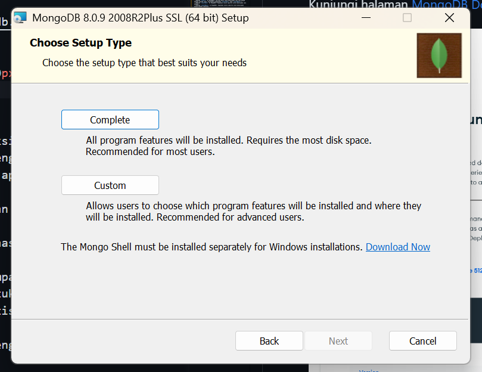

# Modul 8: Create dan Read pada Database NoSQL (MongoDB)

## Pendahuluan: MongoDB dan Pengenalan Singkat NoSQL

MongoDB merupakan salah satu jenis basis data **NoSQL** (Not Only SQL) yang populer dan banyak digunakan. Berbeda secara fundamental dengan basis data relasional tradisional seperti **MySQL**, yang mengharuskan data terstruktur secara rapi dalam tabel dengan skema yang kaku sejak awal, MongoDB dirancang untuk menangani data yang bersifat _unstructured_ (tidak terstruktur) atau semi-terstruktur. Data dalam MongoDB disimpan dalam format yang menyerupai JSON, disebut **BSON** (Binary JSON), sehingga model datanya menjadi sangat fleksibel dan mudah dimodifikasi.

Kehadiran NoSQL, termasuk MongoDB, didorong oleh kebutuhan aplikasi modern yang menghasilkan volume data masif (Big Data), memerlukan akses data berkecepatan tinggi (_real-time_), dan seringkali memiliki skema data yang dinamis. Basis data relasional konvensional terkadang menghadapi keterbatasan dalam menjawab tantangan tersebut.

MongoDB memiliki beberapa karakteristik utama, antara lain:

- **Skema Fleksibel**: Tidak memerlukan definisi struktur tabel yang rigid di awal. Penambahan field baru dapat dilakukan dengan mudah, berbeda dengan MySQL yang skemanya harus didefinisikan secara paten.
- **Skalabilitas Horizontal**: Apabila volume data meningkat atau jumlah pengguna bertambah, kapasitas dapat ditingkatkan dengan menambahkan server baru (dikenal dengan istilah _sharding_). MySQL umumnya ditingkatkan skalabilitasnya secara vertikal (peningkatan spesifikasi server).
- **Orientasi Dokumen**: Data disimpan sebagai dokumen BSON, yang memudahkan pengembang yang terbiasa dengan format JSON.

Secara umum, basis data NoSQL (termasuk MongoDB) memiliki keunggulan dalam aspek:

- **Fleksibilitas Data**: Ideal untuk data dengan struktur beragam atau sering mengalami perubahan.
- **Skalabilitas**: Mudah diskalakan untuk menangani volume data dan lalu lintas pengguna yang besar.
- **Performa**: Umumnya menawarkan kecepatan tinggi untuk operasi baca-tulis data, terutama untuk dataset besar dan kebutuhan baca intensif.

Namun, perlu dipahami bahwa NoSQL bukanlah solusi universal. Basis data relasional seperti MySQL tetap relevan, khususnya untuk aplikasi yang menuntut konsistensi data yang sangat ketat (misalnya, transaksi perbankan yang memerlukan kepatuhan penuh terhadap prinsip ACID) dan relasi antar data yang kompleks.

Berikut adalah perbandingan ringkas antara MongoDB (sebagai representasi NoSQL) dan MySQL (sebagai representasi SQL/Relasional) untuk memberikan gambaran perbedaan yang lebih jelas:

| Fitur                  | MongoDB (NoSQL - Document)             | MySQL (SQL - Relasional)                          |
| ---------------------- | -------------------------------------- | ------------------------------------------------- |
| Tipe Database          | NoSQL (Orientasi Dokumen)              | SQL (Relasional)                                  |
| Model Data             | Skema fleksibel (koleksi & dokumen)    | Data terstruktur (tabel & baris)                  |
| Bahasa Kueri           | MongoDB Query Language (MQL)           | Structured Query Language (SQL)                   |
| Skalabilitas           | Horizontal (sharding)                  | Vertikal (umumnya), mendukung replikasi           |
| Performa               | Tinggi untuk dataset besar, baca cepat | Baik untuk kueri kompleks & _joins_               |
| Integritas Data        | _Eventual consistency_ (umumnya)       | Konsistensi kuat (ACID compliance)                |
| Skema                  | Dinamis, dapat berubah-ubah            | Tetap, didefinisikan di awal                      |
| Transaksi              | Dukungan terbatas untuk multi-dokumen  | Dukungan penuh ACID untuk multi-baris             |
| Rekomendasi Penggunaan | Big Data, CMS, Analitik Real-time      | Sistem Perbankan, E-commerce, Aplikasi Enterprise |

Dengan demikian, MongoDB merupakan pilihan yang tepat apabila dibutuhkan:

- Fleksibilitas skema data.
- Skalabilitas tinggi untuk data yang terus berkembang.
- Penanganan data tidak terstruktur atau semi-terstruktur secara cepat.

Dalam modul ini, akan dipelajari lebih lanjut mengenai mekanisme kerja dengan MongoDB, mulai dari proses instalasi hingga operasi dasar Create dan Read.

## Pengenalan JSON (JavaScript Object Notation)

Sebelum membahas lebih jauh mengenai BSON yang digunakan oleh MongoDB, penting untuk memahami terlebih dahulu **JSON (JavaScript Object Notation)**. Meskipun berakar dari JavaScript, JSON bersifat independen terhadap bahasa pemrograman dan umum digunakan dalam berbagai aplikasi sebagai format untuk mentransmisikan data antara server dan klien web, atau antar berbagai sistem.

**Struktur Dasar JSON:**
Data dalam JSON direpresentasikan dalam dua struktur utama:

1.  **Objek**: Kumpulan pasangan kunci/nilai (key/value pairs) yang tidak berurutan. Sebuah objek dimulai dengan `{` (kurung kurawal buka) dan diakhiri dengan `}` (kurung kurawal tutup). Setiap kunci adalah string yang diikuti oleh `:` (titik dua), dan kemudian nilainya. Pasangan kunci/nilai dipisahkan oleh `,` (koma).
    Contoh: `{"nama": "Budi", "usia": 30, "kota": "Jakarta"}`
2.  **Array**: Kumpulan nilai yang berurutan. Sebuah array dimulai dengan `[` (kurung siku buka) dan diakhiri dengan `]` (kurung siku tutup). Nilai-nilai di dalam array dipisahkan oleh `,` (koma).
    Contoh: `["apel", "mangga", "jeruk"]`


**Tipe Data dalam JSON:**
JSON mendukung beberapa tipe data dasar:

- **String**: Urutan karakter, diapit oleh tanda kutip ganda (`"`). Contoh: `"Halo Dunia"`
- **Number**: Angka, bisa berupa integer atau floating-point. Contoh: `100`, `3.14`
- **Boolean**: Nilai `true` atau `false`.
- **Array**: Seperti yang dijelaskan di atas.
- **Object**: Seperti yang dijelaskan di atas.
- **Null**: Merepresentasikan nilai kosong atau tidak ada, ditulis sebagai `null`.

Pemahaman terhadap JSON sangat membantu dalam bekerja dengan MongoDB, karena format penyimpanan data MongoDB (BSON) merupakan ekstensi biner dari JSON, yang menawarkan tipe data tambahan dan efisiensi penyimpanan.

## Instalasi dan Konfigurasi MongoDB

Untuk melakukan instalasi MongoDB pada sistem operasi Windows, diperlukan instalasi dua program terpisah, yaitu `MongoDB server`, `MongoDB shell`, dan `MongoDB Compass` (opsional sebagai GUI).

> MongoDB Community Server dan MongoDB Shell merupakan 2 program terpisah semenjak mongodb versi >= 5

### Unduh MongoDB Community Server

Kunjungi halaman [MongoDB Download Center](https://www.mongodb.com/download-center/community).


ikuti langkah2 awal instalasi dan setujui end license agreement. Setelah itu untuk installation type (setup type) pilih yang complete



setelah itu biarkan seluruh konfigurasi servis (service config) menggunakan nilai defaultnya, jangan lupa untuk mengingat / menyimpan path instalasi mongodb kalian!


setelah itu kalian bisa ceklis untuk menginstall mongodb compass (opsional). **Direkomendasikan untuk pembelajaran kalian tetapi tidak untuk mengerjakan praktikum karena praktikum sistem basis data mengenai mongodb hanya menggunakan mongoshell**

Instalasi selesai~

### Unduh MongoDB Shell

Kunjungi halaman [MongoDB Tools Download](https://www.mongodb.com/try/download/shell).


download mongodb shell, jangan lupa untuk pilih package MSI untuk memudahkan instalasi.

klik next, kemudian biarkan atau custom path instalasi mongosh kamu. Jangan lupa untuk disimpan pathnya!


kemudian klik next, lalu install. Setelah itu buka setting edit system environment variable


jangan lupa klik ok setiap kali membuat perubahan. Kemudian test mongosh dengan membuka terminal baru lalu menjalankan command `mongosh`


Instalasi dan Konfigurasi selesai~

## Dasar-dasar MongoDB

Bagian ini membahas konsep-konsep inti seperti dokumen, koleksi, dan kueri dalam MongoDB. Akan dieksplorasi bagaimana MongoDB menyimpan dan mengambil data, sehingga pengguna dapat memanfaatkan fleksibilitasnya untuk membangun aplikasi modern.

- **Database, Collection, dan Document di MongoDB**: Merupakan struktur dasar penyimpanan data (Database \> Collection \> Document).
- **MongoDB Cursor**: Mekanisme MongoDB dalam mengembalikan hasil kueri, umumnya digunakan untuk iterasi data dalam jumlah besar.
- **Tipe Data di MongoDB**: Jenis-jenis data yang dapat disimpan (misalnya, string, number, boolean, array, object, dan lainnya yang spesifik untuk BSON).
- **ObjectId di MongoDB**: Identifier unik yang secara otomatis digenerasi untuk setiap dokumen.
- **MongoDB Query**: Cara untuk mengajukan permintaan atau mengambil data dari basis data.
- **Pengenalan BSON dan Tipe-tipenya**: Format biner yang menyerupai JSON, digunakan oleh MongoDB untuk menyimpan data secara efisien, dengan dukungan tipe data tambahan.

## Operasi Dasar: Create dan Read di MongoDB

Pada bagian ini, akan difokuskan pada operasi **Create (Membuat)** dan **Read (Membaca)** data. Akan dipelajari cara menyisipkan dokumen baru dan mengambil dokumen dari koleksi di MongoDB.

### Operasi Create di MongoDB

- **Metode `insert()` di MongoDB**: Perintah dasar untuk menyisipkan satu atau banyak dokumen (metode lawas, disarankan menggunakan `insertOne()` atau `insertMany()`).
- **Metode `insertOne()` di MongoDB**: Digunakan secara spesifik untuk menyisipkan satu dokumen.
- **Metode `insertMany()` di MongoDB**: Digunakan secara spesifik untuk menyisipkan banyak dokumen sekaligus.

Setelah berhasil mengakses MongoDB Shell, langkah pertama adalah mengakses atau membuat basis data dengan menjalankan:

```shell
use nama_database
```

Untuk memeriksa daftar basis data yang telah dibuat, dapat digunakan perintah:

```shell
show dbs
```

\

Jika `gfgDB` (atau nama basis data yang Anda gunakan) belum ada, MongoDB akan secara otomatis membuatnya ketika data pertama kali disisipkan ke dalamnya.

#### Membuat Collection MongoDB

Dalam MongoDB, _collection_ dapat dianalogikan sebagai grup dokumen, atau serupa dengan skema dalam basis data relasional, meskipun _collection_ pada MongoDB pada dasarnya tidak memberlakukan aturan skema yang kaku.

_Collection_ dapat dibuat secara eksplisit dengan menjalankan:

```javascript
db.createCollection("nama_collection");
```

Penjelasan:

- Metode `createCollection()` digunakan untuk membuat _collection_ secara eksplisit.
- Output yang umum adalah `{ "ok" : 1 }`, yang menandakan operasi berhasil.

> Perintah `createCollection()` bersifat opsional, karena _collection_ dapat terbentuk secara otomatis ketika dokumen pertama disisipkan.


#### Operasi Insert

Berikut adalah berbagai metode untuk memasukkan data baru ke dalam _collection_. Setelah basis data dan _collection_ siap (atau akan dibuat secara implisit), proses penyisipan dokumen dapat dimulai. Dokumen dalam MongoDB memiliki struktur serupa objek JSON.

1.  **Metode `insertOne()` di MongoDB**

    Digunakan untuk menyisipkan satu dokumen ke dalam _collection_.

    ```javascript
    db.nama_koleksi_anda.insertOne({ field1: value1, field2: value2, ... });
    ```

2.  **Metode `insertMany()` di MongoDB**

    Digunakan untuk menyisipkan banyak dokumen sekaligus ke dalam _collection_. Metode ini lebih efisien dibandingkan `insertOne()` yang dijalankan berulang kali untuk volume data yang besar.

    ```javascript
    db.nama_koleksi_anda.insertMany([
      { field1: value1, field2: value2, ... },
      { field1: valueA, field2: valueB, ... }
    ]);
    ```

### Operasi Query Read

Pertama, dapat diketahui terlebih dahulu daftar _collection_ yang ada dalam basis data aktif dengan menjalankan:

```shell
show collections
```

1.  **Kueri `findOne()`**

    Digunakan untuk mengambil satu dokumen dari _collection_ tertentu berdasarkan kriteria yang spesifik.

    Contoh kueri berdasarkan spesifikasi:

    ```javascript
    db.student.findOne({ name: "Avinash" });
    ```

    Output:

    ```javascript
    { "_id": ObjectId("6011c71f781ba1a1c1ffc5b2"), "name": "Avinash", "language": "python" }
    ```

    Contoh pengambilan field spesifik (proyeksi):

    ```javascript
    db.student.findOne({ name: "Vishal" }, { _id: 0, name: 1, language: 1 });
    ```

    Output:

    ```javascript
    { "name": "Vishal", "language": "python" }
    ```

    (_id: 0 berarti field \_id tidak ditampilkan, field lain dengan nilai 1 akan ditampilkan_)

2.  **Kueri `find()`**

    > Untuk mengambil banyak dokumen, dapat digunakan metode `.find()`. Metode ini akan mengembalikan kursor ke dokumen-dokumen yang cocok dengan kriteria. Jika dijalankan tanpa argumen (`db.collection.find({})`), akan mengembalikan semua dokumen dalam koleksi. Untuk menampilkan hasilnya secara rapi, Anda dapat menambahkan `.pretty()` (meskipun `.pretty()` lebih merupakan fitur dari mongo shell lawas, `mongosh` modern biasanya sudah menampilkan output JSON dengan baik).
